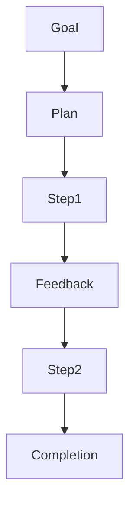
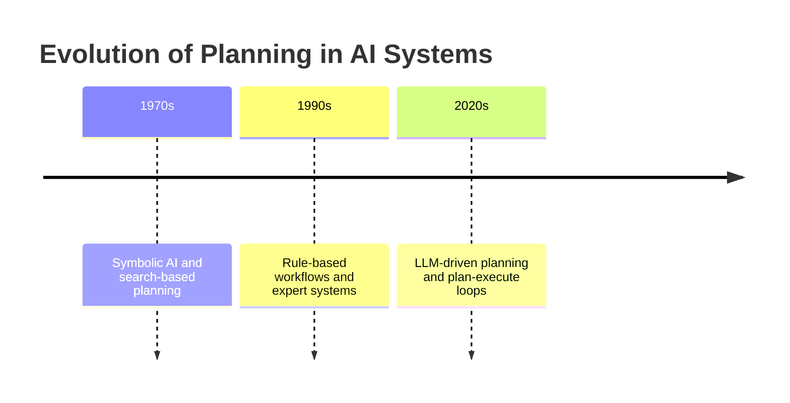
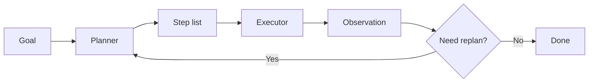
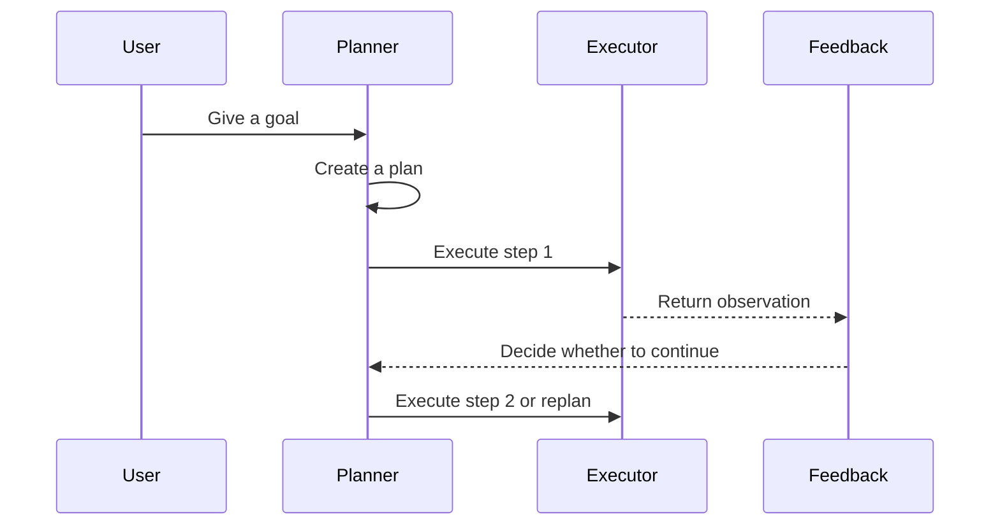
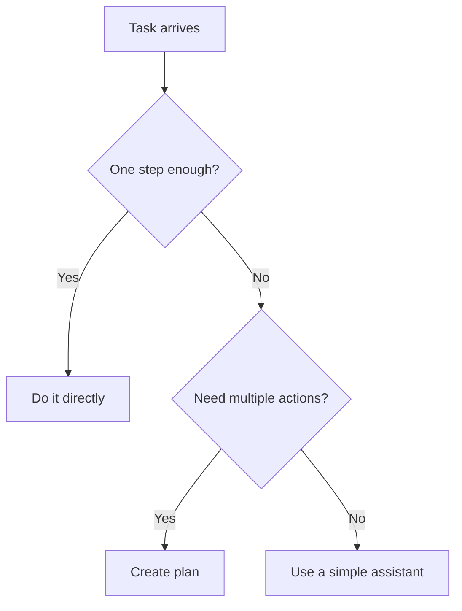
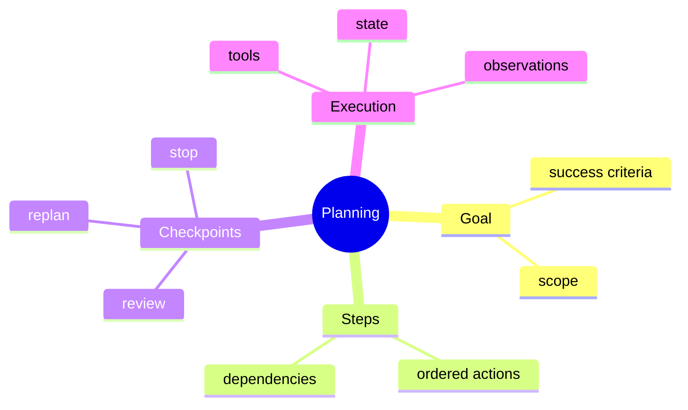

# Day 23 - Planning

[Previous: Day 22 - What are AI Agents?](../day_22/day_22_what_are_ai_agents.md) | [Next: Day 24 - Multi-Agent Systems](../day_24/day_24_multi_agent_systems.md)

## Introduction
Yesterday we learned what an AI agent is. Today we focus on one of the most important parts of agent behavior: planning.

Planning is the process of turning a goal into smaller, ordered steps. In agent systems, planning helps the model decide what to do first, what to check next, when to replan, and when to stop.


Planning matters because many goals are too large for one response. If the assistant must research a topic, inspect sources, compare options, and then summarize findings, it needs structure. Planning gives the agent that structure.

Today you will learn how planning works, why it exists, how it differs from execution, and how to design plans that are simple, revisable, and safe.

## Learning Objectives
By the end of this day, you should be able to:

- explain why planning improves agent behavior
- break a goal into useful steps
- understand plan-and-execute workflows
- design checkpoints for complex tasks
- recognize when planning is unnecessary
- describe how replanning works when new information appears
- connect planning to tool use, memory, and multi-agent systems

## Prerequisites
You should already understand:

- Day 22: What are AI Agents?
- Day 21: Knowledge Assistant Project
- retrieval and memory concepts from Week 3

If those topics still feel new, review them first. Planning makes the most sense once you understand the agent loop that it helps organize.

## Big Picture
Planning sits between the goal and the action.



The important idea is this:

- the goal tells the agent what success looks like
- the plan tells the agent what to try first
- feedback tells the agent whether the plan is still working
- replanning tells the agent what to do next

Without planning, agents often act too quickly, repeat themselves, or fail to finish larger tasks.

## What Is Planning?
Planning is a structured way to convert a high-level objective into smaller actions.

In an AI system, planning can happen in several forms:

- explicit: the model writes a plan before acting
- implicit: the model chooses actions step by step without exposing a formal plan
- hybrid: the system creates a rough plan, then adapts it during execution

The plan is not a prediction of the future. It is a useful working strategy.

## Why Planning Exists
Planning exists because complex tasks are not solved well by one-shot behavior.

Examples include:

- researching a topic across multiple sources
- comparing several documents
- collecting information before answering
- handling tasks with dependencies
- searching, checking, and then responding

Planning helps the agent:

- avoid jumping to conclusions
- work in a logical order
- remember what has already been done
- decide when enough evidence has been collected
- adapt when the first attempt does not work

## Historical Background
Planning is one of the oldest ideas in AI.

Before modern LLMs, AI researchers built symbolic planners, search algorithms, and rule-based control systems. Modern agent systems bring back that idea, but with a more flexible model that can reason in natural language about the next step.



## Deep Theory

### Planning versus execution
Planning is deciding what to do. Execution is doing it.

That distinction matters because a good plan can still fail during execution, and a bad plan can waste time even if the executor is perfect.

| Aspect | Planning | Execution |
| --- | --- | --- |
| Main question | What should we do next? | How do we do it? |
| Output | Strategy or steps | Tool calls or actions |
| Failure mode | Wrong order or missing steps | Incorrect or failed action |
| Best use | Complex tasks | Concrete operations |

### Plan-and-execute workflow
In a plan-and-execute design, the system first creates a plan and then performs the steps one by one.

This is helpful because:

- the agent can think before acting
- the plan can be reviewed or logged
- the execution layer can be simpler and more deterministic



### Replanning
Replanning means revising the plan when new information appears.

This is one of the most important ideas in agent design because the world rarely behaves exactly as expected.

The agent may need to replan when:

- a tool fails
- the retrieved evidence is incomplete
- a query returns unexpected results
- the task scope changes
- the original plan was too optimistic

### Hierarchical planning
Some tasks are easier to manage when broken into layers.

For example:

- top level: research the topic
- middle level: find sources, summarize evidence, compare approaches
- bottom level: search, inspect, cite

Hierarchical planning is useful because it lets the agent manage complexity without trying to solve everything in one step.

### Checkpoints
Checkpoints are decision points where the system pauses to verify progress.

Examples include:

- after retrieval, before answer generation
- after one tool call, before the next
- after a draft, before final output

Checkpoints reduce the chance that the agent continues down a bad path.

### Advantages
- adds structure to complex tasks
- makes agent behavior easier to inspect
- supports re-planning and recovery
- improves tool use discipline
- helps the system know when it is making progress

### Limitations
- adds latency and cost
- can overcomplicate simple tasks
- plan quality is not guaranteed
- poor plans can mislead execution
- planning without checkpoints is often too fragile

### Alternatives
- single-step generation
- fixed workflow engines
- direct tool execution without explicit planning
- user-driven step-by-step interaction

### When should you use planning?
Use planning when the task:

- has multiple dependencies
- benefits from intermediate checkpoints
- may need course correction
- requires research or comparison
- is too complex for a single action

### When should you not use planning?
Do not use it when:

- the task is simple and deterministic
- a single search or lookup is enough
- latency must be extremely low
- the plan would be longer than the execution itself

## Visual Learning

### Planning Loop


### Decision Tree


### Planning Mind Map


## Code Walkthrough

The examples below are small and direct so you can see how planning logic behaves.

### Python Example: Create a simple plan
```python
def create_plan(goal):
        goal_lower = goal.lower()

        if 'research' in goal_lower:
                return ['clarify scope', 'retrieve sources', 'summarize evidence', 'write answer']

        if 'summary' in goal_lower:
                return ['collect notes', 'group topics', 'draft summary', 'review']

        return ['understand goal', 'choose a strategy', 'execute', 'review']


goal = 'Prepare a study summary'
plan = create_plan(goal)

print(goal)
print(plan)
```

#### Code Explanation
- `create_plan` turns a goal into ordered actions.
- the planning logic is intentionally simple and based on keywords.
- different goals lead to different step lists.
- the plan is short enough to be revised later.

### TypeScript Example: Plan object
```typescript
type Plan = {
    goal: string;
    steps: string[];
    checkpointAt: number[];
};

function buildPlan(goal: string): Plan {
    return {
        goal,
        steps: ['collect notes', 'group topics', 'draft summary', 'review'],
        checkpointAt: [1, 3],
    };
}

const plan = buildPlan('Prepare a study summary');
console.log(plan);
```

#### Code Explanation
- `Plan` keeps the structure explicit.
- `steps` lists the actions in order.
- `checkpointAt` marks where the system should pause and inspect progress.

### Python Example: Replanning rule
```python
def should_replan(step_number, last_observation):
        if 'error' in last_observation.lower():
                return True

        if step_number >= 3:
                return True

        return False


print(should_replan(1, 'Search was successful'))
print(should_replan(2, 'Tool returned an error'))
```

#### Code Explanation
- `should_replan` checks for failure signals.
- an error observation triggers replanning immediately.
- a step limit also triggers replanning to avoid going too far down the wrong path.

### TypeScript Example: Checkpoint execution
```typescript
function executeStep(step: string): string {
    return `Executed: ${step}`;
}

const steps = ['collect notes', 'group topics', 'draft summary', 'review'];

for (let index = 0; index < steps.length; index += 1) {
    const result = executeStep(steps[index]);
    console.log(result);

    if (index === 1) {
        console.log('Checkpoint reached: review whether the plan still makes sense.');
    }
}
```

#### Code Explanation
- `executeStep` stands in for a real tool or action.
- the loop runs through the plan in order.
- the checkpoint after step 2 shows where the system can pause and reflect.

### Python Example: Dynamic plan update
```python
def update_plan(plan, feedback):
        if 'missing sources' in feedback.lower():
                return ['retrieve more sources', 'compare evidence', 'resume answer']

        if 'too broad' in feedback.lower():
                return ['narrow scope', 'retrieve targeted context', 'resume answer']

        return plan


original_plan = ['retrieve sources', 'summarize', 'answer']
feedback = 'The scope is too broad.'
new_plan = update_plan(original_plan, feedback)

print(new_plan)
```

#### Code Explanation
- `update_plan` changes the plan based on feedback.
- feedback from execution can reveal that the original strategy was too broad.
- replanning lets the system adapt instead of failing silently.

## Practical Examples

### Beginner Example: Study summary
The task is “prepare a study summary.”

A good plan is small and simple:

1. collect notes
2. group topics
3. draft summary
4. review

Why it works:

- the steps are easy to follow
- the order makes sense
- the plan is short enough to revise

### Intermediate Example: Research a course topic
The task is “research hybrid search for a class lesson.”

The agent should:

1. clarify the scope
2. retrieve relevant lessons
3. compare lexical and semantic search
4. summarize the tradeoffs
5. cite the source lessons

What could go wrong:

- the scope may be too broad
- the retrieval may miss important context
- the plan may need a checkpoint after source collection

### Professional Example: Travel assistant planning
A travel assistant must gather constraints before making recommendations.

The plan may include:

1. ask about budget
2. ask about dates
3. ask about destination preferences
4. check constraints
5. generate options

Why professionals like this:

- planning prevents irrelevant recommendations
- the assistant gathers the right info before acting
- the user experience feels structured

### Real-World Company Example
Documentation assistants, research copilots, and support automation tools all use planning ideas even if they do not call them that.

The system may first decide what evidence to gather, then decide how to respond. That is planning in practice.

## Best Practices
- keep plans short enough to revise
- add checkpoints after important steps
- replan when new information appears
- separate planning from execution when possible
- use planning only when the task benefits from it
- keep the plan visible to the control layer
- design steps around evidence, not just text generation

## Common Mistakes
- writing plans that are too detailed to follow
- assuming the first plan will always work
- planning tasks that are simple enough for one step
- not checking whether the plan is still valid
- hiding the plan from the control layer
- letting plans grow without a budget or stop rule

### Debugging Strategy
When planning fails, inspect it in this order:

1. Was the goal clear enough?
2. Were the steps ordered correctly?
3. Did execution feedback reveal a missing dependency?
4. Was the replan rule triggered at the right time?
5. Did the plan become too large or too vague?

## Performance

Planning can improve quality, but it also adds overhead.

### Latency
Planning adds time before action.

You can reduce latency by:

- keeping plans short
- planning only when necessary
- using checkpoints instead of overplanning
- reusing stable plans for repeated tasks

### Cost
Cost increases when:

- the planner makes many model calls
- the plan is rewritten too often
- too many checkpoints are added

### Memory
Planning state should be small and focused.

Keep only what the planner needs to decide the next step.

### Scalability
Planning scales better when it is modular.

For example:

- a planner can produce steps
- an executor can perform them
- a monitor can decide when to replan

### Reliability
Plans should fail safely.

If a step cannot be completed, the system should explain the failure or replan, not silently continue.

## Security

Planning systems need the same caution as agents because the plan can influence actions.

### Prompt Injection
Untrusted text may attempt to influence the plan.

### Secrets and API Keys
Do not let planning steps reveal secrets or private context unnecessarily.

### Authentication and Authorization
The plan should not include actions the user cannot perform.

### Data Privacy
Plans and logs may contain sensitive project details or user goals.

### Hallucinations and Model Safety
The planner may invent steps that are not needed or not safe.

To reduce risk:

- verify plan steps before execution
- use tool permissions
- keep the plan narrow

## Evaluation
Evaluate planning by looking at whether the steps are useful, not just whether the final answer is correct.

### What to measure
- plan length
- plan usefulness
- checkpoint quality
- replanning frequency
- task success rate

### Useful questions
- Did the plan reflect the real task?
- Did the plan help the agent avoid unnecessary actions?
- Did replanning improve the result?
- Was the plan simple enough to debug?

## Exercises

### Easy
1. Break a simple task into steps.
2. Explain why plans should be short.
3. Name one place where a checkpoint helps.
4. Describe the difference between planning and execution.

### Medium
5. Explain plan-and-execute.
6. Design a replanning rule.
7. Compare planning for a simple task and a complex task.
8. Explain why checkpoints improve reliability.

### Hard
9. Create a planner for a document research task.
10. Design a replan trigger for failed tool calls.
11. Explain how a planner should behave when the task scope changes.
12. Describe how to keep the plan visible for debugging.

### Challenge
13. Build a planning layer for a travel assistant that gathers constraints before making recommendations.
14. Add a checkpoint after each major step.
15. Add replanning when the retrieved evidence is weak.
16. Add a max-step budget.
17. Add logs for every planning decision.

### Reflection Questions
18. Why is planning useful even when the final answer is simple?
19. When does planning become overengineering?
20. What is the biggest difference between planning and just listing steps?
21. How does planning prepare you for multi-agent systems?
22. Why is re-planning more realistic than trying to produce a perfect plan?

## Mini Project
Design a planning layer for a travel assistant that gathers constraints before making recommendations.

### Goal
Build a planner that asks about budget, dates, destination preferences, and travel style before producing suggestions.

### Features
- detect which constraints are still missing
- ask the user targeted follow-up questions
- produce a short plan before recommending options
- replan when new constraints appear
- stop once enough information is gathered

### Suggested folder structure
```text
travel-planner/
├── app/
│   ├── planner.py
│   ├── executor.py
│   ├── state.py
│   ├── feedback.py
│   └── main.py
├── tests/
│   └── test_planner.py
└── README.md
```

### Project Steps
1. define the travel goal
2. list the constraints the agent needs
3. create a plan for collecting missing details
4. add checkpoints after each question
5. replan if the user changes the goal
6. generate a recommendation only when enough context is available

### What You Learn
- how planning improves recommendation quality
- how to gather missing information before acting
- how to avoid premature answers
- how planning connects to the multi-agent systems in Day 24

## Capstone Update
Add these items to the final capstone plan:

- a planner that determines what retrieval or tool action should happen first
- checkpoints for verifying evidence before answering
- a re-planning strategy for failed or incomplete steps
- a small evaluation set for plan quality

This will make the capstone’s agent layer more structured and easier to trust.

## Summary
Planning gives agents structure.

The best plans are simple, revisable, and tightly connected to the current goal. Planning should improve the task, not become the task.

The main lessons from today are:

- planning turns goals into actions
- execution turns actions into results
- checkpoints and replanning make agent behavior safer
- simple planning is often better than elaborate planning

If Day 22 taught you what an agent is, Day 23 teaches you how agents decide what to do next.

[Previous: Day 22 - What are AI Agents?](../day_22/day_22_what_are_ai_agents.md) | [Next: Day 24 - Multi-Agent Systems](../day_24/day_24_multi_agent_systems.md)

## Further Reading
- https://www.langchain.com/langgraph
- https://arxiv.org/abs/2305.10403
- https://www.deeplearning.ai/short-courses/
- https://openai.com/index/introducing-openai-responses/
- https://www.anthropic.com/news/building-effective-agents
