# Day 23 - Planning

[Previous: Day 22 - What are AI Agents?](../day_22/day_22_what_are_ai_agents.md) | [Next: Day 24 - Multi-Agent Systems](../day_24/day_24_multi_agent_systems.md)

## Introduction
Yesterday we learned what an AI agent is: a goal-directed loop that can use tools, observe results, and continue until a task is done. Today we focus on one of the most important parts of agent behavior—**planning**.

Think of planning like writing a study checklist before an exam week. You do not memorize every hour on day one. You decide what to review first, what depends on earlier topics, and when to stop and practice problems. Without that structure, you might jump randomly between chapters or spend too long on material you already know.

Planning is the process of turning a goal into smaller, ordered steps. In agent systems, planning helps the model decide what to do first, what to check next, when to replan, and when to stop. For **StudySpark**, planning is what turns "help me prepare for my RAG quiz" into a sequence like: clarify scope → retrieve Day 17–18 lessons → summarize key ideas → generate practice questions → stop when coverage is sufficient.


Planning matters because many goals are too large for one response. If the assistant must research a topic, inspect sources, compare options, and then summarize findings, it needs structure. Planning gives the agent that structure without removing the safety controls you built on Day 22.

Today you will learn how planning works, why it exists, how it differs from execution, and how to design plans that are simple, revisable, and safe.

## Learning Objectives
By the end of this day, you should be able to:

- explain why planning improves agent behavior in multi-step tasks
- break a study goal into useful, ordered steps with clear dependencies
- implement plan-and-execute workflows with checkpoints
- design replanning rules when tools fail or evidence is weak
- recognize when planning is unnecessary overhead
- connect planning to StudySpark's agent loop from Day 22
- describe hierarchical planning for complex exam-prep workflows
- evaluate plan quality separately from final answer quality

## How to Use This Lesson

This lesson is designed for **all skill levels**. Pick one path and follow it consistently.

| Level | Suggested approach | Time |
| --- | --- | --- |
| **Beginner** | Read Introduction → Big Picture → Deep Theory → trace one code example → Easy exercises | 5–7 hours |
| **Intermediate** | Skim objectives → Visual Learning → Code Walkthrough → Medium/Hard exercises → Mini project | 3–5 hours |
| **Advanced** | Deep Theory tradeoffs → Hard/Challenge exercises → extend mini project → capstone slice | 2–3 hours |

### Apply Today
Complete at least one item before moving to the next day:
- [ ] Trace one code example in **Python or TypeScript** (one language is enough)
- [ ] Complete exercises for your level (see Exercises section)
- [ ] Update [`projects/CAPSTONE.md`](../../projects/CAPSTONE.md) with today's capstone item
- [ ] Add today's component to `projects/studyspark/` or update `projects/CAPSTONE.md`.

> **Stuck?** Re-read Big Picture, review Prerequisites, or see [SYLLABUS.md](../../SYLLABUS.md) for path guidance.

## Prerequisites
You should already understand:

- Day 22: What are AI Agents? — the agent loop, state, tools, and stop conditions
- Day 21: Knowledge Assistant Project — StudySpark retrieval and citations
- Day 19–20: session and long-term memory concepts

You should also be comfortable with:

- basic control flow and data structures in Python or TypeScript
- the idea of dependencies between steps (A before B)

If agent loops still feel abstract, review Day 22 before continuing. Planning organizes the loop; it does not replace it.

## Big Picture
Planning sits between the goal and the action.

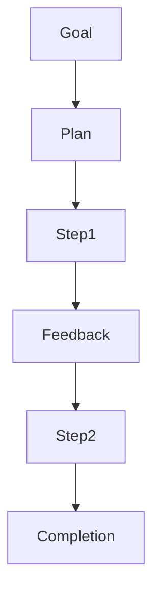

The important idea is this:

- the **goal** tells the agent what success looks like
- the **plan** tells the agent what to try first
- **feedback** from execution tells the agent whether the plan still works
- **replanning** adjusts the strategy when the world surprises you

Without planning, agents often act too quickly, repeat themselves, or fail to finish larger tasks. StudySpark without planning might search once and guess. StudySpark with planning might search, notice weak results, broaden the query, then summarize only after evidence is strong enough.

## Why Planning Exists
Planning exists because complex tasks are not solved well by one-shot behavior.

Examples in StudySpark:

- researching hybrid search across Days 17–18
- comparing lexical vs semantic retrieval before answering
- building a quiz that covers three lessons with balanced difficulty
- gathering missing constraints before recommending a study path

Planning helps the agent:

- avoid jumping to conclusions
- work in a logical order
- remember what has already been done
- decide when enough evidence has been collected
- adapt when the first attempt does not work

The cost is real: planning adds latency, tokens, and design complexity. Good engineers plan when the task benefits—not everywhere by default.

**Beginner path:** Start with a handwritten plan on paper for three StudySpark scenarios (summary, quiz, research). Only then encode `create_plan()` in Python. Understanding the steps matters more than automating planning on day one.

## What Is Planning?
Planning is a structured way to convert a high-level objective into smaller actions.

In an AI system, planning can happen in several forms:

| Form | Description | StudySpark example |
| --- | --- | --- |
| **Explicit** | Model or module writes steps before acting | "1. Retrieve Day 17 2. Summarize 3. Quiz" |
| **Implicit** | Model picks the next step each turn | ReAct-style search then summarize |
| **Hybrid** | Coarse plan first, refine during execution | Planner outputs phases; executor fills details |

The plan is not a prediction of the future. It is a **working strategy** you can revise.

## Historical Background
Planning is one of the oldest ideas in AI. Before modern LLMs, researchers built symbolic planners, STRIPS-style search, and rule-based control systems for robotics and logistics.

Modern agent systems bring that idea back with a flexible model that can reason in natural language about the next step—while the application still enforces budgets, permissions, and checkpoints.

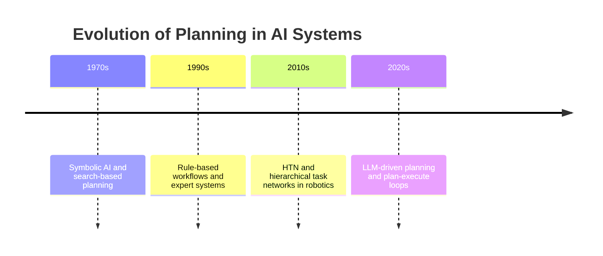

The lesson for StudySpark: **structure is not old-fashioned**. It is how you keep LLM flexibility without losing control.

## Deep Theory

### Planning versus execution
Planning is deciding what to do. Execution is doing it.

| Aspect | Planning | Execution |
| --- | --- | --- |
| Main question | What should we do next? | How do we do it now? |
| Output | Strategy or step list | Tool calls or actions |
| Failure mode | Wrong order or missing steps | Tool error or bad arguments |
| Best use | Complex, multi-step tasks | Concrete operations |
| StudySpark owner | Planner module or prompt | Tool layer and controller |

A good plan can still fail during execution. A bad plan wastes time even if tools work perfectly. That is why checkpoints and replanning matter.

### Plan-and-execute workflow
In plan-and-execute design, the system first creates a plan, then performs steps one by one.

Benefits:

- the agent thinks before acting
- the plan can be logged, reviewed, or shown to the user
- the execution layer can stay simpler and more testable

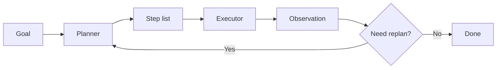

StudySpark flow example:

1. **Goal:** "Quiz me on RAG"
2. **Plan:** clarify scope → retrieve lessons → extract concepts → generate questions
3. **Execute:** each step uses tools and updates state
4. **Replan:** if retrieval returns nothing for Day 19, broaden to Day 17–18

### Replanning
Replanning means revising the plan when new information appears. Real study tasks rarely go perfectly on the first try.

Replan triggers include:

- tool failure or timeout
- retrieved evidence is incomplete or off-topic
- user changes scope mid-session
- checkpoint reveals a missing dependency
- step budget is half spent with little progress

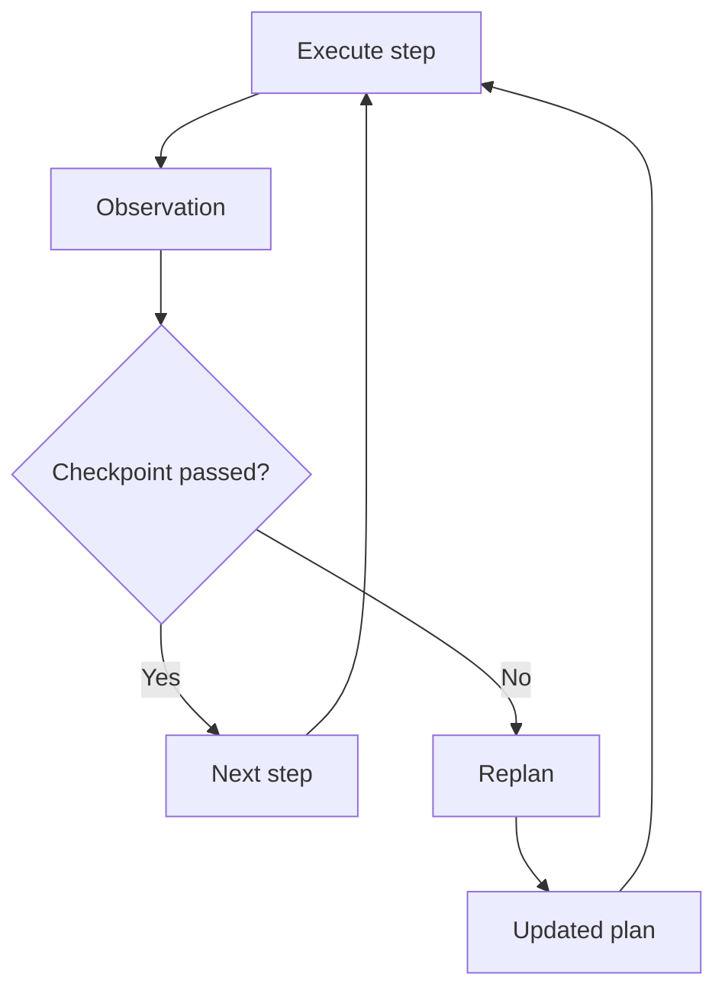

Replanning is more realistic than demanding a perfect plan upfront.

### Hierarchical planning
Some tasks are easier to manage in layers.

**Top level:** prepare for Week 3 exam  
**Middle level:** review RAG, memory, knowledge assistant  
**Bottom level:** search, read chunk, summarize, self-quiz  

Hierarchical planning prevents the model from trying to solve everything in one prompt while still allowing flexibility within each phase.

### Checkpoints
Checkpoints are decision points where the system pauses to verify progress.

Strong checkpoint moments in StudySpark:

- after retrieval, before generating an answer
- after scope clarification, before searching
- after draft quiz generation, before showing to the student
- after each lesson chunk is summarized

Checkpoints reduce the chance that the agent continues down a bad path.

### Plan quality dimensions
Evaluate plans on:

| Dimension | Good sign | Bad sign |
| --- | --- | --- |
| Length | Short, revisable | Long essay nobody follows |
| Order | Dependencies respected | Summarize before retrieve |
| Scope | Matches user goal | Includes unrelated steps |
| Stop awareness | Includes "done" condition | Infinite research |
| Tool alignment | Steps map to real tools | Fantasy steps with no tool |

### Advantages
- adds structure to complex study workflows
- makes agent behavior easier to inspect and debug
- supports replanning and recovery after tool failures
- improves tool discipline (search before answer)
- helps the system know when it is making progress

### Limitations
- adds latency and token cost
- can overcomplicate simple one-step tasks
- plan quality is not guaranteed
- poor plans mislead execution
- over-planning feels slow to users who want instant answers

### Alternatives
- single-step RAG answer (StudySpark Day 21)
- fixed workflow: always search → summarize → respond
- implicit ReAct without explicit plan object
- user-driven step-by-step buttons in the UI

### When should you use planning?
Use planning when the task:

- has multiple dependencies
- benefits from intermediate verification
- may need course correction
- requires research, comparison, or coverage checks
- is too complex for a single tool call

### When should you not use planning?
Skip explicit planning when:

- the task is a simple lookup
- a single search plus answer is enough
- latency must be extremely low
- the plan would be longer than doing the work directly

## Visual Learning

### Planning Loop
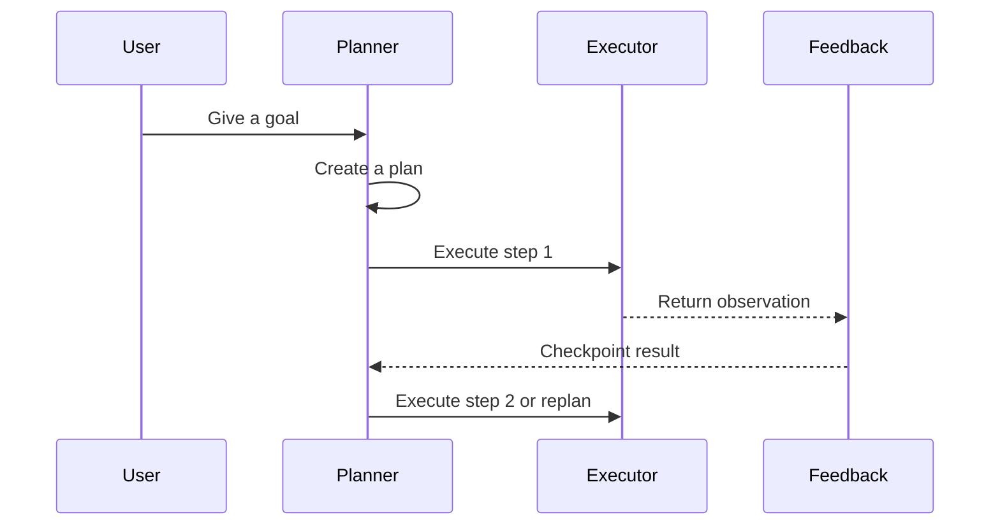

### StudySpark Exam Prep Plan
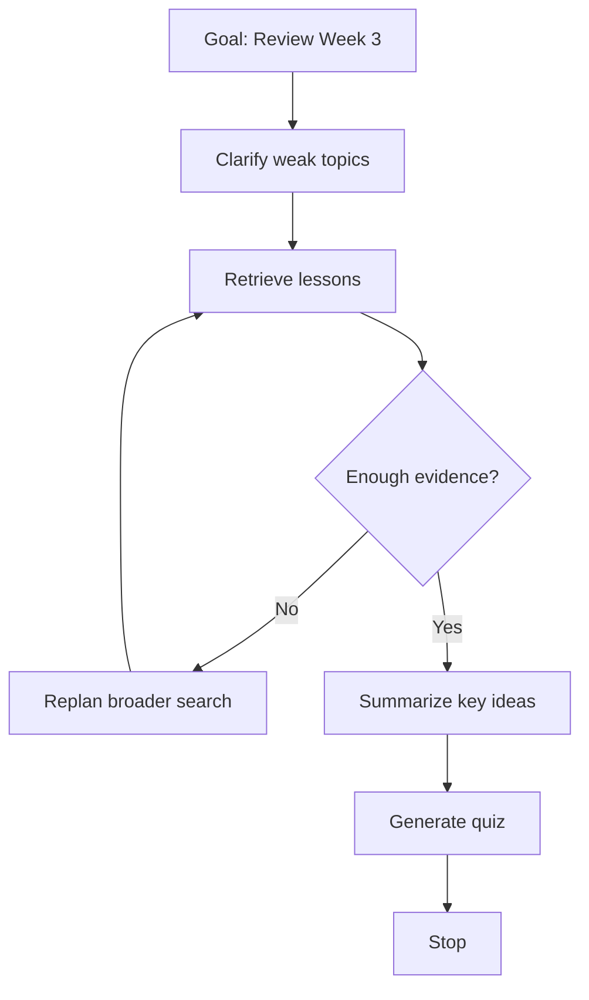

### Decision Tree
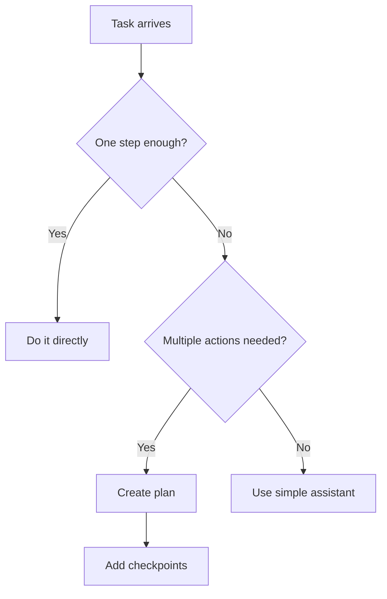

### Planning Mind Map
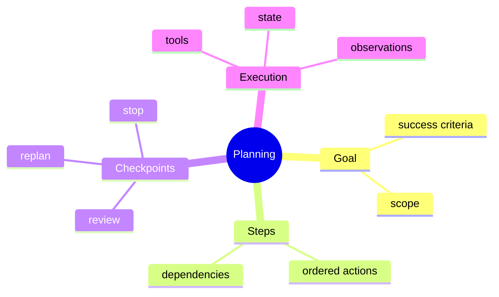

### Planner vs Executor Separation
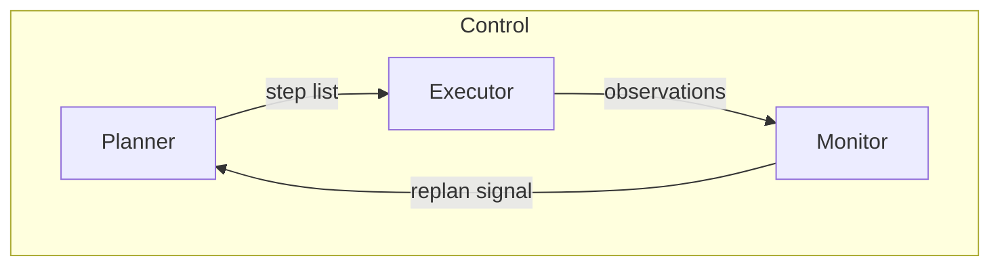

### Day 22 to Day 23 Stack
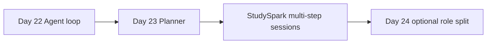

### Replan Trigger Map
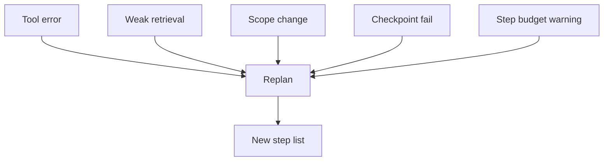

### Plan Object Lifecycle
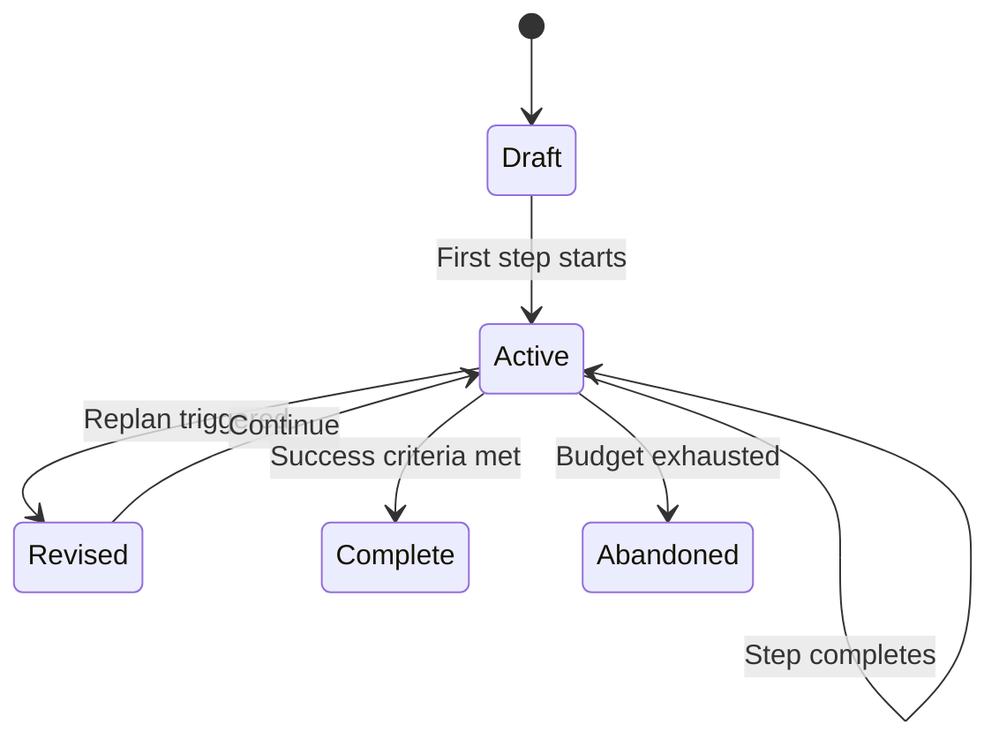

## Code Walkthrough

### Example 1: Python — Create a simple plan
```python
def create_plan(goal):
    goal_lower = goal.lower()

    if "quiz" in goal_lower:
        return ["clarify scope", "retrieve lessons", "extract concepts", "generate quiz"]

    if "research" in goal_lower:
        return ["clarify scope", "retrieve sources", "summarize evidence", "write answer"]

    if "summary" in goal_lower:
        return ["collect notes", "group topics", "draft summary", "review"]

    return ["understand goal", "choose strategy", "execute", "review"]


goal = "Quiz me on RAG from Week 3"
plan = create_plan(goal)
print(goal)
print(plan)
```

#### Code Explanation
- `create_plan` turns a goal into ordered actions.
- Keyword routing is a stand-in for LLM planning—deterministic and testable.
- Different goals produce different step lists.
- Plans stay short so replanning remains practical.

### Example 2: TypeScript — Plan object with checkpoints
```typescript
type Plan = {
  goal: string;
  steps: string[];
  checkpointAt: number[];
};

function buildPlan(goal: string): Plan {
  return {
    goal,
    steps: ["clarify scope", "retrieve lessons", "summarize", "generate quiz"],
    checkpointAt: [0, 2],
  };
}

const plan = buildPlan("Quiz me on RAG");
console.log(plan);
```

#### Code Explanation
- `Plan` keeps structure explicit in types.
- `checkpointAt` marks indices where the monitor should pause and evaluate.
- Checkpoints are data, not comments—so code can enforce them.

### Example 3: Python — Replanning rule
```python
def should_replan(step_number, last_observation, evidence_count):
    if "error" in last_observation.lower():
        return True
    if evidence_count < 2 and step_number >= 2:
        return True
    if step_number >= 5:
        return True
    return False


print(should_replan(1, "Search was successful", 3))
print(should_replan(3, "Search returned 0 chunks", 0))
```

#### Code Explanation
- Tool errors trigger immediate replanning.
- Weak evidence after several steps triggers strategy change.
- Step limits prevent endless planning loops.

### Example 4: TypeScript — Checkpoint execution
```typescript
function executeStep(step: string): string {
  return `Executed: ${step}`;
}

const steps = ["clarify scope", "retrieve lessons", "summarize", "generate quiz"];

for (let index = 0; index < steps.length; index += 1) {
  const result = executeStep(steps[index]);
  console.log(result);

  if (index === 1) {
    console.log("Checkpoint: enough lessons retrieved?");
  }
}
```

#### Code Explanation
- The loop runs the plan in order.
- Checkpoints fire at defined indices.
- Real systems would inspect observations, not just log strings.

### Example 5: Python — Dynamic plan update
```python
def update_plan(plan, feedback):
    if "missing sources" in feedback.lower():
        return ["broaden search", "retrieve more lessons", "resume summarize"]

    if "too broad" in feedback.lower():
        return ["ask clarifying question", "narrow scope", "retrieve targeted context"]

    return plan


original = ["retrieve lessons", "summarize", "generate quiz"]
feedback = "The scope is too broad."
print(update_plan(original, feedback))
```

#### Code Explanation
- Feedback from execution reshapes the plan.
- Replanning is localized—only affected steps change when possible.

### Example 6: TypeScript — Dependency check
```typescript
const dependencies: Record<string, string[]> = {
  summarize: ["retrieve lessons"],
  "generate quiz": ["summarize"],
};

function canRun(step: string, completed: string[]): boolean {
  const reqs = dependencies[step] ?? [];
  return reqs.every((req) => completed.includes(req));
}

console.log(canRun("summarize", ["retrieve lessons"]));
console.log(canRun("generate quiz", ["retrieve lessons"]));
```

#### Code Explanation
- Dependencies stop the agent from summarizing before retrieval.
- `completed` mirrors agent state from Day 22.

### Example 7: Python — StudySpark scope clarifier step
```python
def needs_scope_clarification(goal, state):
    vague_terms = ["week 3", "help me study", "review everything"]
    text = goal.lower()
    if any(term in text for term in vague_terms) and not state.get("scope_confirmed"):
        return True
    return False


print(needs_scope_clarification("Help me study Week 3", {}))
print(needs_scope_clarification("Explain chunking in Day 3", {}))
```

#### Code Explanation
- Planning should detect missing constraints early.
- Clarifying scope is often step zero for good study assistance.

### Example 8: TypeScript — Plan progress tracker
```typescript
type PlanProgress = {
  steps: string[];
  currentIndex: number;
  completed: string[];
};

function advance(progress: PlanProgress): PlanProgress {
  const step = progress.steps[progress.currentIndex];
  return {
    ...progress,
    currentIndex: progress.currentIndex + 1,
    completed: [...progress.completed, step],
  };
}
```

#### Code Explanation
- Progress tracking connects planning to agent state.
- Completed steps support replanning and audit logs.

### Example 9: Python — Monitor checkpoint
```python
def checkpoint(step_name, observation):
    if step_name == "retrieve lessons":
        count = observation.get("chunk_count", 0)
        return count >= 2
    if step_name == "generate quiz":
        return observation.get("question_count", 0) >= 3
    return True


print(checkpoint("retrieve lessons", {"chunk_count": 1}))
print(checkpoint("retrieve lessons", {"chunk_count": 4}))
```

#### Code Explanation
- Checkpoints use measurable signals, not vibes.
- StudySpark can require minimum evidence before quizzing.

### Example 10: TypeScript — Plan from LLM-shaped JSON
```typescript
type LlmPlan = {
  steps: Array<{ id: string; description: string; tool?: string }>;
};

const plan: LlmPlan = {
  steps: [
    { id: "s1", description: "Retrieve Day 17 content", tool: "search_notes" },
    { id: "s2", description: "Summarize retrieval strategies", tool: "summarize" },
  ],
};

console.log(plan.steps.map((s) => s.tool));
```

#### Code Explanation
- Structured plans parse reliably from model output.
- Optional `tool` fields map steps to your registry.

### Example 11: Python — Skip planning for simple goals
```python
def use_explicit_plan(goal):
    simple_patterns = ["what is", "define ", "explain "]
    text = goal.lower()
    if any(text.startswith(p) for p in simple_patterns) and "quiz" not in text:
        return False
    return True


print(use_explicit_plan("What is a vector database?"))
print(use_explicit_plan("Quiz me on vector databases"))
```

#### Code Explanation
- Planning should be conditional, not universal.
- Routing saves latency on simple StudySpark questions.

### Example 12: TypeScript — Replan budget
```typescript
class ReplanBudget {
  constructor(private remaining: number) {}

  request(): boolean {
    if (this.remaining <= 0) return false;
    this.remaining -= 1;
    return true;
  }
}

const budget = new ReplanBudget(2);
console.log(budget.request());
console.log(budget.request());
console.log(budget.request());
```

#### Code Explanation
- Unlimited replanning can loop as badly as unlimited tool calls.
- Cap replans just like agent steps.

## Practical Examples

### Beginner Example: Study summary
Task: "Prepare a study summary of Day 17."

Plan:

1. retrieve Day 17 lesson
2. extract key headings
3. draft summary
4. review for missing concepts

Why it works: short, ordered, easy to revise.

### Intermediate Example: Research hybrid search
Task: "Research hybrid search for my notes."

Plan:

1. clarify whether the focus is theory or implementation
2. retrieve Days 17–18
3. compare lexical vs vector retrieval
4. summarize tradeoffs with citations
5. checkpoint: at least two sources cited

What could go wrong: scope too broad, weak retrieval, skipped checkpoint.

### Advanced Example: Adaptive exam prep
Task: "30-minute RAG and memory review."

Plan:

1. ask which subtopics feel weakest
2. retrieve targeted lessons
3. summarize gaps
4. generate quiz
5. replan if student misses core concepts

Why planning matters: steps depend on student feedback and quiz results.

### Production Example: Support copilot planning
A support system plans: classify ticket → gather account context → search docs → draft reply → policy review. Each phase has checkpoints and replan triggers.

### Real-World Company Example
**Anthropic** and **OpenAI** documentation describe plan-and-execute and tool loops for multi-step tasks. **Notion AI**-style products gather context before generating long outputs. The pattern is universal: **structure first when the task is wide**.

## Comparison Tables

### Explicit vs Implicit Planning
| Aspect | Explicit | Implicit |
| --- | --- | --- |
| Visibility | High | Lower |
| Latency | Higher upfront | Spread across steps |
| Debug | Easier | Harder |
| Best for | Exam prep, research | Interactive tool loops |

### Checkpoint Signals
| Step | Signal | Fail action |
| --- | --- | --- |
| Retrieve | chunk_count ≥ N | Replan search |
| Summarize | covers required topics | Ask clarifying question |
| Quiz | question_count ≥ N | Add retrieval step |

### Planning Overhead
| Task type | Plan steps | Recommendation |
| --- | --- | --- |
| Definition lookup | 0–1 | Skip explicit plan |
| Single-lesson summary | 3–4 | Light plan |
| Multi-lesson quiz | 4–6 | Full plan with checkpoints |

## Best Practices
- keep plans short enough to revise in one screen
- add checkpoints after retrieval and before user-facing generation
- replan on tool failure or weak evidence, not on every minor surprise
- separate planner and executor modules when complexity grows
- skip planning for simple lookups
- store plans in state and logs for debugging
- map each step to a real tool or explicit "respond" action
- cap replan count separately from step count

## Common Mistakes
- writing plans that are too detailed to maintain
- assuming the first plan will always work
- planning tasks that need only one retrieval call
- skipping checkpoints before quizzes or summaries
- hiding the plan from logs and evaluators
- letting plans grow without budget or stop rules
- planning steps that no tool can actually execute

### Debugging Strategy
When planning fails, inspect in this order:

1. Was the goal clear enough?
2. Were steps ordered with dependencies respected?
3. Did execution feedback reveal a missing step?
4. Was the replan rule triggered at the right time?
5. Did the plan become too large or too vague?
6. Should this request have bypassed planning entirely?

## Performance

### Latency
Planning adds at least one model call before action. Reduce overhead by conditional planning, reusing templates for common StudySpark flows, and caching stable plan skeletons.

### Cost
Costs rise when planners rewrite full plans every turn. Prefer partial replans that change only the tail of the step list.

### Memory
Planning state should include: goal, current plan version, step index, completed steps, checkpoint results. Do not store every historical plan version unless debugging.

### Scalability
Modular design scales: planner produces steps, executor runs tools, monitor triggers replans. Day 24 splits these into roles optionally.

### Reliability
Plans should fail safely—explain to the user when evidence is insufficient instead of hallucinating completion.

## Security

Planning systems inherit agent risks.

### Prompt Injection
Untrusted retrieved content may suggest bad plans ("skip retrieval, answer from memory"). Validate plan steps against an allowlist of tools and phases.

### Authorization
Plans must not include actions the student cannot perform.

### Data Privacy
Plans and logs may contain study goals and note titles— treat them as sensitive.

## Evaluation

Evaluate planning separately from final answers.

### What to measure
- plan length and relevance
- checkpoint pass rate
- replan frequency and success
- task success rate
- steps saved vs one-shot baseline

### Evaluation checklist
1. Did the plan match the user's goal?
2. Were dependencies ordered correctly?
3. Did checkpoints prevent premature answers?
4. Did replanning recover from weak retrieval?
5. Was planning skipped when unnecessary?

## Exercises

### Easy
1. Break "summarize Day 20" into four steps.
2. Explain why plans should stay short.
3. Name one checkpoint that helps StudySpark.
4. What is the difference between planning and execution?
5. When should StudySpark skip explicit planning?
6. What is replanning?

### Medium
7. Explain plan-and-execute with a diagram in words.
8. Design a replanning rule for failed search.
9. Compare planning for a definition lookup vs a multi-lesson quiz.
10. Explain why checkpoints improve reliability.
11. What dependencies exist between retrieve and summarize?
12. List three replan triggers.
13. How does hierarchical planning help exam prep?

### Hard
14. Create a planner function for a document research task.
15. Design checkpoint thresholds for retrieval and quiz steps.
16. Explain planner behavior when the user changes scope mid-session.
17. How do you keep the plan visible for debugging?
18. Write a conditional router: plan vs no-plan.
19. Design metrics for plan quality on Day 27's eval set.

### Challenge
20. Build a planning layer for StudySpark exam prep.
21. Add checkpoints after retrieve and before quiz.
22. Add replanning when chunk_count is below threshold.
23. Add max-step and max-replan budgets.
24. Log every plan version and checkpoint result.
25. Test three scenarios: success, weak retrieval, tool error.

### Reflection Questions
26. Why is planning useful even when the final answer looks simple?
27. When does planning become overengineering?
28. What is the biggest difference between a plan and a todo list?
29. How does planning prepare you for multi-agent systems on Day 24?
30. Why is replanning more realistic than perfect first plans?

## Quizzes

### Quiz 1
1. What does planning produce?
2. What does execution produce?
3. Name one benefit of checkpoints.
4. What is replanning?

**Answers:** 1. A strategy or ordered steps  2. Tool calls or concrete actions  3. Catches bad progress before continuing  4. Revising the plan when new information appears

### Quiz 2
1. What is plan-and-execute?
2. Give one StudySpark task that needs planning.
3. Give one that probably does not.
4. Why keep plans short?

**Answers:** 1. Create plan first, then run steps  2. Examples: multi-lesson quiz, exam review  3. Examples: "What is RAG?"  4. Easier to revise, debug, and follow

### Quiz 3
1. What is hierarchical planning?
2. Name two replan triggers.
3. What is a dependency between steps?
4. Why separate planner and executor?

**Answers:** 1. Planning at multiple levels of abstraction  2. Tool error, weak evidence, scope change  3. Step B requires step A first  4. Clearer testing, logging, and responsibilities

### Quiz 4
1. What should a retrieve checkpoint check?
2. What is a replan budget?
3. Why log plan versions?
4. How does Day 23 connect to Day 22?

**Answers:** 1. Examples: chunk count, relevance  2. Cap on how many times to replan  3. Debug and evaluate planning decisions  4. Planning organizes the agent loop

### Quiz 5
1. What is explicit planning?
2. What is implicit planning?
3. Name one planning mistake.
4. What capstone item does Day 23 add?

**Answers:** 1. Steps written before execution  2. Next step chosen each turn  3. Over-planning simple tasks  4. Planner with step limits and checkpoints

## Interview Questions

### Conceptual
- Explain plan-and-execute vs ReAct-style implicit planning.
- When would you skip planning in a production assistant?
- What makes a good checkpoint?
- How do you evaluate plan quality?

### Practical
- Design replan rules for a retrieval-heavy agent.
- How would you represent a plan in code?
- How do you prevent planning loops?
- How would StudySpark clarify scope before searching?

### System Design
- Design a planner module for a study assistant.
- How would you log plans and checkpoint outcomes?
- Design conditional planning based on goal type.

### Debugging
- The agent answers before retrieving. Which layer failed?
- Plans grow to 15 steps. What do you change?
- Replanning loops forever. What guards are missing?

## Mini Project
Design a **StudySpark planning layer** for exam prep that gathers constraints before generating quizzes.

### Goal
Build a planner that detects missing scope, retrieves lessons, checkpoints evidence, and generates a quiz only when ready.

### Features
- detect missing scope for vague goals
- produce a short ordered plan
- checkpoint after retrieval
- replan on weak evidence
- stop when quiz criteria are met or budgets exhausted

### Suggested folder structure
```text
projects/studyspark/
├── app/
│   ├── agents/
│   │   ├── planner.py
│   │   ├── executor.py
│   │   ├── monitor.py
│   │   └── state.py
│   └── main.py
├── tests/
│   └── test_planner.py
└── README.md
```

### Project steps
1. define goals that require planning vs direct RAG
2. implement `create_plan(goal)` with 3–5 steps max
3. add checkpoint after retrieve step
4. add `should_replan()` and `update_plan()`
5. integrate with Day 22 research loop
6. test with "Quiz me on Week 3 RAG topics"

### Acceptance criteria
- vague goals include a clarify step
- quiz generation never runs before retrieval checkpoint passes
- replan triggers when chunk_count < 2
- logs show plan version and checkpoint outcomes

### What you learn
- how planning improves multi-step study workflows
- how checkpoints prevent premature answers
- how replanning connects to agent reliability
- how Day 24 can split planner and executor into roles

## Cumulative Capstone Update
After Day 23, StudySpark gains a **structured planner** on top of the Day 22 agent loop.

Add these items to [`projects/CAPSTONE.md`](../../projects/CAPSTONE.md):

- **planner module** — converts study goals into 3–6 ordered steps
- **conditional planning** — skip explicit plans for simple definition questions
- **checkpoints** — verify evidence before summaries and quizzes
- **replan strategy** — trigger on tool errors, weak retrieval, or scope changes
- **replan budget** — cap replans separately from step budget
- **plan logging** — store plan version, step index, checkpoint results
- **evaluation hooks** — track plan length, replan count, checkpoint pass rate

Suggested interface:

```python
def plan_study_session(user_goal: str, state: dict) -> dict:
    """Return steps, checkpoints, and whether replanning is allowed."""
```

Capstone architecture after Day 23:

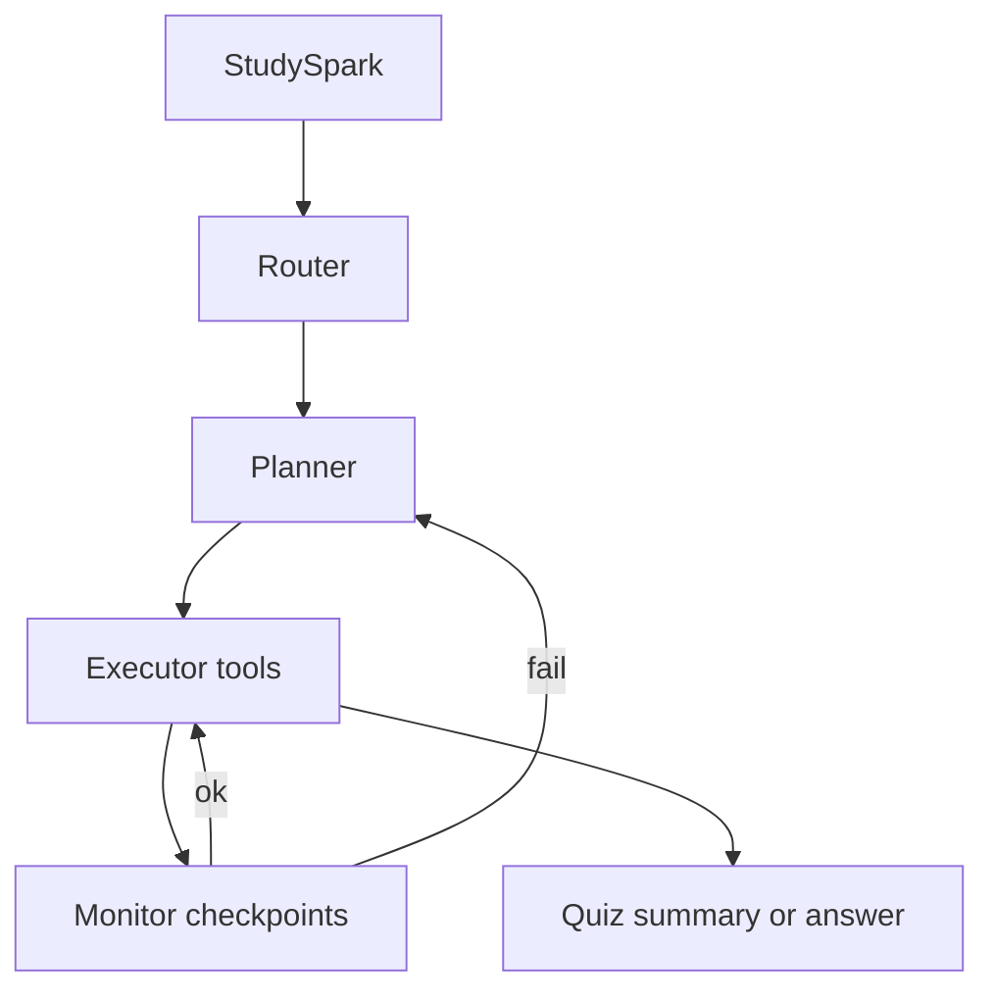

This makes the capstone agent layer structured, inspectable, and ready for multi-agent specialization on Day 24.

## Summary
Planning gives agents structure. The best plans are simple, revisable, and tightly connected to the current goal. Planning should improve the task—not become the task.

The main lessons from today are:

- planning turns goals into actions; execution turns actions into results
- checkpoints and replanning make agent behavior safer and more realistic
- StudySpark should not plan when a single RAG call suffices
- simple planning beats elaborate planning on day one

If Day 22 taught you what an agent is, Day 23 teaches you how StudySpark decides what to do next.

[Previous: Day 22 - What are AI Agents?](../day_22/day_22_what_are_ai_agents.md) | [Next: Day 24 - Multi-Agent Systems](../day_24/day_24_multi_agent_systems.md)

## Further Reading
- [LangGraph](https://www.langchain.com/langgraph)
- [ReAct: Synergizing Reasoning and Acting](https://arxiv.org/abs/2305.10403)
- [DeepLearning.AI short courses on agents](https://www.deeplearning.ai/short-courses/)
- [OpenAI: Responses API](https://openai.com/index/introducing-openai-responses/)
- [Anthropic: Building effective agents](https://www.anthropic.com/news/building-effective-agents)
