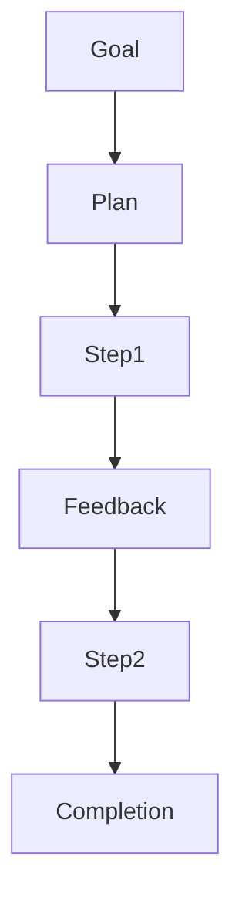

# Day 23 - Planning

[Previous: Day 22 - What are AI Agents?](../day_22/day_22_what_are_ai_agents.md) | [Next: Day 24 - Multi-Agent Systems](../day_24/day_24_multi_agent_systems.md)

## Introduction
Planning is the process of turning a goal into smaller steps. In agent systems, planning helps the model decide what to do first, what to check next, and when to stop.


## Learning Objectives
By the end of this day, you should be able to:

- explain why planning improves agent behavior
- break a task into ordered steps
- understand plan-and-execute style workflows
- design checkpoints for complex tasks
- recognize when planning is unnecessary

## Theory
Planning does not mean the model must produce a perfect future. It means the system should create a useful next-step strategy before acting. For small tasks, a short plan is enough. For bigger tasks, the plan may change as the agent learns more.

### Visual Diagram


## Code Examples

### Python
```python
goal = "Prepare a study summary"
plan = ["collect notes", "group topics", "draft summary", "review"]
print(goal)
print(plan)
```

### TypeScript
```typescript
const goal = 'Prepare a study summary';
const plan = ['collect notes', 'group topics', 'draft summary', 'review'];

console.log(goal);
console.log(plan);
```

## Best Practices
- keep plans short enough to revise
- add checkpoints after important steps
- replan when new information appears
- separate planning from execution when possible
- use planning only when the task benefits from it

## Common Mistakes
- writing plans that are too detailed to follow
- assuming the first plan will always work
- planning tasks that are simple enough for one step
- not checking if the plan is still valid
- hiding the plan from the control layer

## Exercises
- Easy: Break a simple task into steps.
- Medium: Explain plan-and-execute.
- Hard: Design a re-planning rule.
- Challenge: Create a planner for a document research task.

## Mini Project
Design a planning layer for a travel assistant that gathers constraints before making recommendations.

## Summary
Planning gives agents structure. The best plans are simple, revisable, and tightly connected to the current goal.

[Previous: Day 22 - What are AI Agents?](../day_22/day_22_what_are_ai_agents.md) | [Next: Day 24 - Multi-Agent Systems](../day_24/day_24_multi_agent_systems.md)

## Additional Resources
- https://www.langchain.com/langgraph
- https://arxiv.org/abs/2305.10403
- https://www.deeplearning.ai/short-courses/
