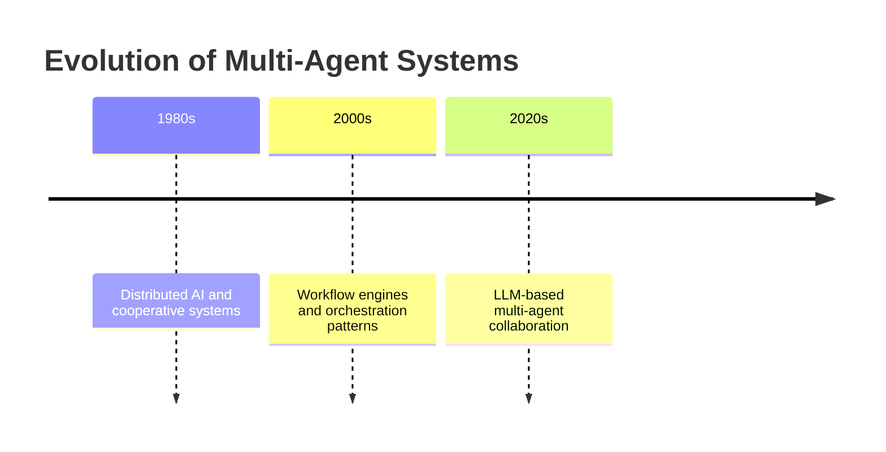
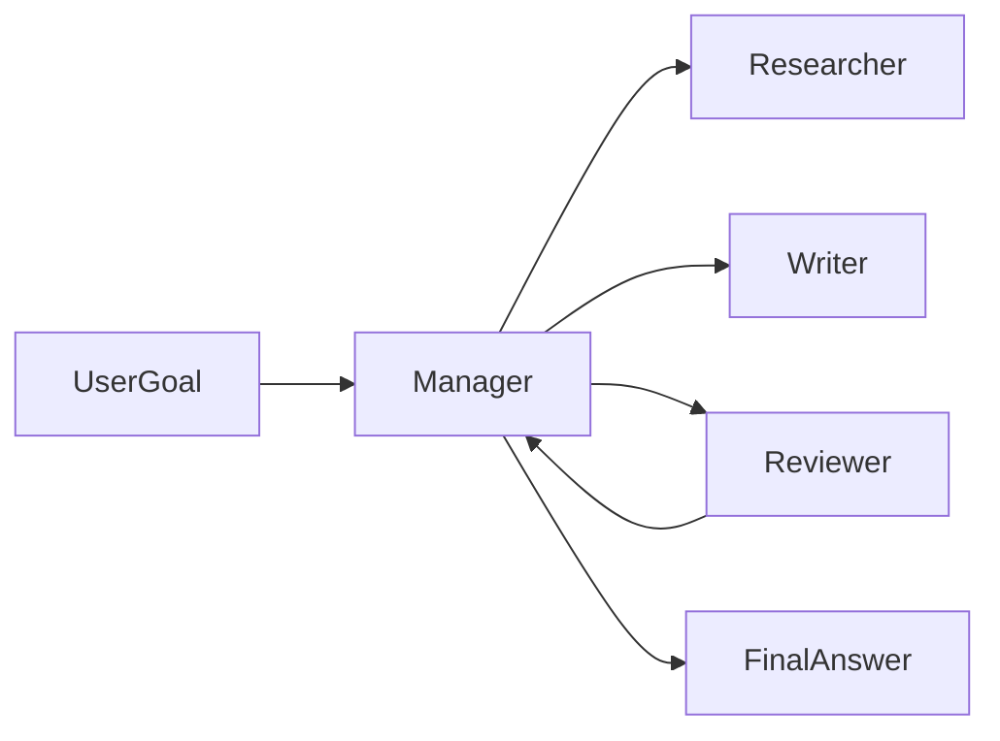
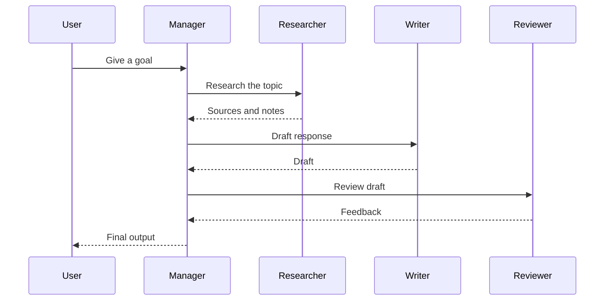
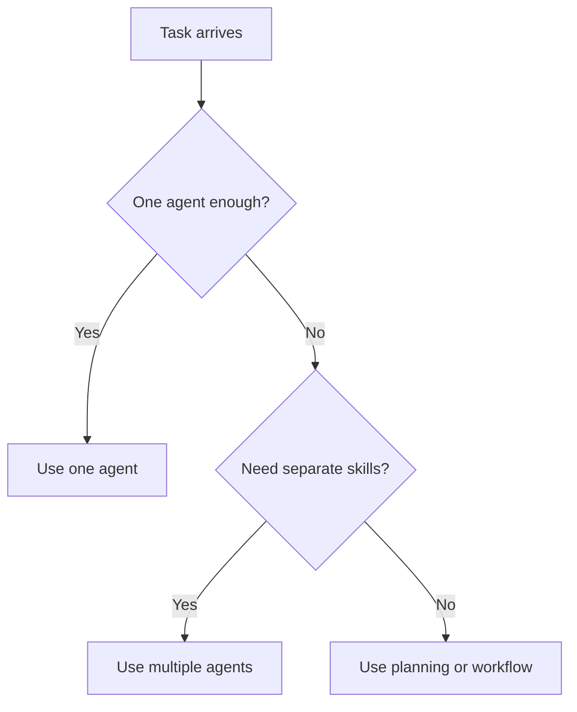
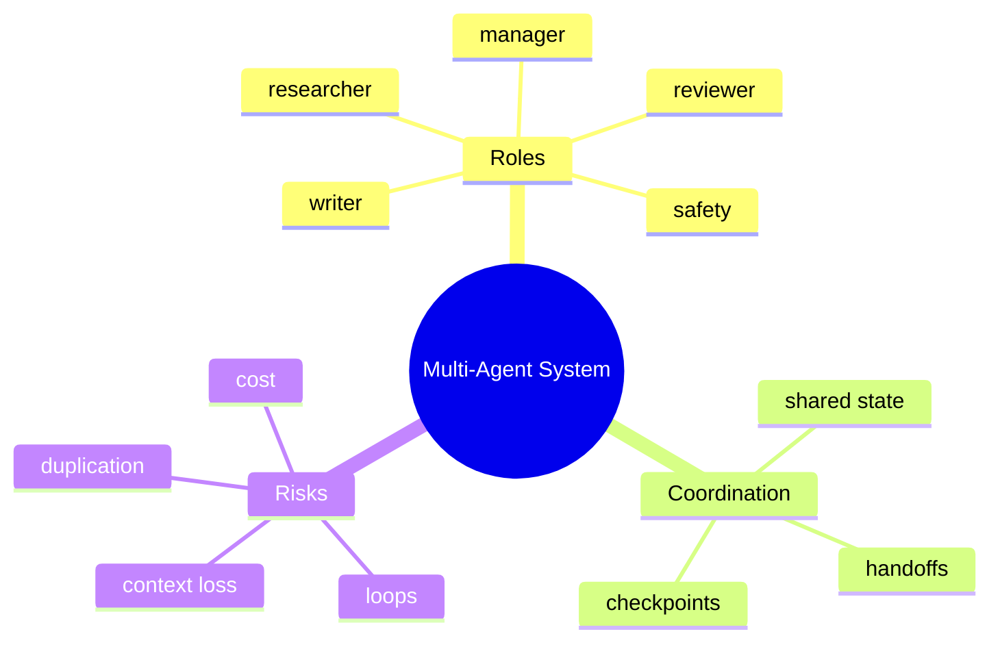

# Day 24 - Multi-Agent Systems

[Previous: Day 23 - Planning](../day_23/day_23_planning.md) | [Next: Day 25 - Model Context Protocol (MCP)](../day_25/day_25_model_context_protocol_mcp.md)

## Introduction
Yesterday we learned how planning helps a single agent turn a goal into steps. Today we go one level higher: what if one agent is not enough?

Multi-agent systems use more than one agent to solve a task. Different agents can specialize in research, planning, execution, review, safety, or summarization.


This matters because some tasks are too broad, too long, or too specialized for one agent. A research agent may find sources, a writing agent may draft text, and a review agent may check quality. The value comes from specialization, not from having many agents just for the sake of it.

## Learning Objectives
By the end of this day, you should be able to:

- explain why multiple agents can be useful
- identify agent roles and handoffs
- understand common coordination patterns
- compare centralized and decentralized control
- design a simple multi-agent workflow
- recognize coordination overhead and failure modes
- decide when a multi-agent system is unnecessary

## Prerequisites
You should already understand:

- Day 22: What are AI Agents?
- Day 23: Planning
- retrieval, memory, and RAG from Week 3

If those are still unfamiliar, review them first. Multi-agent systems are built on top of agent loops and planning, so they make most sense after those ideas are clear.

## Big Picture
Multi-agent systems split a complex task into specialized roles.


The key idea is simple:

- one agent may be good at gathering evidence
- another may be good at drafting
- another may be good at checking quality

Coordination turns those separate skills into a coherent result.

## Why Multi-Agent Systems Exist
Multi-agent systems exist because one agent can become overloaded when a task needs different skills.

Examples include:

- research and writing
- planning and execution
- generation and review
- content creation and safety checking
- data gathering and synthesis

Instead of forcing one agent to do everything, we can assign clear roles and let each one focus on a smaller job.

## Historical Background
Multi-agent ideas have existed for a long time in AI research, distributed systems, and workflow orchestration.

The modern version uses LLMs as flexible decision-makers, but the architectural idea is old: divide work, coordinate ownership, and define handoffs.



## Deep Theory

### What is a multi-agent system?
A multi-agent system is a system in which several agents cooperate, compete, or coordinate to solve a task.

In this course, we focus mostly on cooperative systems, where agents work together toward a shared goal.

### Why specialization helps
Specialization improves clarity and quality.

If one agent tries to do everything, it may:

- lose track of subgoals
- mix research with writing
- skip review
- carry too much context

When roles are separated, each agent can be simpler and more reliable.

### Common roles
| Role | Responsibility |
| --- | --- |
| Manager | Assigns work and coordinates the system |
| Researcher | Finds evidence or sources |
| Planner | Breaks goals into steps |
| Writer | Produces a draft or response |
| Reviewer | Checks quality, clarity, or safety |
| Critic | Identifies weaknesses or missing pieces |
| Safety agent | Checks policy or risk |

### Coordination patterns
There are several common ways to coordinate multiple agents.

#### 1. Manager-worker pattern
One agent manages the task and delegates to specialist agents.

This is common because it keeps control centralized and easier to debug.

#### 2. Sequential handoff pattern
One agent completes its job and passes the result to the next.

This works well when the task has a natural order.

#### 3. Parallel collaboration pattern
Several agents work on different parts at the same time.

This can improve speed, but it needs careful merging.

#### 4. Critic-review pattern
One agent drafts, another criticizes, and another revises.

This is often useful for quality improvement.



### Centralized versus decentralized control
In centralized control, one manager decides what happens next.

In decentralized control, agents may interact more directly with each other.

| Control Model | Strength | Weakness |
| --- | --- | --- |
| Centralized | Easier to govern and debug | Single coordination bottleneck |
| Decentralized | Flexible and parallel | Harder to control and inspect |

For beginners, centralized control is usually the better choice.

### Handoffs
Handoffs are the points where one agent passes output to another.

Good handoffs should include:

- the task result
- the relevant evidence
- the current state
- any constraints or warnings

Poor handoffs lose context and create duplicate work.

### Shared state
Multi-agent systems need a careful approach to shared state.

Too little shared state makes agents blind to each other. Too much shared state creates confusion and coupling.

The best pattern is usually:

- shared goal
- minimal shared task state
- clear ownership per agent
- explicit logs of what each agent did

### Advantages
- divides complex tasks into manageable pieces
- supports specialization
- can improve quality through review and critique
- can run some work in parallel
- makes role boundaries clearer

### Limitations
- more coordination overhead
- more opportunities for loops or duplication
- harder to debug than one agent
- more prompt and state management complexity
- not always better than a single agent

### Alternatives
- one narrow agent
- a fixed workflow engine
- a planning-only assistant
- a human-in-the-loop workflow

### When should you use a multi-agent system?
Use it when the task:

- has distinct phases
- needs different expertise
- benefits from review or critique
- can be parallelized
- is too large for one agent to manage cleanly

### When should you not use it?
Do not use multi-agent design when:

- one agent is enough
- the coordination cost would outweigh the benefit
- the task is simple and deterministic
- debugging would become too difficult for the value gained

## Visual Learning

### Multi-Agent Workflow


### Decision Tree


### System Map


## Code Walkthrough

The following examples show the coordination idea in a compact form.

### Python Example: Role-based agent pipeline
```python
def research_agent(goal):
        return f"Research notes for: {goal}"


def writing_agent(notes):
        return f"Draft based on: {notes}"


def review_agent(draft):
        return f"Reviewed draft: {draft}"


goal = 'Create a short report about hybrid search'
notes = research_agent(goal)
draft = writing_agent(notes)
review = review_agent(draft)

print(notes)
print(draft)
print(review)
```

#### Code Explanation
- `research_agent` gathers notes.
- `writing_agent` turns notes into a draft.
- `review_agent` checks the draft.
- each function has one role, which makes the pipeline easy to understand.

### TypeScript Example: Agent registry
```typescript
type Agent = (input: string) => string;

const agents: Record<string, Agent> = {
    research: (input) => `Research notes for: ${input}`,
    write: (input) => `Draft based on: ${input}`,
    review: (input) => `Reviewed draft: ${input}`,
};

function runAgent(name: string, input: string): string {
    const agent = agents[name];

    if (!agent) {
        throw new Error(`Unknown agent: ${name}`);
    }

    return agent(input);
}

console.log(runAgent('research', 'multi-agent systems'));
```

#### Code Explanation
- `Agent` defines a shared interface.
- `agents` stores the available roles.
- `runAgent` centralizes access and validation.

### Python Example: Manager handoff logic
```python
def manager(goal):
        research_notes = research_agent(goal)
        draft = writing_agent(research_notes)
        review = review_agent(draft)

        return {
                'goal': goal,
                'research': research_notes,
                'draft': draft,
                'review': review,
        }


result = manager('Create a short report about hybrid search')
print(result)
```

#### Code Explanation
- `manager` orchestrates the agents.
- each stage returns data to the manager.
- the manager decides the sequence and collects the outputs.

### TypeScript Example: Shared state object
```typescript
type SharedState = {
    goal: string;
    researchNotes?: string;
    draft?: string;
    review?: string;
};

const state: SharedState = {
    goal: 'Create a short report about hybrid search',
};

console.log(state);
```

#### Code Explanation
- `SharedState` defines the minimal state the system needs.
- each field is optional because it may be filled in later.
- keeping state explicit improves traceability.

### Python Example: Detect duplicate work
```python
def already_done(state, step):
        return step in state.get('completed_steps', [])


state = {'completed_steps': ['research']}
print(already_done(state, 'research'))
print(already_done(state, 'write'))
```

#### Code Explanation
- `already_done` helps prevent repeated work.
- tracking completed steps is a simple but important coordination guard.

## Practical Examples

### Beginner Example: Three-agent knowledge report
One agent finds sources, another summarizes them, and a third checks quality.

Why it works:

- each role is easy to understand
- the workflow follows a natural order
- quality review becomes a separate responsibility

### Intermediate Example: Research and writing collaboration
The research agent collects evidence, the writer drafts the report, and the reviewer checks for missing citations.

What could go wrong:

- the writer may over-interpret the evidence
- the reviewer may not see the original sources
- the manager may send too much context to every agent

### Professional Example: Support triage workflow
A support system may use one agent to classify the issue, another to gather context, and a third to draft the response.

Why professionals like this:

- tasks are separated by function
- each agent can be tuned for its own role
- review and safety can be inserted before customer-facing output

### Real-World Company Example
Companies building internal copilots often use multi-step, multi-role workflows even when they do not label them as such.

For example, one component may retrieve documents, another may summarize them, and another may format the result for the user. That is a multi-agent style system at the architectural level.

## Best Practices
- assign clear roles to each agent
- define handoff rules and ownership
- keep shared state minimal and explicit
- add stopping conditions to prevent loops
- measure whether multiple agents actually improve quality
- prefer centralized control for the first version
- keep agent outputs structured when possible
- log every handoff and result

## Common Mistakes
- creating agents without clear purpose
- letting agents duplicate each other's work
- passing too much state between agents
- ignoring coordination overhead
- using multi-agent design when one agent is enough
- making the system so complex that debugging becomes impossible

### Debugging Strategy
When a multi-agent system fails, inspect it in this order:

1. Were the agent roles distinct?
2. Was the handoff complete?
3. Did one agent repeat another agent’s work?
4. Did the manager coordinate steps in the right order?
5. Did the final reviewer have enough context?

This helps determine whether the problem is role design, handoff design, or orchestration.

## Performance

Multi-agent systems can improve quality, but they also add overhead.

### Latency
Latency grows when multiple agents run in sequence.

You can reduce it by:

- parallelizing independent work
- keeping agent roles narrow
- avoiding unnecessary review loops
- using the smallest useful set of agents

### Cost
Costs rise when:

- each agent makes its own model calls
- the manager repeatedly passes large context blocks
- the system loops between agents too many times

### Memory
Shared state should stay small.

If every agent receives the full history, the system becomes expensive and noisy.

### Scalability
To scale multi-agent systems, teams often:

- standardize handoff schemas
- isolate each agent’s responsibility
- parallelize independent subtasks
- make the manager the single source of coordination

### Reliability
Reliability improves when the coordination rules are simple and observable.

If the system cannot explain why one agent handed work to another, it will be difficult to trust or debug.

## Security

Multi-agent systems increase the surface area for mistakes.

### Prompt Injection
One agent may pass harmful text to another agent if the handoff is not controlled.

### Secrets and API Keys
Only the appropriate agent or tool should see secrets.

### Authentication and Authorization
Each agent should only access the tools and data it is allowed to use.

### Data Privacy
Shared state may move sensitive context between agents. Keep that scope minimal.

### Hallucinations and Model Safety
One agent may hallucinate and another may trust the hallucination.

That is why review agents and validation checks matter.

## Evaluation
Evaluate multi-agent systems by looking at the whole workflow.

### What to measure
- task success rate
- handoff quality
- duplicate work rate
- loop frequency
- final answer quality
- review effectiveness

### Useful questions
- Did the right agent do the right task?
- Was the handoff complete?
- Did the reviewer catch real issues?
- Did the system finish faster or slower than a single agent?

## Exercises

### Easy
1. Name three agent roles.
2. Explain why coordination is hard.
3. Describe one benefit of specialization.
4. Explain why a manager agent is useful.

### Medium
5. Compare centralized and decentralized control.
6. Explain why shared state should be minimal.
7. Describe how a handoff should work.
8. Explain why multi-agent systems can be slower than single-agent systems.

### Hard
9. Design a multi-agent workflow for research and writing.
10. Propose a handoff protocol between agents.
11. Explain how to prevent duplicate work.
12. Describe how to add a reviewer without creating a loop.

### Challenge
13. Create a three-agent system for a knowledge report.
14. Add explicit handoff messages and shared state.
15. Add a stop rule for the manager.
16. Add a reviewer that checks citations.
17. Add logging for every agent action.

### Reflection Questions
18. Why are more agents not always better?
19. When does specialization improve quality?
20. What is the biggest coordination risk in a multi-agent design?
21. How does this lesson prepare you for MCP?
22. Where would you draw the line between one agent and many?

## Mini Project
Create a three-agent system for a knowledge report: one agent finds sources, one summarizes, and one checks quality.

### Goal
Build a small multi-agent workflow that produces a short, cited report from a knowledge base.

### Features
- a researcher agent that collects sources
- a writer agent that creates the draft
- a reviewer agent that checks quality and citations
- a manager agent that coordinates the handoffs
- logging for every step

### Suggested folder structure
```text
report-agents/
├── app/
│   ├── manager.py
│   ├── researcher.py
│   ├── writer.py
│   ├── reviewer.py
│   ├── state.py
│   └── main.py
├── tests/
│   └── test_workflow.py
└── README.md
```

### Project Steps
1. define the three roles
2. decide what each handoff should contain
3. implement the manager coordination logic
4. keep shared state explicit
5. add a review step before final output
6. test with a knowledge-report prompt

### What You Learn
- how coordination changes system design
- how role boundaries reduce confusion
- how reviews can improve quality
- how this lesson leads naturally into MCP and tool access standardization

## Capstone Update
Add these items to the final capstone plan:

- at least one manager agent for coordination
- specialized sub-agents or subtasks for research, drafting, and review
- explicit handoff payloads
- a shared state structure with minimal fields
- logging for each agent transition

This gives the final capstone a realistic multi-agent shape without making it unnecessarily complex.

## Summary
Multi-agent systems are powerful when roles are clear and coordination is controlled.

More agents are not automatically better. The value comes from specialization, handoffs, and careful orchestration.

The main lessons from today are:

- split work only when the task benefits from specialization
- keep handoffs small and explicit
- use a manager to reduce chaos
- evaluate whether multi-agent design actually improves quality

If Day 23 taught you how to plan, Day 24 teaches you how to divide the work across multiple agents.

[Previous: Day 23 - Planning](../day_23/day_23_planning.md) | [Next: Day 25 - Model Context Protocol (MCP)](../day_25/day_25_model_context_protocol_mcp.md)

## Further Reading
- https://www.langchain.com/langgraph
- https://www.anthropic.com/news/building-effective-agents
- https://www.deeplearning.ai/short-courses/
- https://arxiv.org/abs/2408.15299
