# Day 24 - Multi-Agent Systems

[Previous: Day 23 - Planning](../day_23/day_23_planning.md) | [Next: Day 25 - Model Context Protocol (MCP)](../day_25/day_25_model_context_protocol_mcp.md)

## Introduction
Yesterday we learned how planning helps a single agent turn a goal into ordered steps with checkpoints and replanning. Today we go one level higher: **what if one agent is not enough?**

Think of a study group. One person is great at finding sources in the textbook, another explains concepts clearly, and a third catches mistakes in practice problems. They succeed because roles are clear—not because twelve people argue about everything at once.

Multi-agent systems use more than one agent to solve a task. Different agents can specialize in research, planning, execution, writing, review, or safety. For **StudySpark**, a researcher agent might gather lesson chunks, a writer agent might draft a summary or quiz, and a reviewer agent might check citations before the student sees anything.


This matters because some tasks are too broad for one prompt and one loop. But more agents are not automatically better. The value comes from **specialization, clean handoffs, and controlled coordination**—not from agent count.

Today you will learn when to split work across agents, how to coordinate them safely, and when a well-planned single agent is the smarter design.

## Learning Objectives
By the end of this day, you should be able to:

- explain why multiple agents can improve quality on complex tasks
- identify agent roles, handoffs, and ownership boundaries
- compare centralized manager vs decentralized coordination
- design a simple multi-agent workflow for StudySpark
- recognize coordination overhead, loops, and context-loss failure modes
- decide when multi-agent design is unnecessary
- connect multi-agent patterns to Day 23 planning and Day 22 agent loops
- sketch logging and shared-state structures for multi-agent debugging

## How to Use This Lesson

This lesson is designed for **all skill levels**. Pick one path and follow it consistently.

| Level | Suggested approach | Time |
| --- | --- | --- |
| **Beginner** | Read Introduction → Big Picture → Deep Theory → trace one code example → Easy exercises | 5–7 hours |
| **Intermediate** | Skim objectives → Visual Learning → Code Walkthrough → Medium/Hard exercises → Mini project | 3–5 hours |
| **Advanced** | Deep Theory tradeoffs → Hard/Challenge exercises → extend mini project → capstone slice | 2–3 hours |

### Apply Today
Complete at least one item before moving to the next day:
- [ ] Trace one code example in **Python or TypeScript** (one language is enough)
- [ ] Complete exercises for your level (see Exercises section)
- [ ] Update [`projects/CAPSTONE.md`](../../projects/CAPSTONE.md) with today's capstone item
- [ ] Add today's component to `projects/studyspark/` or update `projects/CAPSTONE.md`.

> **Stuck?** Re-read Big Picture, review Prerequisites, or see [SYLLABUS.md](../../SYLLABUS.md) for path guidance.

## Prerequisites
You should already understand:

- Day 22: What are AI Agents? — loops, tools, state, stop rules
- Day 23: Planning — plan-and-execute, checkpoints, replanning
- Day 17–21: RAG, memory, and the StudySpark knowledge assistant

You should also be comfortable with:

- modular code organization (functions, modules, typed objects)
- basic logging and test ideas from earlier weeks

Multi-agent systems are built on top of agent loops and planning. If those feel shaky, review Days 22–23 first.

## Big Picture
Multi-agent systems split a complex task into specialized roles coordinated by explicit rules.


The key idea:

- one agent may excel at gathering evidence
- another may excel at drafting student-friendly explanations
- another may excel at catching missing citations or unsafe content

Coordination turns separate skills into one coherent StudySpark experience.

## Why Multi-Agent Systems Exist
One agent can become overloaded when a task needs **different expertise at different phases**.

StudySpark examples:

| Task phase | Specialist need |
| --- | --- |
| Retrieval | precise search, filter by lesson metadata |
| Explanation | simplify language for beginner path |
| Quiz writing | structured output with difficulty tags |
| Review | citation and policy checks |

Instead of one mega-prompt trying to "do everything," roles divide the problem. The tradeoff is coordination cost. Day 24 teaches you to pay that cost only when specialization earns its keep.

### StudySpark Week 4 decision framework
Before adding agents, run this checklist against your Day 23 single-agent planner:

1. **Quality gap** — Does a reviewer catch citation errors the single agent misses on your eval set?
2. **Prompt conflict** — Does one system prompt try to be both "precise retriever" and "friendly tutor"?
3. **Context overload** — Does combined history exceed useful context for one call?
4. **Latency budget** — Can you afford two or three model calls per student request?
5. **Debug cost** — Can you log handoffs clearly enough to explain failures to a teammate?

If you answer "no" to most items, keep StudySpark on one agent with planning. If "yes" to several, pilot a three-role pipeline on one feature—quiz generation or lesson reports—before converting the whole product.

| StudySpark feature | Suggested starting architecture |
| --- | --- |
| Single-topic Q&A | Day 21 RAG only |
| Multi-step review session | Day 22–23 single agent |
| Cited lesson report | Three-agent pipeline |
| Full exam coach | Multi-agent plus MCP (Days 24–25) |

## Historical Background
Multi-agent ideas are old in AI research and software engineering. Distributed problem-solving, blackboard architectures, and workflow orchestration all split work across components with defined interfaces.

The modern LLM twist is flexible language-based reasoning inside each role. The architectural lesson remains: **divide work, define handoffs, control shared state**.

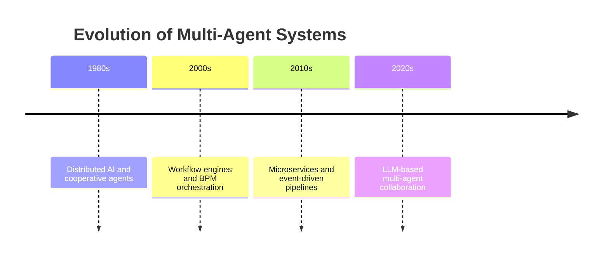

## Deep Theory

### What is a multi-agent system?
A multi-agent system is one where several agents cooperate—or occasionally compete—to solve a task. In this course we focus on **cooperative** systems with a shared goal.

StudySpark is cooperative: every agent serves the student's learning outcome.

### Single agent vs multi-agent
| Factor | Single agent | Multi-agent |
| --- | --- | --- |
| Complexity | Lower | Higher |
| Specialization | Generalist | Role-focused |
| Debug | Simpler trace | Need handoff logs |
| Cost | Often lower | Often higher |
| Best when | Narrow workflows | Distinct phases with different prompts/tools |

**Rule of thumb:** start with one bounded agent plus planning. Split into multiple agents when evaluation shows quality or clarity gains that justify overhead.

### Common roles
| Role | Responsibility | StudySpark example |
| --- | --- | --- |
| Manager | Assigns work, owns stop rules | Orchestrates exam prep session |
| Researcher | Finds evidence | Retrieves lesson chunks |
| Planner | Breaks goals into steps | Builds study plan from Day 23 |
| Writer | Drafts output | Summary or quiz questions |
| Reviewer | Checks quality | Verifies citations exist |
| Safety | Policy checks | Refuses graded homework completion |

Not every product needs every role on day one.

### Coordination patterns

#### 1. Manager-worker
One manager delegates to specialists. Easiest to debug. **Recommended first pattern for StudySpark.**

#### 2. Sequential handoff
Agent A finishes, passes output to Agent B. Natural for research → write → review pipelines.

#### 3. Parallel collaboration
Agents work simultaneously on subtasks, then merge. Faster but needs merge logic.

#### 4. Critic-review loop
Writer drafts, critic finds issues, writer revises. Good for quality, watch for infinite loops.

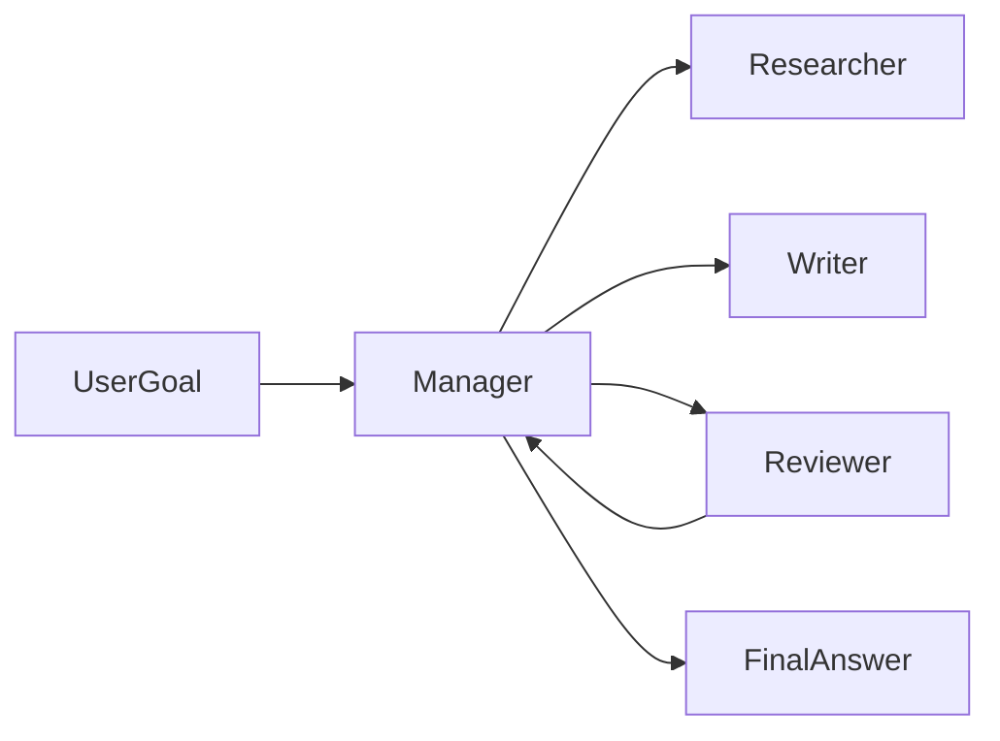

### Centralized vs decentralized control
| Model | Strength | Weakness |
| --- | --- | --- |
| Centralized manager | Easier governance and logging | Manager can bottleneck |
| Decentralized peer agents | Flexible, parallel | Harder to debug |
| Hybrid | Manager plus peer handoffs | More design work |

For StudySpark capstone v1, use a **centralized manager**.

### Handoffs
Handoffs are where one agent passes work to another. A good handoff payload includes:

- task goal and scope
- evidence or draft content
- structured metadata (lesson IDs, chunk IDs)
- warnings (weak retrieval, low confidence)
- completed steps and remaining budget

Poor handoffs cause duplicated searches, lost citations, and reviewers operating blind.

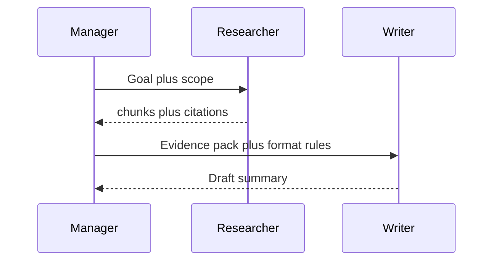

### Shared state
Multi-agent systems need disciplined shared state.

| Approach | Risk |
| --- | --- |
| Too little shared state | Agents repeat work |
| Too much shared state | Context noise, cost blowup |
| Just right | Shared goal, minimal task fields, per-agent private notes |

Best pattern for StudySpark:

- shared: goal, lesson scope, evidence pack, step budget
- private: role-specific scratch work
- logged: every handoff in order

### Advantages
- divides complex study workflows into manageable pieces
- allows role-specific prompts and tools
- improves quality via dedicated review
- can parallelize independent subtasks
- clarifies ownership for debugging

### Limitations
- coordination overhead in latency and tokens
- duplicate work if handoffs are sloppy
- harder to test than one agent
- temptation to add agents without measurable benefit
- loop risk between critic and writer

### Alternatives
- single agent with Day 23 planner (often enough)
- fixed pipeline functions without separate LLM roles
- human review instead of reviewer agent
- UI wizard steps instead of autonomous agents

### When should you use multi-agent design?
Use it when:

- phases need clearly different prompts or tools
- review or safety passes add measurable value
- parallel subtasks reduce latency
- one agent's context is overloaded

### When should you not use it?
Skip multi-agent when:

- StudySpark's single research agent passes evals
- coordination cost exceeds quality gains
- the workflow is linear and stable (use functions)
- you cannot log and test handoffs yet

## Visual Learning

### Multi-Agent Workflow
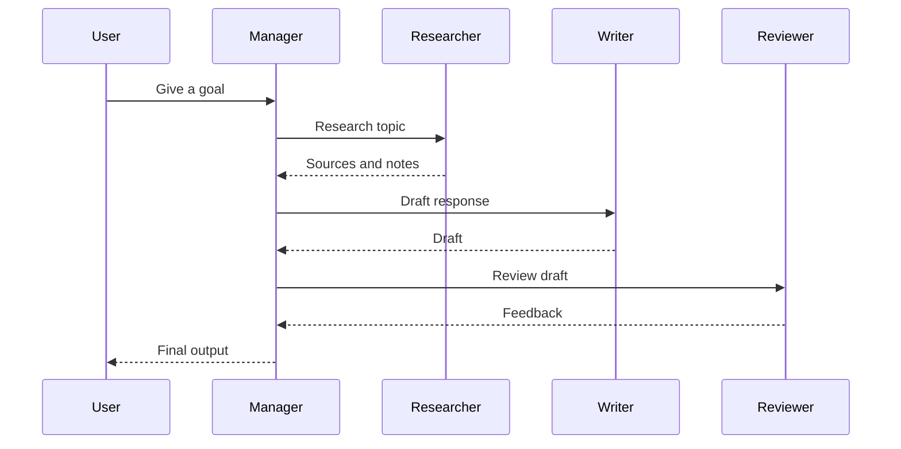

### StudySpark Three-Agent Report
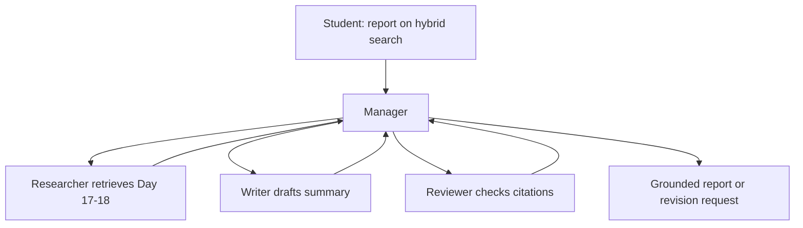

### Decision Tree
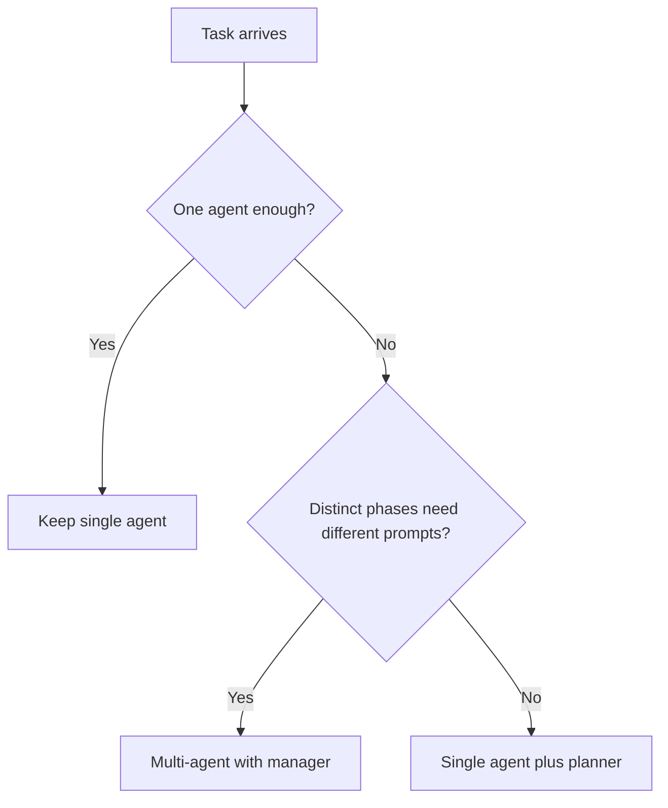

### System Map
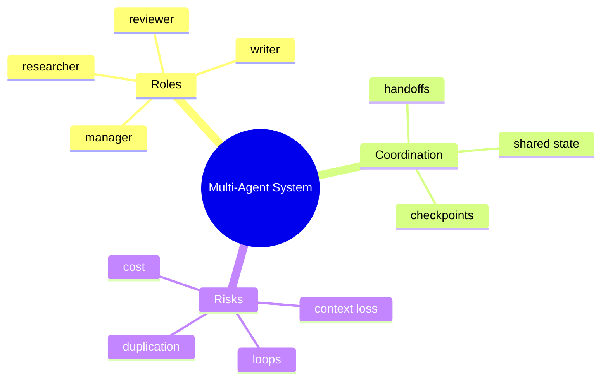

### Handoff Payload Schema
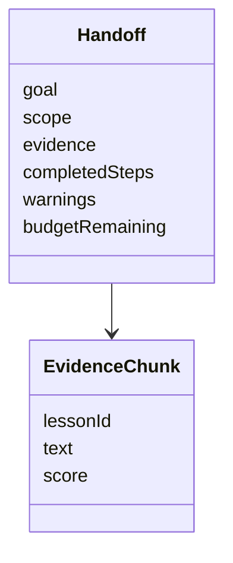

### Parallel vs Sequential
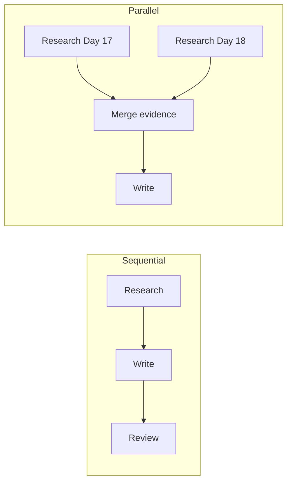

### Critic Loop Guard
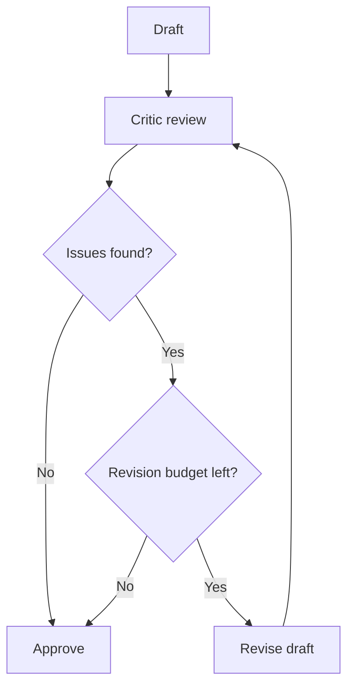

### Day 23 Planner to Day 24 Roles
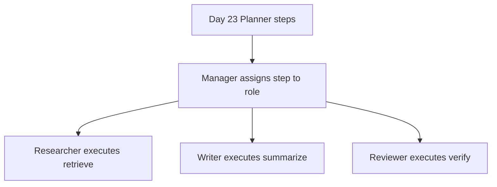

### Observability Across Agents
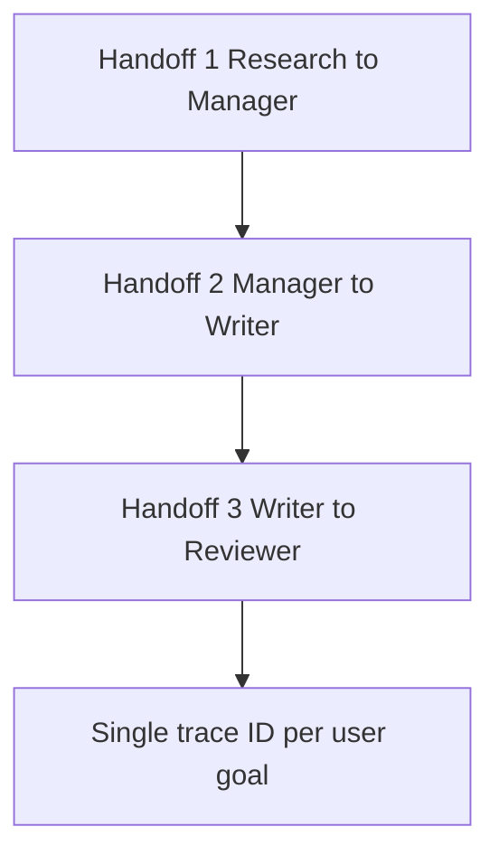

## Code Walkthrough

### Example 1: Python — Role-based pipeline
```python
def research_agent(goal):
    return {"notes": f"Research notes for: {goal}", "citations": ["day_18_hybrid_search.md"]}


def writing_agent(research_pack):
    return f"Draft based on: {research_pack['notes']}"


def review_agent(draft, citations):
    if not citations:
        return {"approved": False, "feedback": "Missing citations"}
    return {"approved": True, "feedback": "Citations present"}


goal = "Create a short report about hybrid search"
research = research_agent(goal)
draft = writing_agent(research)
review = review_agent(draft, research["citations"])
print(draft)
print(review)
```

#### Code Explanation
- Each function owns one role with a narrow contract.
- Research returns structured evidence, not only prose.
- Reviewer checks citations before approval.

### Example 2: TypeScript — Agent registry
```typescript
type AgentResult = string | Record<string, unknown>;

type Agent = (input: string | Record<string, unknown>) => AgentResult;

const agents: Record<string, Agent> = {
  research: (input) => ({ notes: `Research notes for: ${input}` }),
  write: (input) => `Draft based on: ${JSON.stringify(input)}`,
  review: (input) => ({ approved: true, feedback: "OK" }),
};

function runAgent(name: string, input: string | Record<string, unknown>): AgentResult {
  const agent = agents[name];
  if (!agent) throw new Error(`Unknown agent: ${name}`);
  return agent(input);
}

console.log(runAgent("research", "multi-agent systems"));
```

#### Code Explanation
- Registry pattern matches Day 22 tool registry—now for roles.
- Typed inputs reduce handoff ambiguity.

### Example 3: Python — Manager orchestration
```python
def manager(goal, max_revisions=1):
    research = research_agent(goal)
    draft = writing_agent(research)
    review = review_agent(draft, research["citations"])
    revisions = 0

    while not review["approved"] and revisions < max_revisions:
        draft = writing_agent({**research, "feedback": review["feedback"]})
        review = review_agent(draft, research["citations"])
        revisions += 1

    return {"goal": goal, "draft": draft, "review": review, "revisions": revisions}


result = manager("Hybrid search report")
print(result)
```

#### Code Explanation
- Manager owns sequencing and revision budget.
- Critic loops are capped to prevent runaway cost.

### Example 4: TypeScript — Shared state object
```typescript
type SharedState = {
  goal: string;
  scope?: string;
  researchNotes?: string;
  citations?: string[];
  draft?: string;
  reviewFeedback?: string;
  completedSteps: string[];
};

const state: SharedState = {
  goal: "Create a short report about hybrid search",
  completedSteps: [],
};

console.log(state);
```

#### Code Explanation
- Optional fields show progressive filling through handoffs.
- `completedSteps` helps detect duplicate work.

### Example 5: Python — Handoff builder
```python
def build_handoff(goal, evidence, completed_steps, warnings=None):
    return {
        "goal": goal,
        "evidence": evidence,
        "completed_steps": completed_steps,
        "warnings": warnings or [],
    }


handoff = build_handoff(
    goal="Summarize RAG",
    evidence=[{"lesson": "day_17", "text": "RAG combines retrieval and generation."}],
    completed_steps=["research"],
    warnings=["only one chunk found"],
)
print(handoff)
```

#### Code Explanation
- Standard handoff shape simplifies writer and reviewer prompts.
- Warnings signal low confidence without hiding problems.

### Example 6: TypeScript — Duplicate work guard
```typescript
function alreadyDone(state: SharedState, step: string): boolean {
  return state.completedSteps.includes(step);
}

const state: SharedState = {
  goal: "Report",
  completedSteps: ["research"],
};

console.log(alreadyDone(state, "research"));
console.log(alreadyDone(state, "write"));
```

#### Code Explanation
- Managers should skip steps already completed in shared state.

### Example 7: Python — Trace ID per goal
```python
import uuid


def start_trace(goal):
    return {"trace_id": str(uuid.uuid4()), "goal": goal}


trace = start_trace("Week 3 quiz prep")
print(trace)
```

#### Code Explanation
- One trace ID links all agent logs for debugging and Day 27 eval.

### Example 8: TypeScript — Role-specific prompts (sketch)
```typescript
const rolePrompts = {
  researcher: "Find lesson evidence only. Return citations.",
  writer: "Explain simply for a beginner using only provided evidence.",
  reviewer: "Reject drafts missing citations or unsupported claims.",
};

console.log(rolePrompts.reviewer);
```

#### Code Explanation
- Specialization often means different system prompts per role.
- Reviewer prompt encodes policy checks StudySpark needs.

### Example 9: Python — Merge parallel research
```python
def merge_evidence(results):
    merged = []
    for pack in results:
        merged.extend(pack.get("evidence", []))
    return {"evidence": merged, "count": len(merged)}


parallel = [
    {"evidence": [{"lesson": "day_17"}]},
    {"evidence": [{"lesson": "day_18"}]},
]
print(merge_evidence(parallel))
```

#### Code Explanation
- Parallel researchers require explicit merge logic.
- Manager must deduplicate and rank merged evidence.

### Example 10: TypeScript — Review loop budget
```typescript
class RevisionBudget {
  constructor(private remaining: number) {}

  canRevise(): boolean {
    if (this.remaining <= 0) return false;
    this.remaining -= 1;
    return true;
  }
}

const budget = new RevisionBudget(1);
console.log(budget.canRevise());
console.log(budget.canRevise());
```

#### Code Explanation
- Reviewer-writer loops need the same budget discipline as agent steps.

### Example 11: Python — StudySpark manager routing
```python
def assign_role(step):
    mapping = {
        "retrieve lessons": "researcher",
        "summarize": "writer",
        "verify citations": "reviewer",
        "clarify scope": "manager",
    }
    return mapping.get(step, "manager")


print(assign_role("retrieve lessons"))
print(assign_role("verify citations"))
```

#### Code Explanation
- Day 23 plan steps map cleanly to Day 24 roles.
- Manager can delegate without rewriting the planner.

### Example 12: TypeScript — Final gate before user
```typescript
type ReviewResult = { approved: boolean; feedback: string };

function canShowUser(review: ReviewResult): boolean {
  return review.approved;
}

console.log(canShowUser({ approved: false, feedback: "Missing citations" }));
```

#### Code Explanation
- User-facing output should pass an explicit quality gate.
- StudySpark should not show unreviewed drafts in production mode.

## Practical Examples

### Beginner Example: Three-agent knowledge report
Researcher finds sources, writer summarizes, reviewer checks citations. Manager coordinates sequentially.

Why it works: natural order, clear roles, small handoffs.

### Intermediate Example: Quiz generation pipeline
Researcher retrieves concepts, writer drafts questions, reviewer checks alignment with source chunks and difficulty guidelines.

Failure mode: writer inventing questions not supported by evidence—reviewer must catch this.

### Advanced Example: Parallel lesson research
Two researchers fetch Day 17 and Day 18 in parallel. Manager merges, writer synthesizes comparison, reviewer validates dual citations.

### Production Example: Support triage multi-agent flow
Classifier agent routes issue type, context agent gathers account facts, drafting agent writes reply, policy agent validates. Same architecture as StudySpark with different domain.

### Real-World Company Example
Many internal copilots use multi-step pipelines without marketing "multi-agent." Components specialize on retrieval, generation, and formatting. The lesson: **multi-agent is an architecture choice**, not a buzzword requirement.

### Beginner path: paper exercise first
Before coding three agents, sketch on paper:

1. Write the student goal at the top.
2. Draw three boxes: Researcher, Writer, Reviewer.
3. Label what each box receives and returns.
4. Circle where citations must flow forward.
5. Note the stop rule if Reviewer rejects twice.

If you cannot draw the handoffs clearly, the code will not be clearer. This exercise takes twenty minutes and prevents a common beginner mistake: three copies of the same generic prompt with different function names.

When you implement in code, keep each agent function under fifty lines and test handoffs independently before wiring the manager. That mirrors how Day 8 taught isolating the API client before building the full UI. Small, testable modules beat one large orchestration file. Your future self debugging a bad citation will thank you for the trace ID and handoff log.

## Comparison Tables

### Coordination Patterns
| Pattern | Latency | Debug | StudySpark fit |
| --- | --- | --- | --- |
| Manager-worker | Medium | High | Best default |
| Sequential | Medium | High | Research-write-review |
| Parallel | Lower | Medium | Multi-lesson gather |
| Critic loop | Higher | Medium | Quality-sensitive drafts |

### Handoff Quality
| Field | Include? | Why |
| --- | --- | --- |
| Goal | Yes | Keeps roles aligned |
| Evidence chunks | Yes | Grounds writer |
| Full chat history | Rarely | Cost and noise |
| Warnings | Yes | Triggers replan |

### When to Add Another Agent
| Signal | Action |
| --- | --- |
| Single agent passes eval | Stay single agent |
| Review catches many errors | Add reviewer role |
| Planner plus executor prompts conflict | Split roles |
| Frequent context overload | Split research and write |

## Best Practices
- assign one clear responsibility per agent
- use a manager for capstone v1 coordination
- define handoff schemas, not free-text-only payloads
- keep shared state minimal and structured
- cap review and replan loops
- log every handoff with trace ID
- measure quality vs single-agent baseline before adding roles
- prefer structured evidence packs over raw dumps

## Common Mistakes
- creating agents without distinct purpose
- duplicating research across roles
- passing entire conversation history to every agent
- unlimited critic-writer loops
- using multi-agent design when one planner suffices
- reviewers without access to citations
- no baseline comparison—"more agents" becomes guesswork

### Debugging Strategy
When multi-agent fails, inspect:

1. Were roles distinct or overlapping?
2. Was the handoff complete and structured?
3. Did an agent repeat another's work?
4. Did the manager sequence steps correctly?
5. Did the reviewer see the same evidence as the writer?
6. Did a loop exhaust budget without user-visible fallback?

## Performance

### Latency
Sequential agents add model calls. Mitigate with parallel research, smaller role-specific prompts, and skipping review for low-risk outputs.

### Cost
Each agent call sends tokens. Mitigate with compact handoffs, evidence summaries, and not resending full history.

### Memory
Store evidence packs once in shared state; pass references to large blobs when possible.

### Scalability
Standardize handoff JSON schema across features. Isolate role prompts in config files for A/B testing on Day 27.

### Reliability
Simplicity wins. A three-agent sequential pipeline with logs often beats a chaotic six-agent mesh.

### Cost estimation (Feynman version)
Multi-agent cost is roughly:

$$
\text{total cost} \approx \sum_{i=1}^{n} (\text{input tokens}_i + \text{output tokens}_i) \times \text{price per token}
$$

Where $n$ is the number of agent calls including revisions. If your manager, researcher, writer, and reviewer each send 2,000 input tokens, you may pay for 8,000 input tokens before the student sees one answer. Compact handoffs are a cost feature, not a nice-to-have.

Track cost per successful report on Day 27's eval set. If multi-agent cost doubles but quality improves less than 10%, revert to single-agent planning.

## Security

Multi-agent systems amplify agent risks.

### Prompt Injection
Malicious retrieved content may target the writer differently than the researcher. Each role needs policy reminders; reviewer checks for instruction hijacking.

### Least Privilege
Researcher: read tools. Writer: generate text only. Manager: no direct database credentials unless needed.

### Data Privacy
Handoffs may contain student notes—encrypt logs, minimize retention.

## Evaluation

Evaluate the **workflow**, not isolated agents.

### What to measure
- end-to-end task success
- handoff completeness score
- duplicate work rate
- review catch rate (true positives)
- loop and revision counts
- latency and cost vs single-agent baseline

### Evaluation checklist
1. Does each step map to exactly one primary role?
2. Are citations preserved from research to final output?
3. Does reviewer rejection improve final quality on eval set?
4. Is multi-agent faster or better—not just more complex?

## Exercises

### Easy
1. Name three agent roles in a StudySpark pipeline.
2. Why is coordination hard?
3. One benefit of specialization.
4. Why is a manager agent useful?
5. What belongs in a handoff payload?
6. When is one agent enough?

### Medium
7. Compare centralized and decentralized control.
8. Why keep shared state minimal?
9. Describe a good research-to-writer handoff.
10. Why can multi-agent be slower than single-agent?
11. What is a critic-review loop?
12. How do Day 23 plan steps map to roles?
13. What is a trace ID for?

### Hard
14. Design a multi-agent workflow for research and writing.
15. Propose a handoff JSON schema for StudySpark.
16. Explain duplicate-work prevention.
17. Add a reviewer without infinite loops.
18. When would you parallelize researchers?
19. Define metrics comparing multi vs single agent.

### Challenge
20. Build a three-agent knowledge report pipeline.
21. Add explicit handoff objects and shared state.
22. Add manager stop rules and revision budget.
23. Add reviewer that rejects missing citations.
24. Log every handoff with trace ID.
25. Compare output quality to Day 22 single-agent baseline.

### Reflection Questions
26. Why are more agents not always better?
27. When does specialization improve quality?
28. Biggest coordination risk in multi-agent design?
29. How does this prepare you for MCP on Day 25?
30. Where would you draw the line between one agent and many in StudySpark?

## Quizzes

### Quiz 1
1. What is a multi-agent system?
2. Name two common roles.
3. What is a handoff?
4. Why use a manager?

**Answers:** 1. Multiple agents coordinating on a shared goal  2. Examples: researcher, writer, reviewer  3. Passing work and context between agents  4. Central coordination and logging

### Quiz 2
1. Manager-worker vs sequential—how do they relate?
2. One risk of shared state that is too large.
3. One benefit of a reviewer agent.
4. When should StudySpark stay single-agent?

**Answers:** 1. Manager often runs sequential delegation  2. Cost, noise, confusion  3. Catches missing citations or weak drafts  4. When single agent plus planner passes evals

### Quiz 3
1. What is a critic loop?
2. How do you prevent infinite review loops?
3. What should researchers return?
4. What is context loss?

**Answers:** 1. Draft, critique, revise cycle  2. Revision budget  3. Structured evidence with citations  4. Later agents missing earlier facts

### Quiz 4
1. Centralized vs decentralized—which is easier to debug?
2. Name one parallel multi-agent use case.
3. Why log handoffs?
4. How does Day 24 connect to Day 23?

**Answers:** 1. Centralized  2. Multi-lesson retrieval  3. Debug, eval, audit  4. Plan steps assign to specialized roles

### Quiz 5
1. What is an evidence pack?
2. Name one security concern in multi-agent systems.
3. What metric compares multi-agent to baseline?
4. What capstone item does Day 24 add?

**Answers:** 1. Structured retrieval results for writers  2. Injection via handoffs, over-privileged tools  3. Quality, cost, latency vs single agent  4. Manager plus specialized sub-agents

## Interview Questions

### Conceptual
- When would you choose multi-agent over one planner agent?
- Explain manager-worker coordination.
- What makes a good handoff?
- How do you detect unnecessary agents?

### Practical
- Design a research-write-review pipeline for a study app.
- How would you cap critic loops?
- How would you prevent duplicate retrieval?
- What would you log for each handoff?

### System Design
- Design StudySpark multi-agent architecture with three roles.
- How would you merge parallel research results?
- Design trace IDs across distributed agent logs.

### Debugging
- Final answers lack citations though research succeeded. Where broke?
- Costs doubled after adding agents. What checks?
- Reviewer always approves. What failed?

## Mini Project
Create a **StudySpark three-agent knowledge report**: researcher, writer, reviewer—coordinated by a manager.

### Goal
Produce a short, cited report from the curriculum knowledge base on a topic such as hybrid search.

### Features
- manager assigns steps from Day 23-style plan
- researcher returns evidence pack with lesson IDs
- writer uses only evidence pack content
- reviewer rejects missing citations
- trace ID links all logs

### Suggested folder structure
```text
projects/studyspark/
├── app/
│   ├── agents/
│   │   ├── manager.py
│   │   ├── researcher.py
│   │   ├── writer.py
│   │   ├── reviewer.py
│   │   └── handoff.py
│   └── main.py
├── tests/
│   └── test_multi_agent_report.py
└── README.md
```

### Project steps
1. define handoff schema
2. implement three role functions with narrow contracts
3. manager sequences research → write → review
4. cap revisions at one
5. log handoffs with trace ID
6. compare to single-agent output on same prompt

### Acceptance criteria
- final output cites at least one lesson from evidence pack
- reviewer rejects draft when citations stripped
- logs show three handoffs in order
- revision loop stops at budget limit

### What you learn
- coordination changes system design
- role boundaries reduce prompt confusion
- review agents improve trust
- leads naturally to Day 25 standardized tool servers

## Cumulative Capstone Update
After Day 24, StudySpark may add **optional multi-agent roles**—only if your eval shows benefit over the Day 23 single-agent planner.

Add these items to [`projects/CAPSTONE.md`](../../projects/CAPSTONE.md):

- **manager agent** — owns trace ID, step budget, and final user gate
- **researcher role** — retrieval and evidence pack construction
- **writer role** — summaries and quizzes grounded in evidence
- **reviewer role** — citation and policy checks before display
- **handoff schema** — goal, evidence, warnings, completed_steps
- **shared state** — minimal fields shared across roles
- **revision budget** — cap critic-writer loops
- **baseline comparison** — document single-agent vs multi-agent eval results

Suggested handoff type:

```python
Handoff = {
    "trace_id": str,
    "goal": str,
    "evidence": list,
    "warnings": list,
    "completed_steps": list,
}
```

Capstone architecture after Day 24:

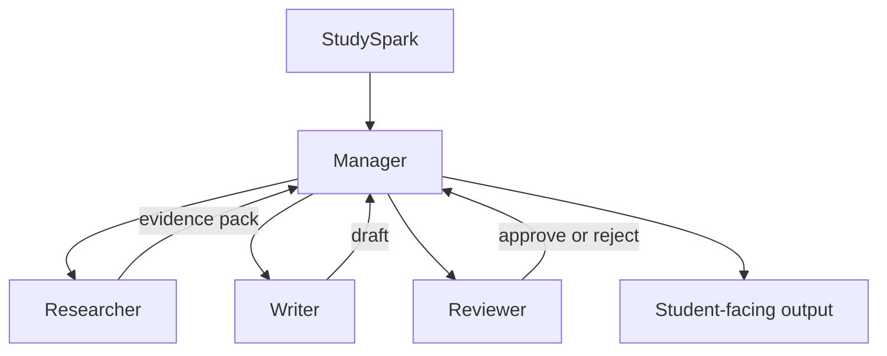

If single-agent passes your eval, keep multi-agent as an optional stretch goal—not a requirement.

### Stretch goal: when to promote to multi-agent
Promote StudySpark from single-agent to multi-agent when your Day 27 eval shows:

- citation errors in more than 15% of single-agent reports
- reviewer checklist catches issues students report in practice
- writer prompts become overloaded (>1,500 tokens of conflicting instructions)
- parallel lesson retrieval cuts latency by more than 30%

Document the before/after metrics in `projects/CAPSTONE.md` so the decision is evidence-based, not trend-driven.

## Summary
Multi-agent systems are powerful when roles are clear and coordination is controlled. More agents are not automatically better.

The main lessons from today are:

- split work only when specialization earns its cost
- handoffs should be structured, small, and logged
- managers reduce chaos in first versions
- compare against single-agent baselines with real metrics

If Day 23 taught you how to plan, Day 24 teaches you how to divide work across specialized agents—before Day 25 standardizes how they connect to tools.

[Previous: Day 23 - Planning](../day_23/day_23_planning.md) | [Next: Day 25 - Model Context Protocol (MCP)](../day_25/day_25_model_context_protocol_mcp.md)

## Further Reading
- [LangGraph multi-agent patterns](https://www.langchain.com/langgraph)
- [Anthropic: Building effective agents](https://www.anthropic.com/news/building-effective-agents)
- [DeepLearning.AI agent courses](https://www.deeplearning.ai/short-courses/)
- [Mixture-of-Agents paper](https://arxiv.org/abs/2408.15299)
