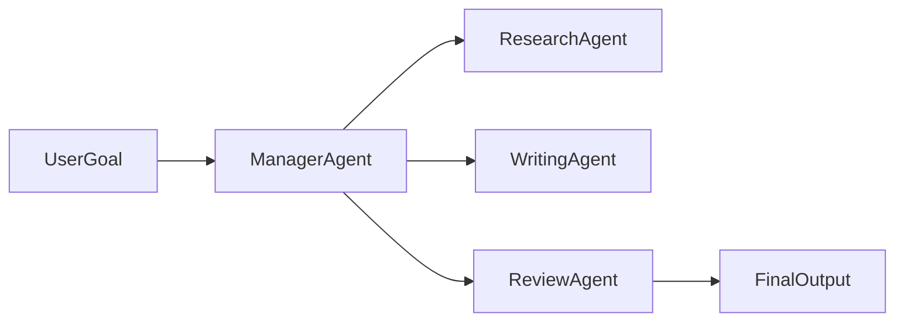

# Day 24 - Multi-Agent Systems

## Introduction
Multi-agent systems use more than one agent to solve a task. Different agents can specialize in research, planning, execution, review, or safety.


## Learning Objectives
By the end of this day, you should be able to:

- explain why multiple agents can be useful
- identify agent roles and handoffs
- understand coordination patterns
- compare centralized and decentralized control
- design a simple multi-agent workflow

## Theory
A single agent can become overloaded when a task needs different skills. Multi-agent design lets you split responsibility. For example, one agent can research, another can draft, and a third can review.

The challenge is coordination. Too many agents can create confusion, duplication, or loops.

### Visual Diagram


## Code Examples

### Python
```python
agents = ["research", "write", "review"]
print(agents)
```

### TypeScript
```typescript
const agents = ['research', 'write', 'review'];
console.log(agents);
```

## Best Practices
- assign clear roles to each agent
- define handoff rules and ownership
- keep shared state minimal and explicit
- add stopping conditions to prevent loops
- measure whether multiple agents actually improve quality

## Common Mistakes
- creating agents without clear purpose
- letting agents duplicate each other's work
- passing too much state between agents
- ignoring coordination overhead
- using multi-agent design when one agent is enough

## Exercises
- Easy: Name three agent roles.
- Medium: Explain why coordination is hard.
- Hard: Design a multi-agent workflow for research and writing.
- Challenge: Propose a handoff protocol between agents.

## Mini Project
Create a three-agent system for a knowledge report: one agent finds sources, one summarizes, and one checks quality.

## Summary
Multi-agent systems are powerful when roles are clear and coordination is controlled. More agents are not automatically better.

## Additional Resources
- https://www.langchain.com/langgraph
- https://www.anthropic.com/news/building-effective-agents
- https://www.deeplearning.ai/short-courses/
