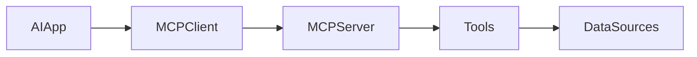
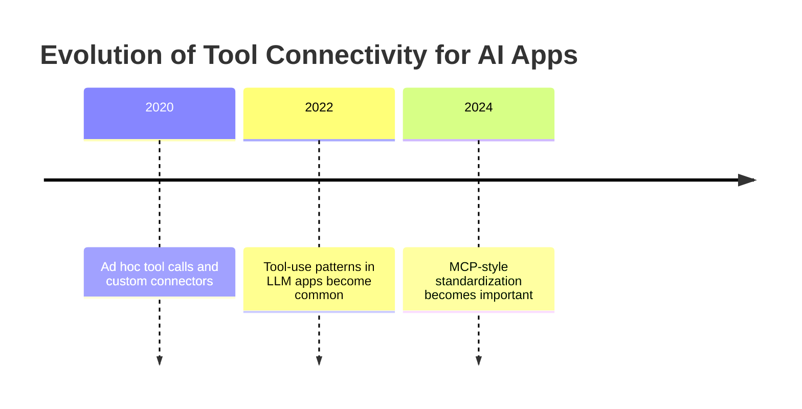
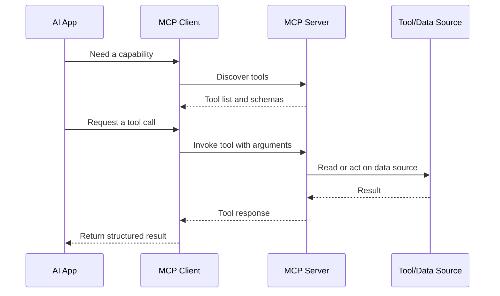
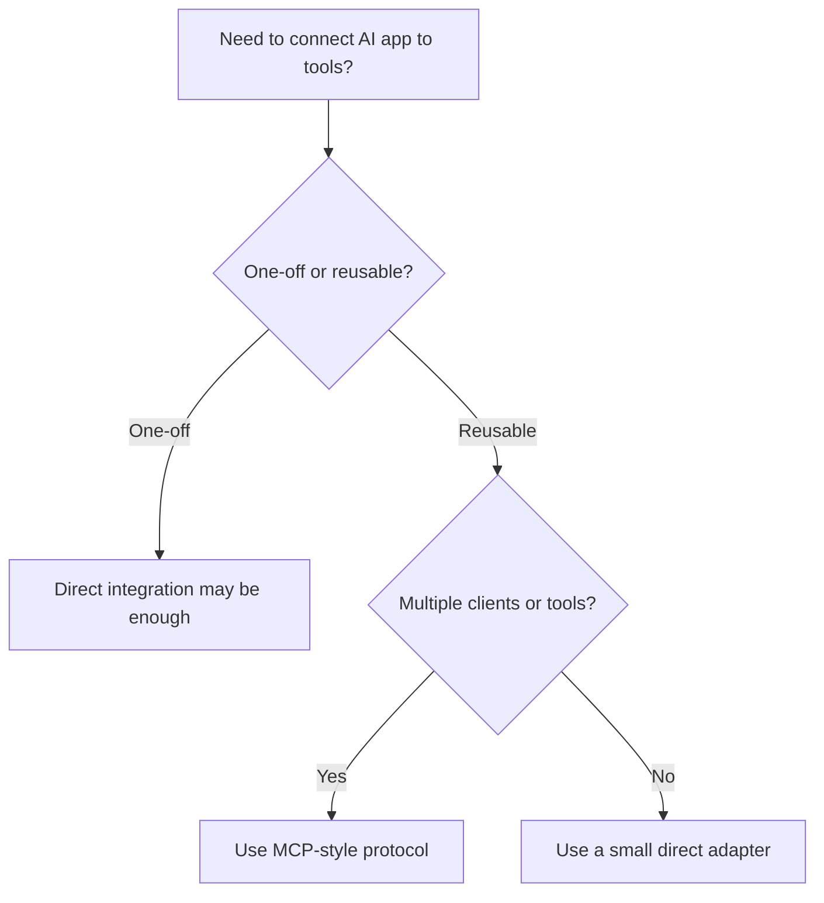
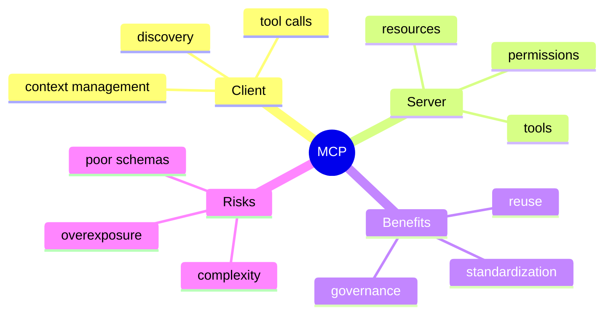

# Day 25 - Model Context Protocol (MCP)

[Previous: Day 24 - Multi-Agent Systems](../day_24/day_24_multi_agent_systems.md) | [Next: Day 26 - LangChain](../day_26/day_26_langchain.md)

## Introduction
Yesterday we learned how multiple agents can coordinate. Today we look at the interface layer that makes those systems easier to connect to real tools and data: the Model Context Protocol, or MCP.

MCP is a standard for connecting AI applications to tools and data sources in a structured way. It helps separate the model from the details of each integration.


This matters because AI applications often need the same kind of external capabilities: search notes, read files, query databases, inspect docs, or fetch records. Without a standard, each app tends to build its own custom connector for every tool. MCP reduces that fragmentation by defining a common protocol for discovery and access.

Today you will learn what MCP is, why it exists, how client-server tool access works, and how to design tool boundaries that are reusable and safe.

## Learning Objectives
By the end of this day, you should be able to:

- explain the purpose of MCP in practical terms
- understand client-server tool access at a high level
- identify why standardization matters for AI apps
- design a simple MCP-style integration plan
- see how MCP supports reusable tooling and governance
- recognize common security and design mistakes in tool exposure
- sketch a tool server for a knowledge assistant or note app

## Prerequisites
You should already understand:

- Day 22: What are AI Agents?
- Day 24: Multi-Agent Systems
- the idea of tool use in an agent loop

If those topics are fuzzy, review them first. MCP makes the most sense once you understand why an agent needs tools in the first place.

## Big Picture
MCP defines a structured way for AI applications to discover and use tools.



The important idea is this:

- the AI application does not hard-code every tool integration
- the MCP client speaks the protocol on behalf of the app
- the MCP server exposes a defined set of capabilities
- the tools interact with data sources or services

That separation makes the system more modular, reusable, and easier to govern.

## Why MCP Exists
MCP exists because custom tool integrations do not scale well.

Without a standard protocol:

- every application needs custom glue code
- every tool has a different shape
- permissions are harder to reason about
- integrations are harder to reuse
- maintenance becomes expensive

With a protocol:

- tools can be discovered in a consistent way
- the app can ask what is available
- the server can define permissions and schemas clearly
- the same server can serve multiple clients

Think of MCP as the adapter layer between AI apps and the outside world.

## Historical Background
As AI assistants became more capable, they needed access to tools, files, and data.

At first, developers wrote one-off integrations. Then they started building reusable tool frameworks. MCP emerged as a stronger standardization idea: instead of every tool inventing its own interface, define a common protocol that clients and servers can follow.



## Deep Theory

### What is MCP?
MCP is a protocol for structured tool and data access in AI systems.

It defines how a client can discover available tools, understand what they do, and call them safely.

In practical terms, MCP tries to answer:

- what tools are available?
- what does each tool do?
- what input does each tool expect?
- what output will it return?
- what permissions are needed?

### Why standardization matters
Standardization matters because tools are only useful if they can be integrated repeatedly without rewriting everything each time.

This is the same reason HTTP became powerful for the web. The protocol gives different systems a shared language.

### Client-server model
MCP usually follows a client-server structure.

- the client is part of the AI application or assistant runtime
- the server exposes tools or resources
- the server may connect to files, APIs, databases, or local services

The client does not need to know all implementation details. It only needs to know the protocol and the tool contract.

### Discovery
Discovery is the process of learning what tools exist and how to use them.

In a standard protocol, a client can ask the server:

- what tools do you offer?
- what arguments do you need?
- what is the description of each tool?

That makes the assistant more adaptive and reduces manual wiring.

### Tool contracts
Every tool should have a clear contract.

The contract usually includes:

- name
- description
- input schema
- output shape
- permissions or access rules

Contracts matter because models make better decisions when tools are described clearly.

### Resources and prompts
In MCP-style systems, the server may expose not only tools but also resources or reusable context.

That allows the assistant to access relevant data in a controlled way instead of dumping everything into one prompt.

### Advantages
- reduces integration fragmentation
- improves reuse across apps
- makes tool access more understandable
- encourages clearer contracts and schemas
- supports safer governance and access control

### Limitations
- adds protocol and implementation overhead
- requires good server design
- still needs auth and permission checks
- does not automatically make tools safe or good
- introduces another layer to debug

### Alternatives
- custom tool endpoints
- direct API integrations from the app
- workflow engines without a protocol layer
- no tool abstraction at all

### When should you use MCP?
Use MCP when:

- multiple apps need access to the same tools
- you want consistent tool discovery
- you need clearer contracts and permissions
- you want to separate tool servers from assistant clients

### When should you not use it?
Do not use MCP when:

- the app is a tiny prototype with one tool
- the overhead is larger than the benefit
- a direct function call would be simpler
- you are not ready to maintain a protocol boundary

## Visual Learning

### MCP Flow


### Decision Tree


### Protocol Mind Map


## Code Walkthrough

The following examples are simplified, but they show the shape of an MCP-style design.

### Python Example: Tool metadata contract
```python
server_name = 'notes-mcp'

tools = [
        {
                'name': 'search_notes',
                'description': 'Search notes by keywords or meaning.',
                'input_schema': {'query': 'string', 'top_k': 'integer'},
        },
        {
                'name': 'get_note',
                'description': 'Fetch a note by its identifier.',
                'input_schema': {'note_id': 'string'},
        },
]

print(server_name)
print(tools)
```

#### Code Explanation
- `server_name` identifies the tool server.
- each tool includes a name, description, and input schema.
- the schema helps the client and model understand how to call the tool.

### TypeScript Example: Tool registry
```typescript
type ToolDefinition = {
    name: string;
    description: string;
    inputSchema: Record<string, string>;
};

const tools: ToolDefinition[] = [
    {
        name: 'search_notes',
        description: 'Search notes by keywords or meaning.',
        inputSchema: { query: 'string', topK: 'integer' },
    },
    {
        name: 'get_note',
        description: 'Fetch a note by its identifier.',
        inputSchema: { noteId: 'string' },
    },
];

console.log(tools);
```

#### Code Explanation
- `ToolDefinition` makes the contract explicit.
- `tools` is the list a client would discover from the server.
- schema clarity improves usability and reduces mistakes.

### Python Example: Client discovery step
```python
def discover_tools(server_tools):
        return [tool['name'] for tool in server_tools]


available_tools = discover_tools(tools)
print(available_tools)
```

#### Code Explanation
- `discover_tools` represents the client asking what is available.
- returning only names is a simplified discovery response.
- real systems would also include descriptions and schemas.

### TypeScript Example: Permission check
```typescript
type UserContext = {
    userId: string;
    role: 'reader' | 'editor' | 'admin';
};

function canUseTool(user: UserContext, toolName: string): boolean {
    if (toolName === 'get_note') {
        return user.role === 'reader' || user.role === 'editor' || user.role === 'admin';
    }

    if (toolName === 'search_notes') {
        return true;
    }

    return false;
}

console.log(canUseTool({ userId: 'u1', role: 'reader' }, 'search_notes'));
```

#### Code Explanation
- `UserContext` carries identity and role information.
- `canUseTool` enforces a simple permission policy.
- access control should be explicit rather than implied.

### Python Example: Tool call wrapper
```python
def call_tool(tool_name, arguments):
        if tool_name == 'search_notes':
                return f"Searching notes for {arguments['query']}"

        if tool_name == 'get_note':
                return f"Retrieving note {arguments['note_id']}"

        raise ValueError(f'Unknown tool: {tool_name}')


print(call_tool('search_notes', {'query': 'vector databases'}))
```

#### Code Explanation
- `call_tool` is a simplified execution boundary.
- unknown tools raise an error.
- the wrapper centralizes tool behavior and validation.

### TypeScript Example: Structured response
```typescript
type ToolResponse = {
    status: 'ok' | 'error';
    data?: string;
    error?: string;
};

const response: ToolResponse = {
    status: 'ok',
    data: 'Searching notes for vector databases',
};

console.log(response);
```

#### Code Explanation
- structured responses are easier to reason about than untyped text.
- `status` tells the client whether the tool succeeded.
- `error` and `data` stay separated for clarity.

## Practical Examples

### Beginner Example: Note search server
A knowledge assistant needs note search and note retrieval.

An MCP server can expose `search_notes` and `get_note` so the assistant does not need to know how the note store is implemented.

Why it works:

- the tool contract is small
- the assistant can discover capabilities dynamically
- multiple apps can reuse the same server

### Intermediate Example: Internal documentation server
A team has one server that exposes docs search, release notes lookup, and glossary lookup.

Different assistants can connect to the same server instead of building their own custom integrations.

What could go wrong:

- too many tools with overlapping descriptions
- unclear permissions
- poor schema design that confuses the client or model

### Professional Example: Enterprise data access layer
An enterprise assistant may connect to multiple MCP servers:

- one for docs
- one for ticket search
- one for internal policies
- one for project metadata

This keeps access modular and easier to govern.

### Real-World Company Example
A company building internal copilots could use MCP-style servers to expose standardized access to docs, APIs, and searchable knowledge. That makes it easier to reuse the same tools across multiple assistants instead of building one connector per application.

## Best Practices
- expose small, focused tools
- document tool behavior clearly
- keep authentication and permissions explicit
- prefer reusable tool servers over one-off integrations
- test the protocol boundary carefully
- keep tool schemas precise and minimal
- separate transport concerns from business logic

## Common Mistakes
- building tool endpoints without a contract
- exposing too much access through one server
- ignoring tool descriptions and schemas
- mixing app logic into the transport layer
- treating standardization as optional once the prototype works
- overloading one server with unrelated tools

### Debugging Strategy
When an MCP integration fails, inspect it in this order:

1. Did the client discover the tool correctly?
2. Is the schema accurate and complete?
3. Did permissions block the call?
4. Did the tool return structured output?
5. Is the server mixing transport and business logic?

## Performance

MCP can reduce development cost, but it also introduces a protocol layer.

### Latency
Latency comes from discovery, transport, and tool execution.

You can reduce it by:

- caching tool discovery when safe
- keeping tool responses compact
- avoiding unnecessary hops
- using only the tools you need

### Cost
Costs rise when:

- tool servers are overcomplicated
- every call crosses too many boundaries
- the same tool is duplicated in many places

### Memory
The protocol itself should stay lightweight.

Do not use the protocol layer to move huge payloads if a smaller, more focused resource would work better.

### Scalability
MCP scales well when tools are reused across many clients and projects.

The real value is not only technical elegance. It is reduced duplication.

### Reliability
The protocol boundary should make failures easier to diagnose.

If a tool fails, the client should know whether the failure came from discovery, permissions, transport, or the tool itself.

## Security

Tool protocols need careful security design.

### Prompt Injection
Do not let untrusted tool output act like instructions.

### Secrets and API Keys
Keep authentication explicit and scoped to the server or user.

### Authentication and Authorization
Each server should enforce permissions based on the user or client context.

### Data Privacy
Only expose the minimum data required for the task.

### Hallucinations and Model Safety
The model may misinterpret a tool description or fabricate a tool result.

Structured contracts and validation reduce that risk.

## Evaluation
Evaluate MCP by asking whether it makes tool access better, safer, and more reusable.

### What to measure
- number of integrations reused across clients
- clarity of tool schemas
- permission errors caught before execution
- tool-call success rate
- developer time saved on new integrations

### Useful questions
- Was the tool easy to discover?
- Was the schema clear enough for the client to use?
- Did permissions behave as expected?
- Did the protocol reduce duplication?

## Exercises

### Easy
1. Explain what MCP is for.
2. Name one thing MCP helps standardize.
3. List one tool your assistant might need.
4. Describe why contracts matter.

### Medium
5. Describe why a standard protocol helps.
6. Explain client-server tool access.
7. Compare direct integration and MCP-style integration.
8. Describe why permissions should be explicit.

### Hard
9. Design an MCP server for a note app.
10. Define the tools and schemas for a knowledge assistant server.
11. Explain how discovery should work.
12. Describe how to keep transport separate from business logic.

### Challenge
13. Outline an MCP server that exposes note search and note retrieval.
14. Add authentication and role-based access.
15. Add a resource for note metadata.
16. Add structured error handling.
17. Add a logging strategy for tool calls.

### Reflection Questions
18. Why is a protocol better than ad hoc connectors?
19. What is the biggest risk of poorly designed tool access?
20. How does MCP support reuse across multiple AI apps?
21. Why should tool descriptions be concise and precise?
22. How does this lesson prepare you for LangChain?

## Mini Project
Outline an MCP server that exposes note search and note retrieval for a knowledge assistant.

### Goal
Create a small, reusable tool server that lets a knowledge assistant search notes and fetch a note by ID.

### Features
- a `search_notes` tool
- a `get_note` tool
- explicit schemas for both tools
- role-based permissions
- structured responses
- clear tool descriptions

### Suggested folder structure
```text
notes-mcp/
├── server/
│   ├── tools.py
│   ├── auth.py
│   ├── schemas.py
│   ├── transport.py
│   └── main.py
├── data/
│   └── notes/
├── tests/
│   └── test_tools.py
└── README.md
```

### Project Steps
1. define the tool contracts
2. decide what permissions each tool requires
3. build a discovery response
4. implement structured tool outputs
5. test the protocol boundary
6. connect the server to a knowledge assistant client

### What You Learn
- how standardized tool access works
- how schemas and permissions improve safety
- how to keep integrations reusable
- how MCP fits naturally before framework layers like LangChain

## Capstone Update
Add these ideas to the final capstone plan:

- a standardized tool server for the knowledge assistant
- explicit schemas for note search and retrieval
- role-based permissions for tool access
- structured responses that the agent can consume reliably
- a clear separation between assistant logic and tool implementation

This will make the capstone easier to extend, easier to test, and easier to integrate with multiple clients.

## Summary
MCP standardizes how assistants connect to tools and data.

It helps make AI systems more modular, reusable, and easier to integrate. The main lessons from today are:

- custom tool wiring does not scale well
- protocol boundaries improve reuse and governance
- tool contracts, schemas, and permissions matter
- a good protocol makes integrations easier to build and debug

If Day 24 taught you how agents cooperate, Day 25 teaches you how agents connect to the outside world in a standard way.

[Previous: Day 24 - Multi-Agent Systems](../day_24/day_24_multi_agent_systems.md) | [Next: Day 26 - LangChain](../day_26/day_26_langchain.md)

## Further Reading
- https://modelcontextprotocol.io/
- https://github.com/modelcontextprotocol
- https://docs.anthropic.com/en/docs/agents-and-tools/mcp
- https://www.anthropic.com/news/model-context-protocol
