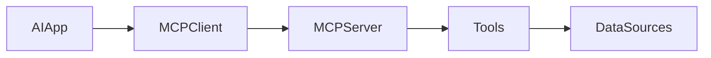

# Day 25 - Model Context Protocol (MCP)

## Introduction
MCP is a standard for connecting AI apps to tools and data sources in a structured way. It helps separate the model from the details of each integration.


## Learning Objectives
By the end of this day, you should be able to:

- explain the purpose of MCP
- understand client-server tool access at a high level
- identify why standardization matters
- design a simple MCP-style integration plan
- see how MCP supports reusable tooling

## Theory
Without a protocol, every app may need a custom connector for every tool. MCP reduces that fragmentation by defining a common way for assistants to discover and use capabilities.

This makes tool ecosystems more reusable and easier to govern.

### Visual Diagram


## Code Examples

### Python
```python
server_name = "notes-mcp"
tools = ["search_notes", "get_note"]
print(server_name)
print(tools)
```

### TypeScript
```typescript
const serverName = 'notes-mcp';
const tools = ['search_notes', 'get_note'];

console.log(serverName);
console.log(tools);
```

## Best Practices
- expose small, focused tools
- document tool behavior clearly
- keep authentication and permissions explicit
- prefer reusable tool servers over one-off integrations
- test the protocol boundary carefully

## Common Mistakes
- building tool endpoints without a contract
- exposing too much access through one server
- ignoring tool descriptions and schemas
- mixing app logic into the transport layer
- treating standardization as optional once the prototype works

## Exercises
- Easy: Explain what MCP is for.
- Medium: Describe why a standard protocol helps.
- Hard: Design an MCP server for a note app.
- Challenge: List two risks of poorly designed tool access.

## Mini Project
Outline an MCP server that exposes note search and note retrieval for a knowledge assistant.

## Summary
MCP standardizes how assistants connect to tools and data. It helps make AI systems more modular, reusable, and easier to integrate.

## Additional Resources
- https://modelcontextprotocol.io/
- https://github.com/modelcontextprotocol
- https://docs.anthropic.com/en/docs/agents-and-tools/mcp
