# Day 25 - Model Context Protocol (MCP)

[Previous: Day 24 - Multi-Agent Systems](../day_24/day_24_multi_agent_systems.md) | [Next: Day 26 - LangChain](../day_26/day_26_langchain.md)

## Introduction
Yesterday we learned how multiple agents can coordinate through managers, handoffs, and shared state. Today we look at the **interface layer** that makes those systems easier to connect to real tools and data: the **Model Context Protocol**, or MCP.

Think of MCP like USB for AI tools. Before USB, every device needed its own custom cable. MCP gives assistants a standard way to discover what a tool server offers, understand how to call it, and receive structured results—without rewriting glue code for every integration.

MCP is a standard for connecting AI applications to tools and data sources in a structured way. It separates the model and agent logic from the details of each backend integration.


For **StudySpark**, MCP matters because the same note-search and lesson-retrieval capabilities might serve the chat UI, the Day 22 research agent, the Day 24 researcher role, and future mobile clients. Without a standard, each component would duplicate custom connectors. With MCP-style boundaries, you expose `search_notes` and `get_lesson` once and reuse them everywhere.

Today you will learn what MCP is, why it exists, how client-server tool access works, and how to design tool boundaries that are reusable, testable, and safe.

## Learning Objectives
By the end of this day, you should be able to:

- explain the purpose of MCP in practical engineering terms
- describe client-server tool discovery and invocation at a high level
- articulate why standardization reduces integration cost
- design a simple MCP-style tool server for StudySpark notes
- define tool contracts with schemas, permissions, and structured responses
- recognize security and design mistakes in tool exposure
- connect MCP to agent loops, planning, and multi-agent handoffs from Days 22–24
- decide when a direct function call is simpler than a protocol layer

## How to Use This Lesson

This lesson is designed for **all skill levels**. Pick one path and follow it consistently.

| Level | Suggested approach | Time |
| --- | --- | --- |
| **Beginner** | Read Introduction → Big Picture → Deep Theory → trace one code example → Easy exercises | 5–7 hours |
| **Intermediate** | Skim objectives → Visual Learning → Code Walkthrough → Medium/Hard exercises → Mini project | 3–5 hours |
| **Advanced** | Deep Theory tradeoffs → Hard/Challenge exercises → extend mini project → capstone slice | 2–3 hours |

### Apply Today
Complete at least one item before moving to the next day:
- [ ] Trace one code example in **Python or TypeScript** (one language is enough)
- [ ] Complete exercises for your level (see Exercises section)
- [ ] Update [`projects/CAPSTONE.md`](../../projects/CAPSTONE.md) with today's capstone item
- [ ] Add today's component to `projects/studyspark/` or update `projects/CAPSTONE.md`.

> **Stuck?** Re-read Big Picture, review Prerequisites, or see [SYLLABUS.md](../../SYLLABUS.md) for path guidance.

## Prerequisites
You should already understand:

- Day 22: What are AI Agents? — tool registries and permission gates
- Day 23: Planning — steps that map to tool calls
- Day 24: Multi-Agent Systems — roles that share tool access
- Day 11–12: tool and function calling concepts

You should also be comfortable with:

- JSON schemas at a basic level
- client-server thinking (request in, response out)

MCP makes the most sense once you understand why agents need tools and why duplicate integrations hurt maintainability.

## Big Picture
MCP defines a structured way for AI applications to discover and use tools.

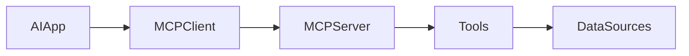

The important idea:

- the **AI application** (StudySpark) does not hard-code every integration detail
- the **MCP client** speaks the protocol on behalf of the app or agent runtime
- the **MCP server** exposes a defined, documented set of capabilities
- **tools** read or act on data sources: notes, lessons, vector DB, files

That separation makes the system modular, reusable, and easier to govern.

## Why MCP Exists
MCP exists because custom tool integrations do not scale.

Without a standard protocol:

- every StudySpark feature rebuilds search and retrieval glue
- each tool has a different shape and error format
- permissions become inconsistent across agents
- integrations are hard to reuse in tests and new clients
- maintenance cost grows with every new surface (CLI, web, agent, MCP host)

With a protocol:

- tools are discovered consistently
- schemas are explicit for humans and models
- servers enforce permissions in one place
- the same note server serves chat, agents, and external MCP hosts

Think of MCP as the **adapter layer** between AI apps and the outside world—similar to how REST standardized web APIs.

## What Is MCP?
MCP is a protocol for structured tool and data access in AI systems. It defines how a client discovers available tools, understands their contracts, and invokes them safely.

Practical questions MCP tries to answer:

- what tools are available?
- what does each tool do?
- what input does each tool expect?
- what output will it return?
- what resources or prompts does the server expose?
- what permissions are required?

MCP is not magic safety dust. It is a **boundary** that makes good engineering easier: contracts, discovery, and centralized enforcement.

## Historical Background
As assistants gained tool use, developers wrote one-off connectors: a search function here, a file reader there. Frameworks improved registration, but each app still invented its own discovery and transport patterns.

MCP emerged as a standardization push—like OpenAPI for AI tool servers—so clients and servers from different teams interoperate.

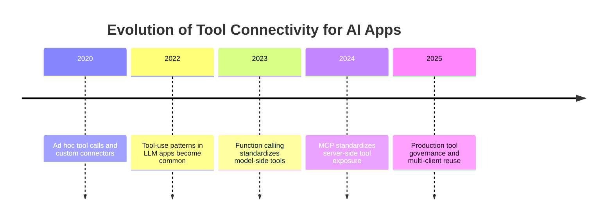

Day 11–12 taught model-side function calling. Day 25 teaches **server-side standardization** so StudySpark tools survive beyond one provider API.

## MCP in the StudySpark Architecture
By Day 25, StudySpark has several consumers of the same capabilities:

| Consumer | Needs from tool layer |
| --- | --- |
| Chat UI (Day 14+) | Fast search, cite lesson |
| Research agent (Day 22) | Multi-step search and inspect |
| Planner executor (Day 23) | Reliable retrieve before summarize |
| Researcher role (Day 24) | Evidence packs with metadata |
| Future CLI or IDE host | Discovery without custom fork |

Without MCP-style boundaries, each row becomes a duplicate integration. With a notes MCP server, you implement search once and point every consumer at the same client SDK.

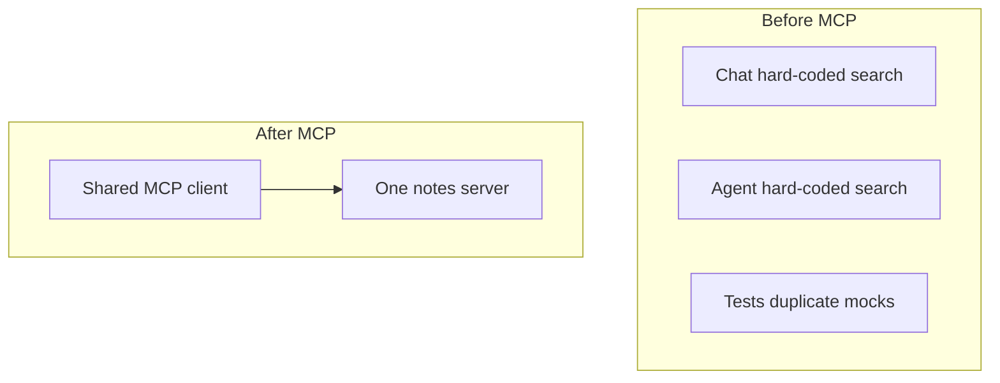

**Beginner path without MCP hosts:** You do not need a production MCP daemon on Day 25. Implement the same **contract**—tool list, schema validation, structured responses—as a Python module plus mock server. That teaches the design pattern; you can swap in a real MCP transport later.

## Deep Theory

### MCP vs function calling
| Layer | What it standardizes | StudySpark example |
| --- | --- | --- |
| Function calling (Day 11–12) | Model proposes a tool call in provider API | OpenAI `tools` array |
| MCP (Day 25) | Server exposes tools via protocol | `search_notes` server any client can use |

They complement each other: the model may call tools through a provider; the MCP client routes those calls to MCP servers.

### End-to-end StudySpark call flow
When a student asks StudySpark to "summarize Day 17 using my notes":

1. **Router** sends the request to the Day 22 agent with Day 23 plan.
2. **Planner** produces: clarify scope → search notes → search curriculum → summarize.
3. **LLM function call** proposes `search_notes(query="RAG", top_k=5)`.
4. **MCP client** validates args against schema and checks user role.
5. **MCP server** runs hybrid search, returns structured chunks.
6. **Agent state** stores observation; planner continues or replans.
7. **Writer** (single or multi-agent) synthesizes with citations.
8. **Audit log** records trace ID, tools, latency for Day 27 eval.

This flow shows MCP sitting **below** agent logic, not replacing it. Guardrails on Day 28 still apply after tools return.

### Client-server model
- **Client** — part of StudySpark runtime or an IDE host; discovers and invokes tools
- **Server** — exposes tools, resources, optional prompts; connects to notes DB, filesystem, APIs
- **Transport** — often stdio or HTTP in implementations; keep business logic out of transport

The client should not need filesystem paths to notes—only the server's tool contract.

### Discovery
Discovery is how the client learns what exists.

A discovery response typically includes tool names, descriptions, and input schemas. Good discovery reduces manual wiring when you add a new tool to the server—clients pick it up automatically on reconnect.

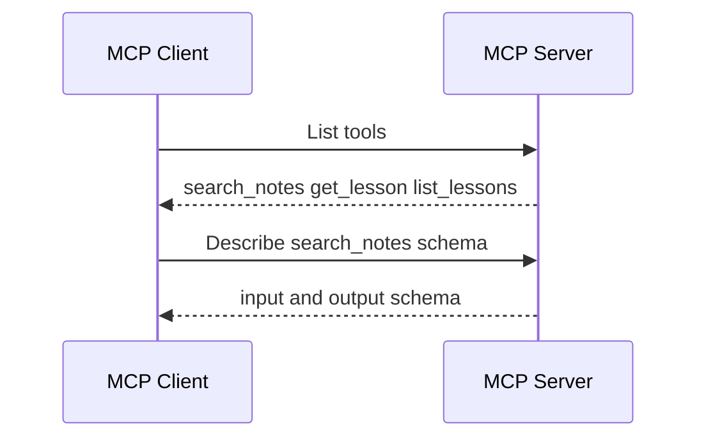

### Tool contracts
Every tool needs a clear contract:

| Field | Purpose |
| --- | --- |
| name | Stable identifier |
| description | Helps model and developers choose correctly |
| input schema | Valid arguments |
| output shape | Predictable parsing |
| permissions | Who may call it |

Poor descriptions cause model misuse: overlapping tools confuse the planner.

### Resources and prompts
MCP servers may expose:

- **tools** — actions with side effects or queries
- **resources** — readable context (note metadata, lesson index)
- **prompts** — reusable prompt templates hosted by the server

Resources let StudySpark fetch lesson indexes without stuffing entire files into discovery responses.

### Advantages
- reduces integration duplication across StudySpark modules
- improves reuse for agents, chat, and external hosts
- centralizes permission checks
- encourages schema-first tool design
- simplifies testing with mock servers

### Limitations
- protocol and transport overhead
- requires disciplined server design
- still needs auth, rate limits, and validation
- does not automatically make tools safe
- another layer to debug when misconfigured

### Alternatives
- direct Python function imports inside StudySpark (fine for early prototypes)
- internal REST microservices without MCP
- provider-native tool definitions only
- monolithic app with no protocol boundary

### When should you use MCP?
Use MCP-style boundaries when:

- multiple clients need the same tools (chat, agent, CLI)
- you want consistent discovery and schemas
- tools should outlive a single LLM provider
- governance and permissions must be centralized

### When should you not use it?
Skip MCP when:

- StudySpark is a tiny prototype with one tool and one UI
- direct function calls are simpler and team size is small
- you are not ready to maintain a server process
- latency of an extra hop is unacceptable without benefit

## Visual Learning

### MCP Flow
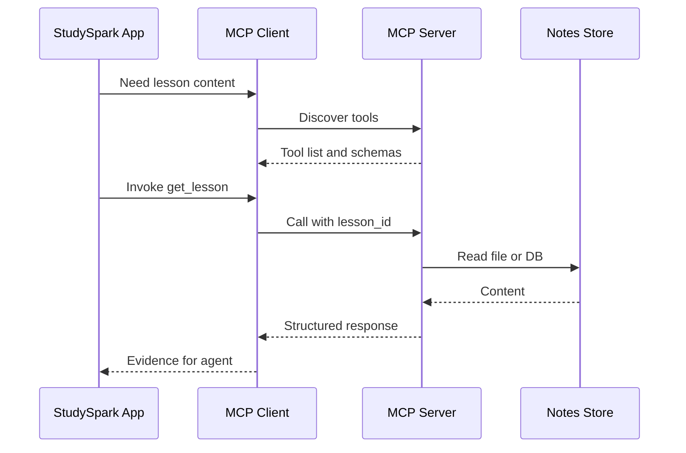

### StudySpark Tool Server
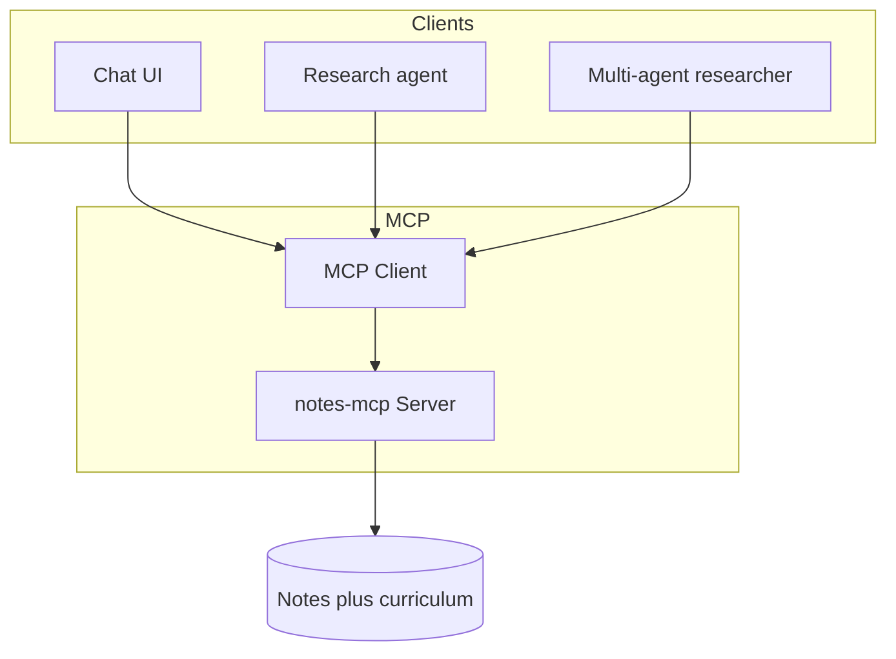

### Decision Tree
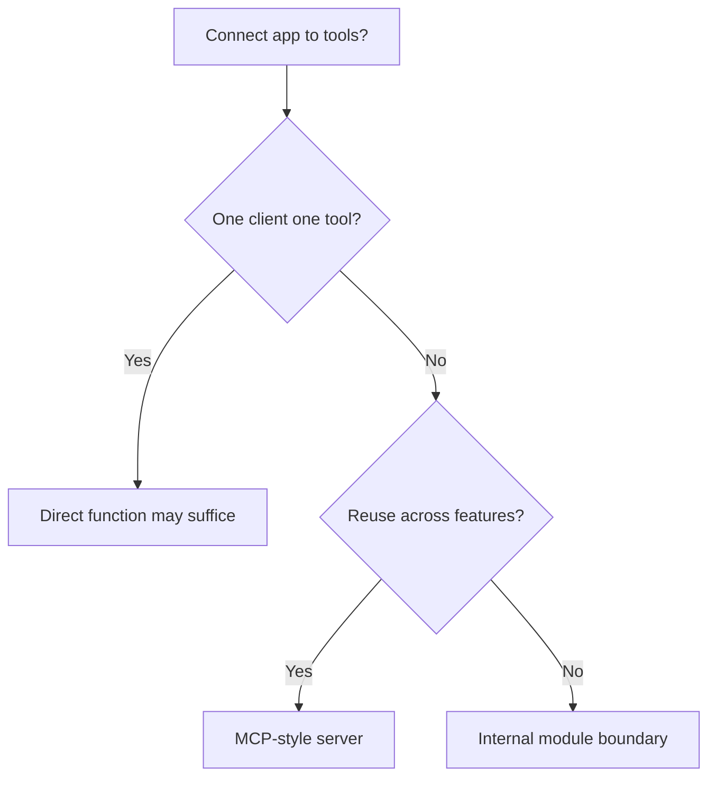

### Protocol Mind Map
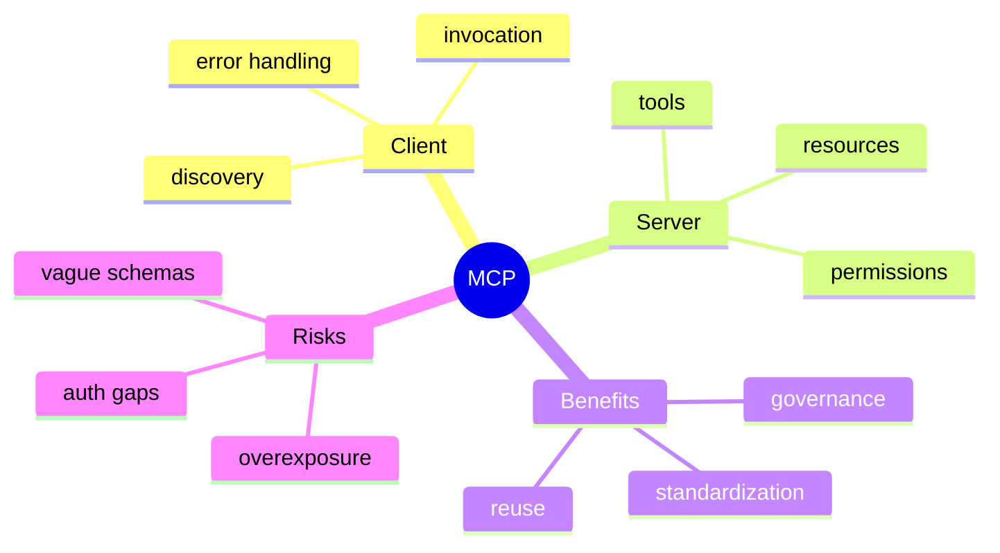

### Day 22-25 Stack
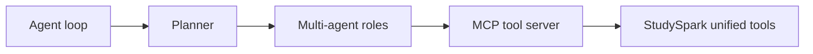

### Permission Flow
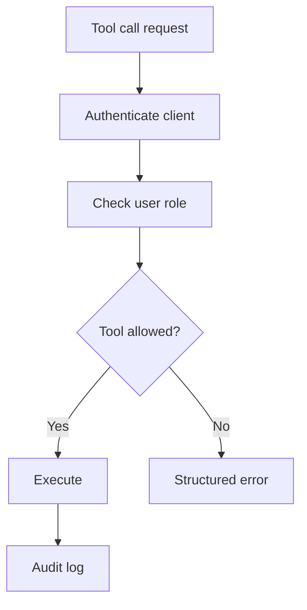

### Error Handling Layers
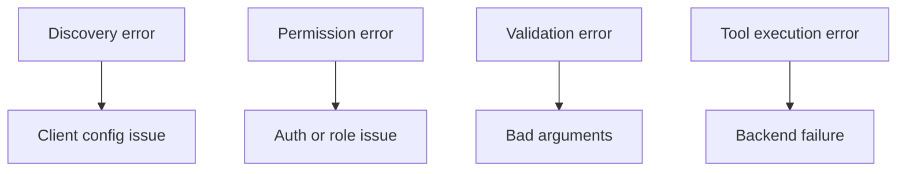

### Transport vs Business Logic
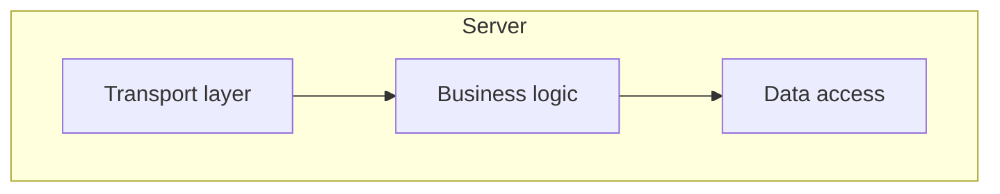

## Code Walkthrough

Examples are simplified to teach MCP **shape** without requiring a live MCP host. Beginners can run them locally.

### Example 1: Python — Tool metadata contract
```python
SERVER_NAME = "studyspark-notes-mcp"

TOOLS = [
    {
        "name": "search_notes",
        "description": "Search student notes and curriculum by keyword or meaning.",
        "input_schema": {
            "type": "object",
            "properties": {
                "query": {"type": "string"},
                "top_k": {"type": "integer", "default": 5},
            },
            "required": ["query"],
        },
    },
    {
        "name": "get_lesson",
        "description": "Fetch a curriculum lesson file by day id, e.g. day_17.",
        "input_schema": {
            "type": "object",
            "properties": {"lesson_id": {"type": "string"}},
            "required": ["lesson_id"],
        },
    },
]

print(SERVER_NAME)
print([t["name"] for t in TOOLS])
```

#### Code Explanation
- `SERVER_NAME` identifies the server in logs and config.
- Each tool has name, description, and JSON Schema-style inputs.
- Clear descriptions reduce model confusion at call time.

### Example 2: TypeScript — Tool registry types
```typescript
type ToolDefinition = {
  name: string;
  description: string;
  inputSchema: Record<string, unknown>;
};

const tools: ToolDefinition[] = [
  {
    name: "search_notes",
    description: "Search notes by keyword or semantic similarity.",
    inputSchema: {
      type: "object",
      properties: { query: { type: "string" }, topK: { type: "integer" } },
      required: ["query"],
    },
  },
  {
    name: "get_lesson",
    description: "Fetch a lesson by id.",
    inputSchema: {
      type: "object",
      properties: { lessonId: { type: "string" } },
      required: ["lessonId"],
    },
  },
];

console.log(tools.map((t) => t.name));
```

#### Code Explanation
- Shared types keep client and server contracts aligned.
- Schema doubles as documentation and validation spec.

### Example 3: Python — Client discovery
```python
def discover_tools(server_tools):
    return [
        {
            "name": tool["name"],
            "description": tool["description"],
            "input_schema": tool["input_schema"],
        }
        for tool in server_tools
    ]


available = discover_tools(TOOLS)
print(available[0]["name"])
```

#### Code Explanation
- Discovery returns enough metadata for planners and models.
- Real MCP clients cache discovery results with TTL.

### Example 4: TypeScript — Permission check
```typescript
type UserContext = {
  userId: string;
  role: "reader" | "editor" | "admin";
};

function canUseTool(user: UserContext, toolName: string): boolean {
  if (toolName === "get_lesson") {
    return true;
  }
  if (toolName === "search_notes") {
    return true;
  }
  if (toolName === "write_note") {
    return user.role === "editor" || user.role === "admin";
  }
  return false;
}

console.log(canUseTool({ userId: "u1", role: "reader" }, "search_notes"));
console.log(canUseTool({ userId: "u1", role: "reader" }, "write_note"));
```

#### Code Explanation
- Permissions live server-side, not in model prompts alone.
- StudySpark students might be read-only on curriculum tools.

### Example 5: Python — Validated tool call wrapper
```python
def validate_args(tool_name, arguments, tools):
    tool = next(t for t in tools if t["name"] == tool_name)
    required = tool["input_schema"].get("required", [])
    for field in required:
        if field not in arguments:
            raise ValueError(f"Missing required field: {field}")


def call_tool(tool_name, arguments, tools):
    validate_args(tool_name, arguments, tools)
    if tool_name == "search_notes":
        return {"status": "ok", "data": {"chunks": [f"Hit for {arguments['query']}"]}}
    if tool_name == "get_lesson":
        return {"status": "ok", "data": {"lesson_id": arguments["lesson_id"], "content": "..."}}
    raise ValueError(f"Unknown tool: {tool_name}")


print(call_tool("search_notes", {"query": "RAG"}, TOOLS))
```

#### Code Explanation
- Validation happens before business logic executes.
- Structured responses separate success from errors consistently.

### Example 6: TypeScript — Structured error response
```typescript
type ToolResponse =
  | { status: "ok"; data: unknown }
  | { status: "error"; error: { code: string; message: string } };

function errorResponse(code: string, message: string): ToolResponse {
  return { status: "error", error: { code, message } };
}

console.log(errorResponse("PERMISSION_DENIED", "write_note requires editor role"));
```

#### Code Explanation
- Agents replan better with machine-readable error codes.
- Free-text-only errors are harder to automate against.

### Example 7: Python — Resource listing (lesson index)
```python
RESOURCES = [
    {"uri": "lesson://day_17", "name": "Day 17 RAG", "mimeType": "text/markdown"},
    {"uri": "lesson://day_18", "name": "Day 18 Hybrid Search", "mimeType": "text/markdown"},
]


def list_resources():
    return RESOURCES


print(list_resources())
```

#### Code Explanation
- Resources expose readable context without executable semantics.
- URIs give stable identifiers for curriculum content.

### Example 8: TypeScript — Client router to server
```typescript
async function invokeTool(name: string, args: Record<string, unknown>): Promise<ToolResponse> {
  // Stand-in for MCP transport call
  if (name === "search_notes") {
    return { status: "ok", data: { chunks: [] } };
  }
  return { status: "error", error: { code: "UNKNOWN_TOOL", message: name } };
}

invokeTool("search_notes", { query: "memory" }).then(console.log);
```

#### Code Explanation
- StudySpark agents call the router, not raw filesystem code.
- Swapping server implementations does not rewrite agent logic.

### Example 9: Python — Separate transport from logic
```python
def search_notes_logic(query, top_k=5):
    return [{"text": f"Chunk about {query}", "score": 0.9}]


def handle_tool_call(tool_name, arguments):
    if tool_name == "search_notes":
        chunks = search_notes_logic(arguments["query"], arguments.get("top_k", 5))
        return {"status": "ok", "data": {"chunks": chunks}}
    return {"status": "error", "error": {"code": "UNKNOWN_TOOL", "message": tool_name}}
```

#### Code Explanation
- `search_notes_logic` is testable without protocol code.
- Transport layer should parse, auth, validate, then delegate.

### Example 10: TypeScript — Audit log entry
```typescript
type AuditEntry = {
  traceId: string;
  tool: string;
  userId: string;
  status: "ok" | "error";
  latencyMs: number;
};

const entry: AuditEntry = {
  traceId: "abc-123",
  tool: "search_notes",
  userId: "student-1",
  status: "ok",
  latencyMs: 42,
};

console.log(entry);
```

#### Code Explanation
- MCP servers should audit tool usage for security and Day 27 eval.
- Connect trace IDs from Day 24 multi-agent flows.

### Example 11: Python — Mock MCP server for tests
```python
class MockNotesServer:
    def __init__(self, tools):
        self.tools = tools

    def list_tools(self):
        return discover_tools(self.tools)

    def call(self, name, arguments):
        return call_tool(name, arguments, self.tools)


server = MockNotesServer(TOOLS)
print(server.list_tools()[0]["name"])
print(server.call("get_lesson", {"lesson_id": "day_17"}))
```

#### Code Explanation
- Tests use mock servers so agents do not hit real storage.
- Same interface as production MCP server.

### Example 12: TypeScript — StudySpark agent using client
```typescript
async function researchStep(query: string): Promise<string> {
  const result = await invokeTool("search_notes", { query, topK: 5 });
  if (result.status === "error") {
    return "Could not search notes.";
  }
  return JSON.stringify(result.data);
}

researchStep("hybrid search").then(console.log);
```

#### Code Explanation
- Day 22 research loop steps become MCP invocations.
- Failures return user-safe messages, not stack traces.

## Practical Examples

### Beginner Example: Note search server
StudySpark chat and agent both call `search_notes` on the same MCP server. One implementation, two clients.

### Intermediate Example: Curriculum resources
Server exposes resources for lesson index and tools for search/get. Chat UI lists resources; agent invokes tools during planning.

### Advanced Example: Multi-server StudySpark
Separate servers for notes (student data) and curriculum (read-only repo content). Different permissions, unified client in StudySpark.

### Production Example: Enterprise doc servers
One MCP server for HR policies, one for engineering docs—central IT governs access; many assistants connect as clients.

### Real-World Company Example
**Anthropic** introduced MCP for connecting Claude to external data and tools consistently. **Cursor** and other IDE products use MCP servers for codebase tools. The pattern matches StudySpark: **standard tool host, many consumers**.

## Comparison Tables

### Direct Integration vs MCP
| Aspect | Direct function | MCP server |
| --- | --- | --- |
| Setup speed | Fastest | Moderate |
| Reuse | Low | High |
| Governance | Per call site | Centralized |
| Testing | Unit tests | Mock server plus contract tests |
| Best for | Prototypes | Multi-client products |

### Tool Design
| Good tool | Bad tool |
| --- | --- |
| `search_notes(query, top_k)` | `do_everything(input)` |
| Clear description | Vague "helper" |
| Structured JSON result | Prose-only blob |

### Error Codes
| Code | Meaning | Agent action |
| --- | --- | --- |
| PERMISSION_DENIED | Auth failed | Stop or ask user |
| VALIDATION_ERROR | Bad args | Fix and retry |
| NOT_FOUND | Missing resource | Replan search |
| INTERNAL_ERROR | Server bug | Fallback message |

## Best Practices
- expose small, focused tools with precise descriptions
- use JSON Schema for inputs and document outputs
- enforce permissions on the server for every call
- separate transport, validation, and business logic
- log tool name, latency, status—not full student content unless policy allows
- version tool contracts when breaking changes occur
- provide mock servers for CI tests
- avoid overlapping tool descriptions that confuse models

## Common Mistakes
- building endpoints without schemas or descriptions
- one mega-tool that does search, summarize, and quiz
- trusting the model to enforce permissions
- mixing FastAPI/HTTP boilerplate with search logic in one file
- exposing write tools before read-only tools are stable
- returning ambiguous error strings without codes
- skipping discovery—hard-coding tool lists in every client

### Debugging Strategy
When MCP integration fails:

1. Did discovery return expected tools and schemas?
2. Are arguments valid against schema?
3. Did permissions block the call?
4. Is the error from transport, validation, or business logic?
5. Does the client duplicate logic that belongs on the server?

## Performance

### Latency
Discovery plus network hop adds overhead. Cache tool lists, colocate server when possible, keep payloads compact.

### Cost
Poor tool design causes extra calls—fix schemas and descriptions before buying bigger models.

### Scalability
MCP shines when many clients reuse one server. Invest in server reliability and rate limits.

### Reliability
Structured errors and health checks on the server prevent agents from misinterpreting failures.

## Security

### Prompt Injection
Tool outputs are untrusted. Do not treat note content as instructions. Agents should cite, not obey, retrieved text.

### Secrets
API keys for embedding providers stay on the server, never in client discovery responses.

### Authentication
Clients present user or service identity; servers map to roles.

### Data Privacy
Student notes require strict access control and minimal logging.

### Supply Chain
Only connect to trusted MCP servers; malicious servers can exfiltrate data.

### Beginner-friendly local setup
You can complete Day 25 without installing external MCP daemons:

1. Create `mcp/server/tools.py` with `search_notes` and `get_lesson` logic.
2. Create `mcp/client/mcp_client.py` that calls the server module in-process.
3. Point Day 22 research agent at `mcp_client.call(...)`.
4. Write tests against `MockNotesServer` from the code walkthrough.

This mirrors how many teams adopt MCP: **schema and boundary first**, wire protocol transport when a second language or host needs access.

## Evaluation

### What to measure
- tool call success rate
- permission denial accuracy (no false allows)
- schema validation catch rate
- client reuse count (how many features share server)
- developer time to add a new client

### Evaluation checklist
1. Can a new client discover tools without code changes to server?
2. Do agents recover gracefully from structured errors?
3. Are read-only tools separated from write tools?
4. Do mock servers enable CI without live data?

## Exercises

### Easy
1. Explain what MCP is for in one sentence.
2. Name one thing MCP standardizes.
3. List two StudySpark tools an MCP server might expose.
4. Why do tool contracts matter?
5. What is discovery?
6. Client vs server—who invokes whom?

### Medium
7. Compare direct integration and MCP-style integration.
8. Explain client-server tool access with StudySpark example.
9. Why should permissions live on the server?
10. What are resources vs tools?
11. Name two MCP debugging steps.
12. When is MCP unnecessary?
13. How does MCP help Day 24 multi-agent roles?

### Hard
14. Design an MCP server for StudySpark notes and curriculum.
15. Define schemas for `search_notes` and `get_lesson`.
16. Design role-based access for reader vs editor.
17. Explain transport vs business logic separation.
18. Design audit log fields for tool calls.
19. Map Day 23 plan steps to MCP tool invocations.

### Challenge
20. Outline a `studyspark-notes-mcp` server with two tools.
21. Add resource listing for lesson index.
22. Add structured error codes and validation.
23. Build a mock server for agent tests.
24. Connect Day 22 research loop to mock MCP client.
25. Document server setup in README and `.env.example`.

### Reflection Questions
26. Why is a protocol better than ad hoc connectors at scale?
27. Biggest risk of poorly designed tool access?
28. How does MCP support reuse across AI apps?
29. Why must tool descriptions be concise and distinct?
30. How does Day 25 prepare you for LangChain on Day 26?

## Quizzes

### Quiz 1
1. What problem does MCP primarily solve?
2. Name the two main MCP components.
3. What is discovery?
4. Why use schemas?

**Answers:** 1. Fragmented custom tool integrations  2. Client and server  3. Learning available tools and their contracts  4. Validation and clear model usage

### Quiz 2
1. Tools vs resources?
2. Where should permissions be enforced?
3. One StudySpark tool name?
4. One alternative to MCP for tiny prototypes?

**Answers:** 1. Tools act; resources are readable context  2. Server  3. Examples: search_notes, get_lesson  4. Direct function imports

### Quiz 3
1. What is a structured tool response?
2. Why separate transport from business logic?
3. What is prompt injection via tool output?
4. How does MCP relate to function calling?

**Answers:** 1. Status plus data or error fields  2. Easier testing and maintenance  3. Untrusted content tries to control agent  4. Function calling is model-side; MCP standardizes server exposure

### Quiz 4
1. Name one bad tool design pattern.
2. What should audit logs include?
3. Why cache discovery?
4. How do agents use MCP on replan?

**Answers:** 1. One giant do-everything tool  2. tool, user, status, latency, trace ID  3. Reduce latency  4. Structured errors trigger replanning rules

### Quiz 5
1. When should StudySpark adopt MCP?
2. Name one security rule for MCP servers.
3. What capstone item does Day 25 add?
4. What day covers frameworks next?

**Answers:** 1. Multiple clients reuse tools  2. Examples: least privilege, no secrets in discovery  3. Standardized tool server outline  4. Day 26 LangChain

## Interview Questions

### Conceptual
- Explain MCP client-server architecture.
- MCP vs REST API for tool access?
- When would you skip MCP?
- What belongs in a tool contract?

### Practical
- Design tools for a note-taking assistant.
- How would you test an MCP server without production data?
- How would you handle PERMISSION_DENIED in an agent loop?
- How would you version a breaking schema change?

### System Design
- Design StudySpark notes MCP server with auth.
- Multiple MCP servers vs one monolithic server?
- Design audit logging for compliance.

### Debugging
- Agent says tool missing but server runs. What do you check?
- Search returns empty always. Server or client bug path?
- Model calls wrong tool repeatedly. Fix?

## Mini Project
Outline a **`studyspark-notes-mcp` server** exposing note search and lesson retrieval.

### Goal
Create a reusable tool server any StudySpark client can use for grounded retrieval.

### Features
- `search_notes` and `get_lesson` tools with JSON Schema
- resource list for curriculum index
- role-based permissions (read-only default)
- structured ok/error responses
- mock mode for tests
- audit logging with trace ID support

### Suggested folder structure
```text
projects/studyspark/
├── mcp/
│   ├── server/
│   │   ├── tools.py
│   │   ├── resources.py
│   │   ├── auth.py
│   │   ├── schemas.py
│   │   └── main.py
│   ├── client/
│   │   └── mcp_client.py
│   └── tests/
│       └── test_tools.py
├── data/
│   └── notes/
└── README.md
```

### Project steps
1. define tool contracts and schemas
2. implement business logic separate from transport stub
3. add permission checks for each tool
4. implement discovery response builder
5. add mock server for agent integration tests
6. connect Day 22 research agent through client wrapper

### Acceptance criteria
- discovery returns both tools with schemas
- invalid args return VALIDATION_ERROR
- reader role cannot call hypothetical write tools
- agent research step uses client, not direct file reads

### What you learn
- standardized tool access across StudySpark features
- schema-first design for agents and evals
- security boundaries before framework abstractions on Day 26

## Cumulative Capstone Update
After Day 25, StudySpark tool access should be **standardized and reusable** across chat, agents, and tests.

Add these items to [`projects/CAPSTONE.md`](../../projects/CAPSTONE.md):

- **tool server outline** — `studyspark-notes-mcp` with `search_notes`, `get_lesson`
- **explicit JSON schemas** — inputs and documented output shapes
- **discovery response** — tools plus optional curriculum resources
- **role-based permissions** — read-only default for curriculum; scoped access for student notes
- **structured responses** — `status`, `data`, `error.code` for agent consumption
- **MCP client module** — single StudySpark entry point for tool calls
- **mock server for CI** — agents tests run without live filesystem dependencies
- **audit logging** — trace ID, tool name, latency, status

Suggested client interface:

```python
def mcp_call(tool_name: str, arguments: dict, user_context: dict) -> dict:
    """Discover, validate, invoke, and return structured tool response."""
```

Capstone architecture after Day 25:

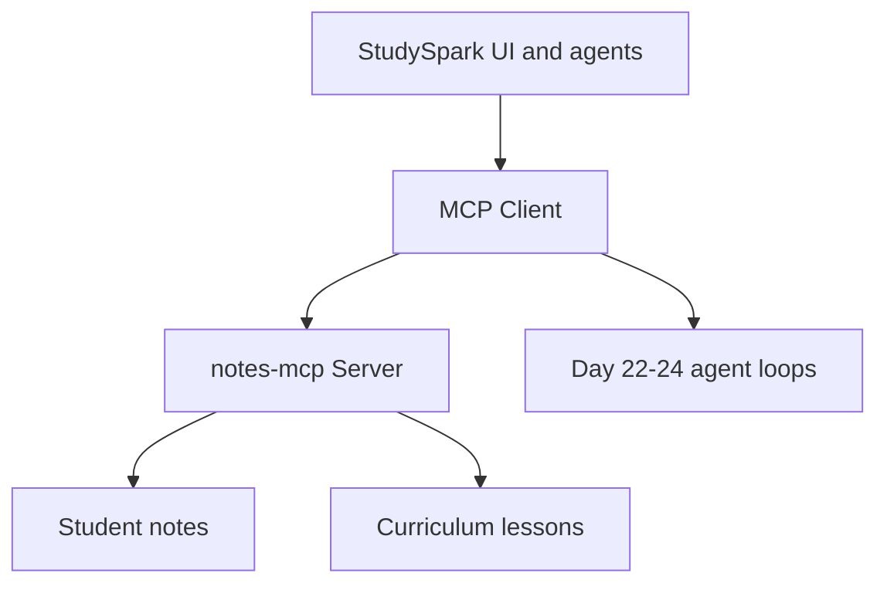

This makes the capstone easier to extend, test, and connect to frameworks on Day 26 without rewriting retrieval glue.

## Summary
MCP standardizes how assistants connect to tools and data. It helps make AI systems modular, reusable, and easier to govern.

The main lessons from today are:

- custom tool wiring does not scale as StudySpark grows
- protocol boundaries improve reuse across chat, agents, and external hosts
- contracts, schemas, and server-side permissions matter as much as model choice
- MCP complements Day 11–12 function calling—it does not replace agent control layers

If Day 24 taught you how agents cooperate, Day 25 teaches you how they connect to the outside world through a stable interface. Day 26 adds framework choices on top of this foundation.

[Previous: Day 24 - Multi-Agent Systems](../day_24/day_24_multi_agent_systems.md) | [Next: Day 26 - LangChain](../day_26/day_26_langchain.md)

## Further Reading
- [Model Context Protocol specification](https://modelcontextprotocol.io/)
- [MCP GitHub organization](https://github.com/modelcontextprotocol)
- [Anthropic MCP documentation](https://docs.anthropic.com/en/docs/agents-and-tools/mcp)
- [Anthropic: Introducing MCP](https://www.anthropic.com/news/model-context-protocol)
- [Day 11–12 lessons in this course](../day_11/day_11_tool_calling.md) — function calling foundations
