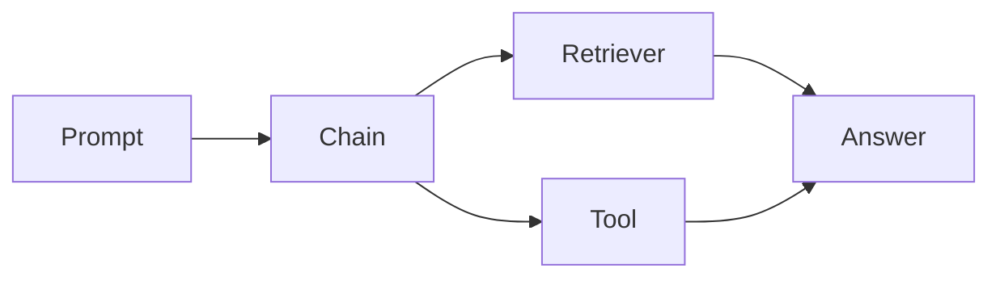
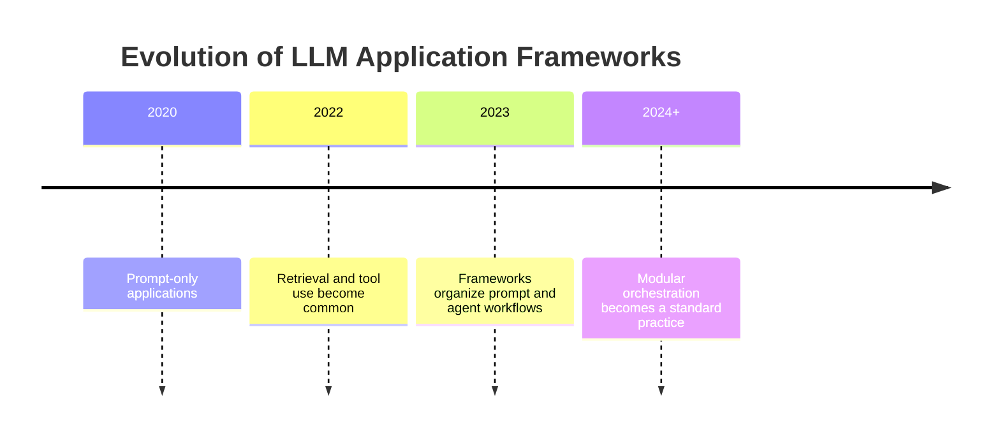
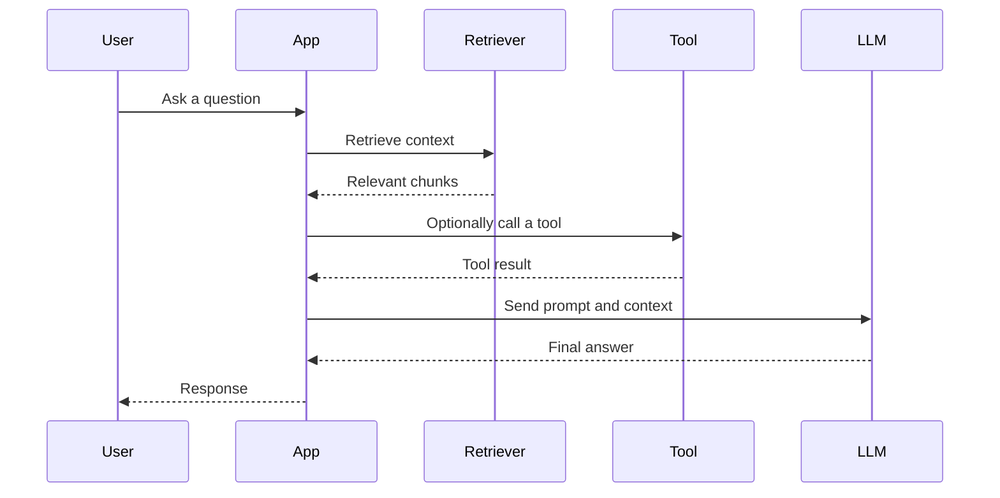
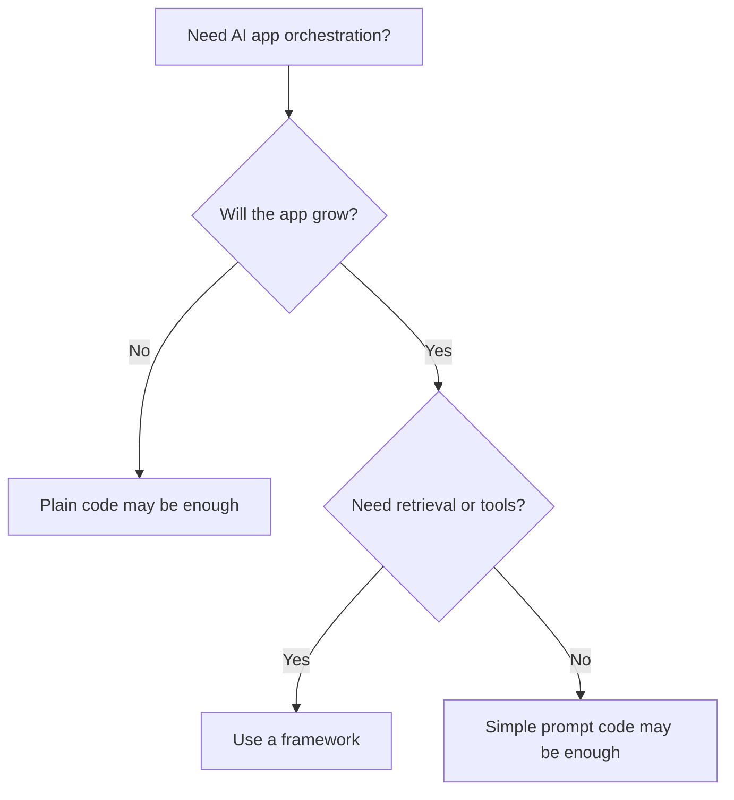
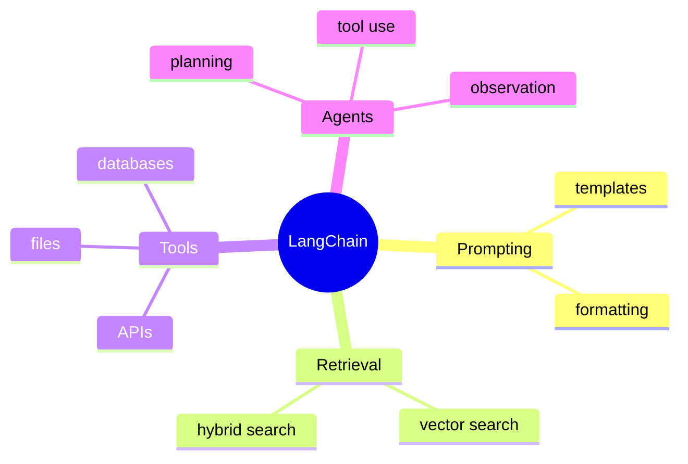

# Day 26 - LangChain

[Previous: Day 25 - Model Context Protocol (MCP)](../day_25/day_25_model_context_protocol_mcp.md) | [Next: Day 27 - Evaluation](../day_27/day_27_evaluation.md)

## Introduction
Yesterday we learned how MCP standardizes tool access. Today we look at a framework that helps you wire prompts, retrieval, tools, and agent workflows together: LangChain.

LangChain is a framework for building LLM applications with prompts, tools, retrieval, and agent workflows. It helps organize common AI app patterns without hiding the underlying engineering.


This matters because many AI applications need the same plumbing:

- prompt preparation
- retrieval
- tool calling
- response formatting
- state handling
- agent orchestration

LangChain helps reduce repetitive wiring, but it should not hide the logic you need to understand and debug.

## Learning Objectives
By the end of this day, you should be able to:

- explain what LangChain is good for
- identify chains, tools, retrievers, and agents
- understand when a framework helps and when plain code is better
- build a small modular AI workflow
- keep framework usage readable and testable
- recognize framework abstractions that make debugging harder
- connect LangChain concepts to the systems you built in Week 3 and early Week 4

## Prerequisites
You should already understand:

- Day 22: What are AI Agents?
- Day 23: Planning
- Day 25: MCP
- the retrieval and memory concepts from Week 3

If those are still fuzzy, review them first. LangChain becomes much clearer once you understand the underlying app patterns it helps organize.

## Big Picture
LangChain sits above the low-level app wiring.



The idea is simple:

- you define components for prompts, retrieval, and tools
- LangChain helps connect those components into a workflow
- the app still needs clear design and testing

Think of LangChain as a construction kit for common LLM app patterns.

## Why LangChain Exists
LangChain exists because AI applications often repeat the same orchestration patterns.

For example:

- load a prompt
- retrieve context
- call a tool
- format a response
- pass state to the next step

Without a framework, every app recreates that wiring from scratch.

LangChain helps by offering reusable abstractions for:

- chains
- retrievers
- tools
- prompts
- memory patterns
- agent workflows

## Historical Background
As LLM apps grew, developers needed reusable building blocks.

First came direct prompting. Then retrieval and tool use became common. Then frameworks like LangChain emerged to reduce boilerplate and standardize orchestration.



## Deep Theory

### What is LangChain?
LangChain is a framework for composing LLM application components.

It does not replace good engineering. It helps you organize it.

### Why frameworks help
Frameworks are useful when they reduce repetitive wiring.

They help when you need to:

- connect prompts to retrievers
- route context into the model
- standardize tool usage
- manage reusable pipelines
- move from prototypes to structured applications

### Core primitives
LangChain apps often use these ideas:

| Primitive | Meaning |
| --- | --- |
| Prompt | Instructions and input template for the model |
| Chain | A sequence of processing steps |
| Retriever | A component that finds relevant context |
| Tool | An external capability the model or agent can use |
| Memory | Stored context used across turns |
| Agent | A system that chooses actions dynamically |

### Chains
A chain is a sequence of steps.

For example:

1. format the prompt
2. retrieve context
3. send to model
4. format the response

Chains are useful because they make app logic explicit.

### Retrievers
Retrievers pull relevant information from a data source.

In this course, retrievers often connect to vector databases or hybrid search systems.

### Tools
Tools let the application access external actions or data sources.

These may include:

- search tools
- calculators
- file readers
- database queries
- custom APIs

### Agents
Agents choose when to use tools or how to proceed.

LangChain can help structure those workflows, but the decision-making still depends on the model and the surrounding control logic.

### Memory
LangChain-like memory patterns help preserve context across turns.

This connects directly to Day 19 and Day 20.

### Why readability matters
Frameworks can either clarify or obscure.

If you cannot tell what the app does without reading a dozen abstractions, the framework is hurting more than helping.

### Advantages
- reduces boilerplate
- provides reusable components
- helps standardize common LLM patterns
- fits naturally with retrieval and agent workflows
- speeds up prototyping and modular design

### Limitations
- abstractions can hide important details
- framework updates may change APIs
- overuse can make apps harder to debug
- simple apps may not need the framework at all

### Alternatives
- plain Python or TypeScript code
- your own orchestration layer
- workflow engines like custom pipelines or task runners
- lower-level SDKs only

### When should you use LangChain?
Use it when:

- you need reusable orchestration
- your app combines prompts, retrieval, and tools
- you want a modular structure
- you expect the workflow to grow

### When should you not use it?
Do not use it when:

- the application is tiny
- a single API call is enough
- you need complete control and minimal abstraction
- the framework would obscure more than it helps

## Visual Learning

### LangChain Workflow


### Decision Tree


### Component Map


## Code Walkthrough

The examples below are intentionally framework-neutral. They show the shape of LangChain-style design without hiding the logic.

### Python Example: Small workflow steps
```python
def build_prompt(question):
        return f"Answer the question clearly: {question}"


def retrieve_context(question):
        return [f"Relevant context for: {question}"]


def format_response(answer, context):
        return {
                'answer': answer,
                'context': context,
        }


question = 'How does retrieval work?'
prompt = build_prompt(question)
context = retrieve_context(question)
response = format_response('Retrieval finds relevant chunks before generation.', context)

print(prompt)
print(response)
```

#### Code Explanation
- `build_prompt` prepares the input for the model.
- `retrieve_context` finds supporting information.
- `format_response` keeps the output structured.
- this is the kind of wiring a framework helps organize.

### TypeScript Example: Modular workflow object
```typescript
type WorkflowResult = {
    prompt: string;
    context: string[];
    answer: string;
};

function buildPrompt(question: string): string {
    return `Answer the question clearly: ${question}`;
}

function retrieveContext(question: string): string[] {
    return [`Relevant context for: ${question}`];
}

function createResult(question: string): WorkflowResult {
    const prompt = buildPrompt(question);
    const context = retrieveContext(question);
    const answer = 'Retrieval finds relevant chunks before generation.';

    return { prompt, context, answer };
}

console.log(createResult('How does retrieval work?'));
```

#### Code Explanation
- `WorkflowResult` keeps the output shape clear.
- each helper function has one responsibility.
- this separation makes the workflow easier to test.

### Python Example: Chain with tool step
```python
def search_tool(query):
        return f"Search results for: {query}"


def run_chain(question):
        prompt = build_prompt(question)
        context = retrieve_context(question)
        tool_result = search_tool(question)

        return {
                'prompt': prompt,
                'context': context,
                'tool_result': tool_result,
        }


print(run_chain('How does retrieval work?'))
```

#### Code Explanation
- `search_tool` represents an external capability.
- `run_chain` combines prompt, retrieval, and tool output.
- the workflow is still understandable because each step is explicit.

### TypeScript Example: Agent-style branch
```typescript
function shouldUseTool(question: string): boolean {
    return question.toLowerCase().includes('search') || question.toLowerCase().includes('find');
}

function answerQuestion(question: string): string {
    if (shouldUseTool(question)) {
        return `Tool-assisted answer for: ${question}`;
    }

    return `Direct answer for: ${question}`;
}

console.log(answerQuestion('Find the day about vector databases'));
```

#### Code Explanation
- `shouldUseTool` is a simple decision rule.
- `answerQuestion` shows a branch between direct response and tool-assisted behavior.
- this is the core idea behind agent workflows.

### Python Example: Response formatter
```python
def format_output(answer, sources):
        return {
                'answer': answer,
                'sources': sources,
                'confidence': 'medium',
        }


print(format_output('Retrieval finds context before generation.', ['day_17/day_17_rag.md']))
```

#### Code Explanation
- `format_output` keeps outputs consistent.
- `sources` helps users trust the result.
- structured outputs make evaluation and debugging easier.

## Practical Examples

### Beginner Example: Note assistant workflow
A note assistant needs to format a question, retrieve matching notes, and return a simple answer.

Why it works:

- the flow is small
- each stage is easy to inspect
- the code stays readable

### Intermediate Example: Repository knowledge assistant
The assistant from Day 21 can use LangChain-style components for prompt building, retrieval, and response formatting.

What could go wrong:

- hiding too much logic behind a chain
- relying on framework defaults without understanding them
- making the workflow more complex than the project needs

### Professional Example: Support assistant workflow
A support assistant may use a retrieval component, a tool component, and a response formatter to answer questions about policies or product behavior.

Why professionals like this:

- the workflow is modular
- the retrieval and tool layers can be tested separately
- the system can grow without rewriting everything

### Real-World Company Example
Teams building internal copilots often use frameworks like LangChain to reduce wiring around retrieval, tools, and formatting. The best teams still keep the workflow understandable and testable, because the framework is not a substitute for architecture.

## Best Practices
- use frameworks to simplify repetition, not to obscure logic
- keep chains small and composable
- test the non-framework parts directly
- document the role of each component
- upgrade carefully when the framework changes
- separate retrieval, reasoning, and formatting when possible
- keep the underlying logic visible in code reviews

## Common Mistakes
- putting all logic into one opaque chain
- treating framework defaults as guaranteed best practice
- not understanding the underlying APIs
- overengineering a simple workflow
- ignoring maintainability when the prototype grows
- assuming the framework will solve poor retrieval or poor prompts

### Debugging Strategy
When a framework-based app fails, inspect it in this order:

1. Is the underlying prompt correct?
2. Is retrieval returning the right context?
3. Are tools being called with the right inputs?
4. Is the output formatter hiding a problem?
5. Is the chain doing too much at once?

## Performance

Frameworks can improve productivity, but they also add overhead if used carelessly.

### Latency
Latency grows when chains become deep or when a framework adds unnecessary steps.

You can reduce it by:

- keeping chains short
- reusing cached retrieval when safe
- avoiding multiple model calls when one would do
- removing unnecessary abstraction layers

### Cost
Costs increase when:

- the framework encourages extra calls
- the chain is overcomplicated
- the workflow repeats the same step in multiple places

### Memory
Framework workflows should keep state tight and relevant.

Too much stored context increases prompt size and makes debugging harder.

### Scalability
Frameworks scale well when the workflow is modular.

For example:

- one component for prompts
- one for retrieval
- one for tools
- one for formatting

### Reliability
The most reliable workflow is usually the one with the fewest moving parts that still solves the problem.

## Security

Frameworks do not remove security problems. They can actually make security harder to see if abstractions are too deep.

### Prompt Injection
Retrieved content or tool output may contain malicious instructions.

### Secrets and API Keys
Keep secrets out of prompts and logged traces.

### Authentication and Authorization
Tool and retriever access should still be enforced outside the framework when needed.

### Data Privacy
Framework traces may contain sensitive user data. Log carefully.

### Hallucinations and Model Safety
Frameworks do not prevent hallucinations. They only organize the app. The model still needs grounding and validation.

## Evaluation
Evaluate framework-based apps at both the component level and the workflow level.

### What to measure
- prompt correctness
- retrieval quality
- tool call success rate
- response formatting accuracy
- end-to-end task success

### Useful questions
- Did the framework make the workflow easier to read?
- Did it reduce wiring without hiding the logic?
- Did it improve the modularity of the app?
- Did it make debugging harder or easier?

## Exercises

### Easy
1. Define a chain.
2. Name one thing LangChain can help organize.
3. Give one reason frameworks are useful.
4. Give one reason a small app may not need a framework.

### Medium
5. Explain when a framework helps.
6. Describe the difference between a retriever and a tool.
7. Explain why modular code is easier to test.
8. Compare a framework workflow and plain code for the same task.

### Hard
9. Design a small retrieval workflow.
10. Explain how you would structure a prompt-retrieval-tool pipeline.
11. Describe how to keep framework abstractions from becoming opaque.
12. Propose a migration strategy for replacing a chain component.

### Challenge
13. Sketch a LangChain-based note assistant with prompt setup, retrieval, and response formatting.
14. Add a tool branch for note search.
15. Add a structured output schema.
16. Add a fallback when retrieval is weak.
17. Add logs for each stage of the workflow.

### Reflection Questions
18. When is a framework helping, and when is it just adding ceremony?
19. Why is readability still the main engineering goal?
20. What do you gain by keeping the underlying logic visible?
21. How does LangChain relate to MCP and agent workflows?
22. What would you insist on testing first in a framework app?

## Mini Project
Sketch a LangChain-based note assistant with prompt setup, retrieval, and response formatting.

### Goal
Build a modular note assistant workflow that retrieves relevant notes, formats the prompt, and returns a structured answer with sources.

### Features
- a prompt builder
- a retriever component
- a tool branch for note search
- a response formatter
- a fallback path when context is weak
- clear logs for each component

### Suggested folder structure
```text
langchain-note-assistant/
├── app/
│   ├── prompt_builder.py
│   ├── retriever.py
│   ├── tools.py
│   ├── formatter.py
│   └── main.py
├── tests/
│   └── test_workflow.py
└── README.md
```

### Project Steps
1. define the prompt template
2. connect the retriever
3. add a note search tool branch
4. format responses with citations
5. test the workflow with repository questions
6. compare the framework version with a plain-code version

### What You Learn
- how framework components map to real workflow steps
- how to keep abstractions readable
- how to compare framework code with plain code
- how this lesson prepares you for evaluation in Day 27

## Capstone Update
Add these items to the final capstone plan:

- a modular assistant workflow that can be implemented with or without a framework
- separate prompt, retrieval, tool, and formatting components
- structured outputs for easier evaluation
- logs that show each stage of the workflow

This will make the capstone easier to maintain and easier to benchmark.

## Summary
LangChain can speed up AI app development, but good engineering still means keeping workflows clear, testable, and modular.

The main lessons from today are:

- frameworks help most when they reduce repeated wiring
- abstraction should not hide the app’s logic
- retrieval, tools, and formatting should remain understandable
- modular design matters more than framework popularity

If Day 25 gave you a standard way to connect tools, Day 26 gives you a way to organize those tool-using workflows into reusable application patterns.

[Previous: Day 25 - Model Context Protocol (MCP)](../day_25/day_25_model_context_protocol_mcp.md) | [Next: Day 27 - Evaluation](../day_27/day_27_evaluation.md)

## Further Reading
- https://python.langchain.com/docs/
- https://js.langchain.com/docs/
- https://www.langchain.com/
- https://www.langchain.com/langgraph
- https://www.anthropic.com/news/building-effective-agents
