# Day 26 - LangChain

[Previous: Day 25 - Model Context Protocol (MCP)](../day_25/day_25_model_context_protocol_mcp.md) | [Next: Day 27 - Evaluation](../day_27/day_27_evaluation.md)

## Introduction

Yesterday you learned how MCP standardizes tool access. Today we look at **LangChain**—a popular framework for wiring prompts, retrieval, tools, and agent workflows together. Here is the most important framing for this lesson: **LangChain is optional.** You do not need a framework to build a good AI application. In fact, the best engineers in this course build the workflow in plain Python or TypeScript first, then decide whether a framework reduces repetition or adds confusion.

Think of LangChain like a power tool in a workshop. A skilled carpenter can build a shelf with hand tools alone. A power saw speeds up repetitive cuts—but only if you already know where each piece goes. If you reach for the saw before you understand the design, you cut faster in the wrong direction.

Day 25 gave you a standard way to connect tools through MCP. Day 26 asks a different question: **how do you organize those tool-using workflows into maintainable application code?** LangChain is one answer. Plain modular code is another. LangGraph—LangChain's graph-based orchestration library—is a third when you need explicit state machines and multi-step agents.

By the end of today, you will understand what frameworks buy you, what they cost you, and how to keep the underlying logic visible whether you use LangChain or not.


## Learning Objectives

By the end of this day, you should be able to:

- explain what LangChain is good for—and when plain code is better
- build a small RAG or tool workflow **without** a framework first
- identify chains, retrievers, tools, memory, and agents as composable concepts
- describe LangGraph and when graph-based orchestration helps
- map LangChain abstractions to code you already wrote in Weeks 2–4
- keep framework usage readable, testable, and debuggable
- compare a framework version and a plain-code version of the same workflow
- connect LangChain concepts to MCP tool servers and StudySpark architecture
- decide whether StudySpark needs a framework at all
- document a "framework vs plain code" decision for your capstone

## How to Use This Lesson

This lesson is designed for **all skill levels**. Pick one path and follow it consistently.

| Level | Suggested approach | Time |
| --- | --- | --- |
| **Beginner** | Read Introduction → Big Picture → Deep Theory → trace one code example → Easy exercises | 5–7 hours |
| **Intermediate** | Skim objectives → Visual Learning → Code Walkthrough → Medium/Hard exercises → Mini project | 3–5 hours |
| **Advanced** | Deep Theory tradeoffs → build plain-code workflow → optionally add LangChain → Challenge exercises → capstone slice | 2–4 hours |

### Apply Today

Complete at least one item before moving to the next day:

- [ ] Trace one code example in **Python or TypeScript** (one language is enough)
- [ ] Complete exercises for your level (see Exercises section)
- [ ] Update [`projects/CAPSTONE.md`](../../projects/CAPSTONE.md) with today's capstone item
- [ ] Add today's safety, eval, or deploy item to the capstone checklist.

> **Stuck?** Re-read Big Picture, review Prerequisites, or see [SYLLABUS.md](../../SYLLABUS.md) for path guidance.

## Prerequisites

You should already understand:

- Day 22: What are AI Agents?
- Day 23: Planning
- Day 25: MCP (tool servers and standardized tool access)
- Week 3 retrieval and memory (Days 15–21)
- basic Python or TypeScript module structure

If those are still fuzzy, review them first. LangChain becomes much clearer once you understand the underlying app patterns it helps organize—and you cannot judge a framework until you have built those patterns yourself.

## Big Picture

Every AI application repeats the same orchestration steps:

1. accept user input
2. validate or scope the request
3. retrieve context or call tools
4. assemble a prompt
5. call the model
6. validate and format the output

LangChain sits **above** the low-level wiring and **below** your product logic. It does not replace good design.

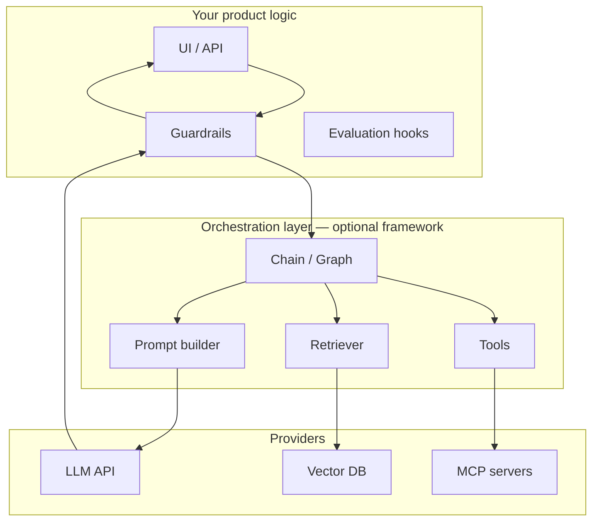

The recommended learning order for this lesson:

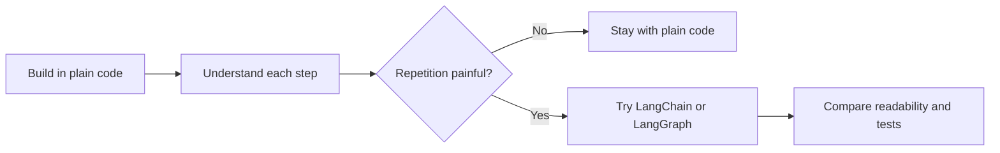

**Rule of thumb:** if you cannot explain your workflow as five named functions, a framework will not fix the confusion—it will hide it.

## Why This Topic Exists

Without a framework, every team reinvents the same glue code:

- prompt templates with variable substitution
- retrieval → context injection → generation pipelines
- tool registration, invocation, and result parsing
- conversation memory and session state
- retry and fallback wrappers around model calls

That glue is not glamorous, but it is where bugs hide. Frameworks like LangChain emerged because thousands of teams were writing the same patterns with slightly different bugs.

The problem frameworks solve is **repetition**, not **thinking**. They give you:

- reusable abstractions for common patterns
- community examples for RAG and agents
- integration adapters for vector stores and model providers

They do **not** give you:

- good retrieval quality
- correct prompt design
- safe tool permissions
- evaluation or guardrails

Those remain your job—as they should.

## Historical Background

LLM application development followed a predictable path:

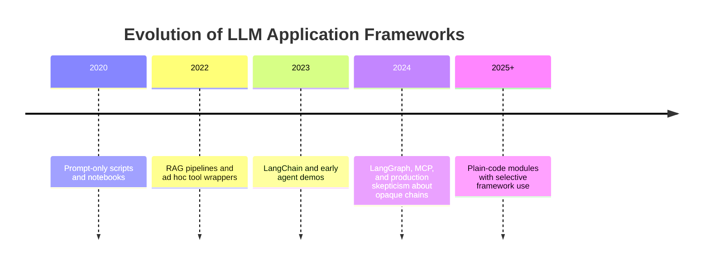

Early LangChain adoption was enthusiastic—and sometimes messy. Teams chained ten abstractions together before the first test passed. Production engineers pushed back: **"I cannot debug what I cannot read."** That feedback shaped LangGraph (explicit graphs and state) and a broader industry trend: **use frameworks where they reduce wiring, not where they replace understanding.**

## Deep Theory

### Build without a framework first

Before importing LangChain, implement your workflow as explicit functions:

| Step | Function responsibility | Testable without LLM? |
| --- | --- | --- |
| Input | Parse and validate user message | Yes |
| Retrieve | Return ranked chunks for a query | Yes (with fixture index) |
| Prompt | Combine system rules, context, question | Yes (snapshot test) |
| Generate | Call model with assembled messages | Mock client |
| Format | Structure output with citations | Yes |
| Guard | Apply output checks and refusal | Yes |

When each step is a function with a clear input and output type, you can:

- unit test retrieval without spending tokens
- swap the model client in one place
- add LangChain later as a thin wrapper—or skip it entirely

This is exactly how [`projects/studyspark/`](../../projects/studyspark/) is structured: modular `app/` folders that grow day by day, not one opaque chain file.

### What is LangChain?

LangChain is a framework for **composing** LLM application components. Its core ideas map directly to patterns you already know:

| LangChain concept | Plain-code equivalent | StudySpark location |
| --- | --- | --- |
| Prompt template | `build_prompt()` function | Prompt helper / RAG builder |
| Chain | `run_pipeline()` calling steps in order | `app/main.py` orchestration |
| Retriever | `search_knowledge_base()` | `app/rag/` |
| Tool | Registered callable with schema | `app/tools/` |
| Memory | Session store read/write | `app/memory/` |
| Agent | Loop: plan → act → observe | Agent design from Day 22–23 |

LangChain provides **Runnable** interfaces, **LCEL** (LangChain Expression Language) for piping steps, and adapters for dozens of vector stores and model providers. Useful—but only after you know what each step does.

### What is LangGraph?

**LangGraph** extends LangChain with **graph-based orchestration**: nodes (steps), edges (transitions), and explicit **state** that flows between them. Use LangGraph when:

- your agent loop has branches, cycles, or human-in-the-loop pauses
- you need to resume a workflow after an external event
- a linear chain cannot express "retry retrieval, then escalate, then refuse"

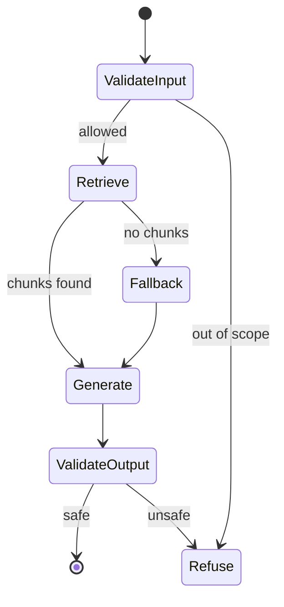

For StudySpark's core Q&A flow, a plain function pipeline is often enough. For a multi-step "research this topic across notes, web, and quiz generation" agent, LangGraph becomes worth considering.

### Chains vs graphs vs plain functions

| Approach | Best for | Risk |
| --- | --- | --- |
| Plain functions | StudySpark MVP, learning, testability | More boilerplate at scale |
| LangChain chains | Linear RAG, simple tool pipelines | Opaque LCEL if overused |
| LangGraph | Multi-step agents, cycles, checkpoints | Learning curve, still need tests |

### Core primitives in depth

**Prompt templates** separate instructions from runtime data. A template might include `{context}` and `{question}` placeholders. The engineering goal is the same whether you use LangChain's `ChatPromptTemplate` or an f-string in a function: **one place to change instructions.**

**Retrievers** wrap search logic. They return documents, not answers. Evaluating retriever quality separately from generation (Day 27) is easier when the retriever is its own module.

**Tools** expose capabilities to the model. Day 25's MCP servers can be wrapped as LangChain tools—or called directly from your own tool registry. The interface differs; the security rules do not.

**Memory** stores conversation state. Short-term session memory (Day 19) and long-term user preferences (Day 20) should have explicit policies: what to store, when to summarize, and what never to persist.

**Agents** choose actions dynamically. LangChain agents loop: model proposes tool call → execute → feed result back → model continues. Your Day 22–23 planning work is the conceptual foundation; the framework is optional syntax.

### Advantages of frameworks

- less boilerplate for common RAG and agent patterns
- adapters for many vector stores and providers
- community examples accelerate prototyping
- LangGraph adds explicit state for complex workflows

### Limitations of frameworks

- abstractions can hide retrieval and prompt bugs
- API changes between major versions require migration work
- debugging stack traces span framework internals
- teams may skip tests because "the chain handles it"
- simple apps gain little and lose clarity

### Alternatives

| Alternative | When to choose |
| --- | --- |
| Plain Python/TypeScript modules | Default for StudySpark and learning |
| Custom pipeline class | Medium complexity, full control |
| Temporal / workflow engines | Long-running jobs, human approval steps |
| Direct SDK + MCP | Minimal deps, production clarity |
| LangGraph | Complex agent state machines |

### When to use LangChain

Use it when:

- you have **proven** repetition across multiple features
- the team already knows the underlying steps
- LangGraph's state model matches your agent design
- adapter integrations save significant time (e.g., many retriever backends)

### When to skip LangChain

Skip it when:

- StudySpark's scope fits in a few hundred lines of orchestration
- you are still learning RAG and agents—plain code teaches more
- code review cannot explain what the chain does
- you need minimal dependencies for deployment (Day 29)

## Visual Learning

### End-to-end workflow (framework-neutral)

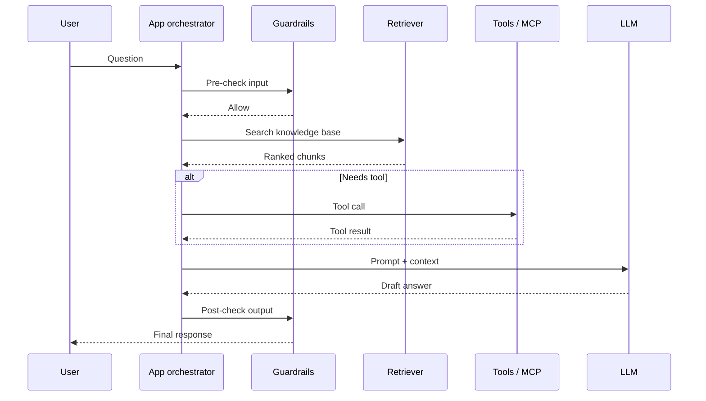

### Framework decision tree

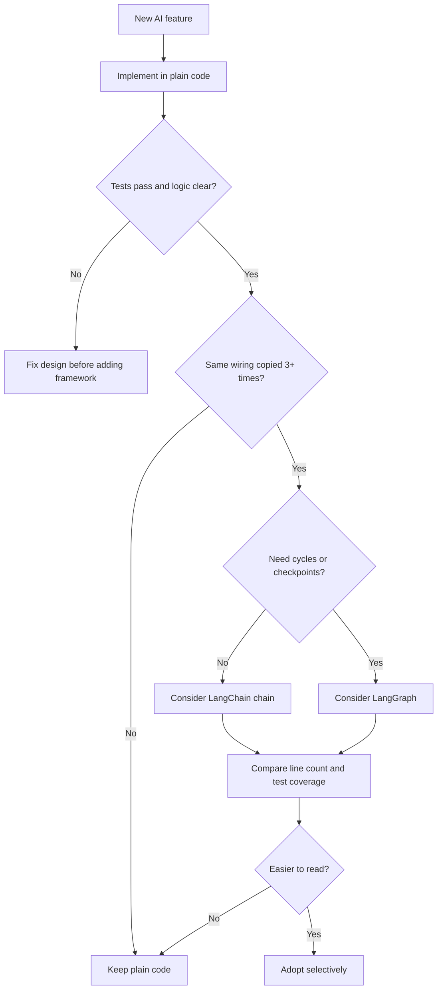

### Component map

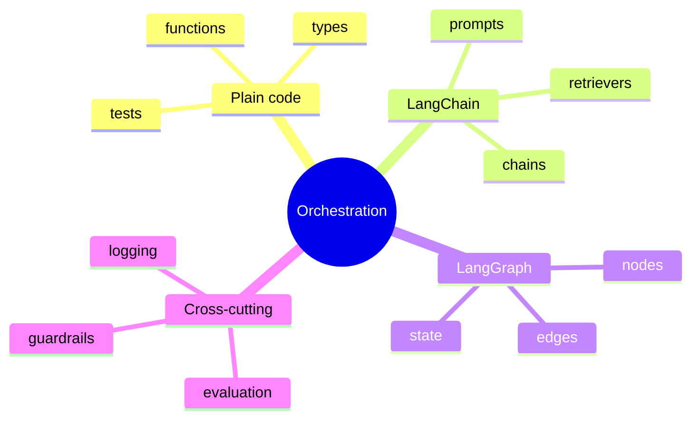

### StudySpark module alignment

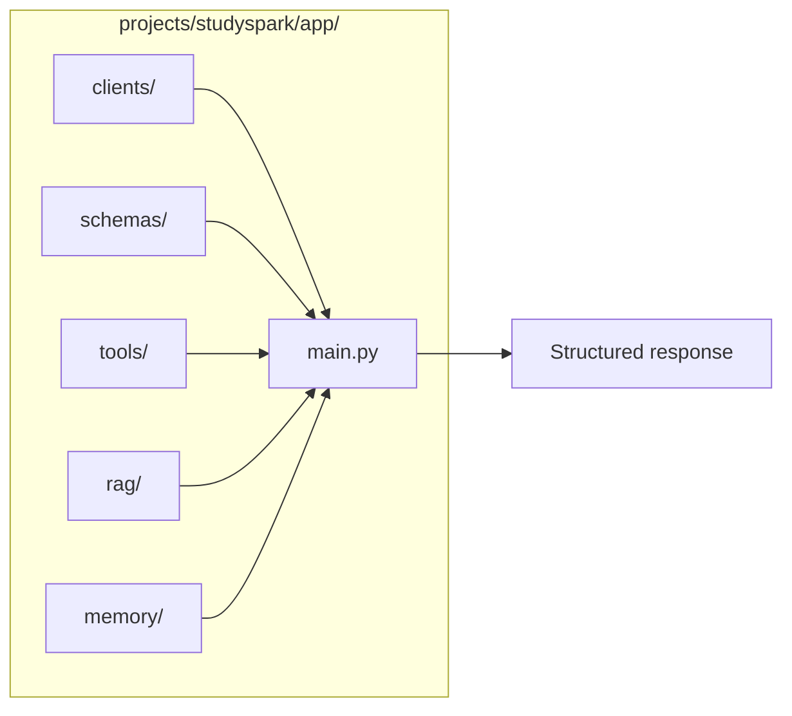

### LCEL vs explicit pipeline

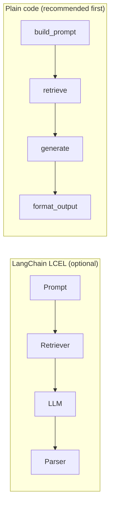

Both diagrams represent the **same** data flow. The question is which version your team can test and debug faster.

### MCP + orchestration layer

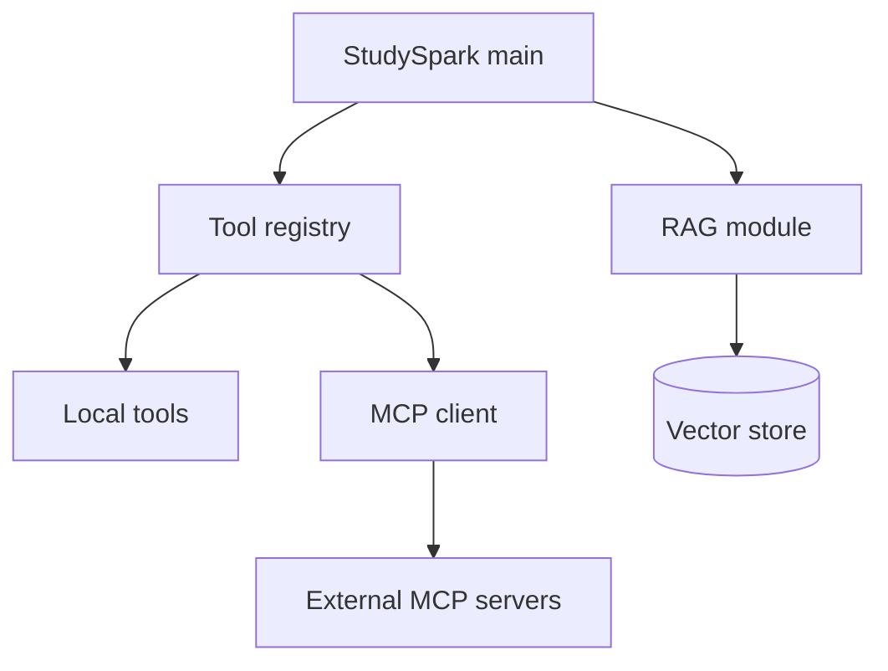

LangChain can wrap MCP tools—or your registry from Day 25 can call them directly.

### Agent loop comparison

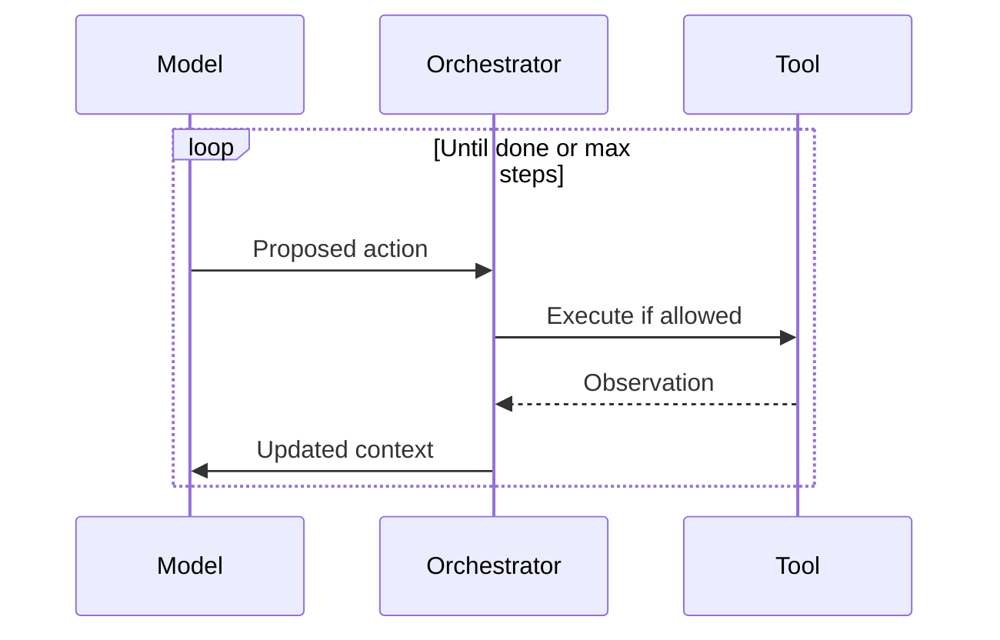

Whether the orchestrator is a `while` loop in plain code or a LangGraph node is an implementation choice—not a product difference.

## Code Walkthrough

The examples below follow the **plain-code-first** rule. LangChain equivalents are optional icing, not the cake.

### Example 1: Python — Minimal pipeline (no framework)

```python
from dataclasses import dataclass


@dataclass
class PipelineResult:
    answer: str
    sources: list[str]


def build_prompt(question: str, context: list[str]) -> str:
    joined = "\n".join(f"- {c}" for c in context)
    return f"Use only this context:\n{joined}\n\nQuestion: {question}"


def retrieve_context(question: str) -> list[str]:
    # Replace with real vector search in StudySpark
    return [f"Chunk about: {question}"]


def generate(prompt: str) -> str:
    # Replace with LLM client from Day 8–9
    return "Retrieval finds relevant chunks before generation."


def format_result(answer: str, sources: list[str]) -> PipelineResult:
    return PipelineResult(answer=answer, sources=sources)


def run_pipeline(question: str) -> PipelineResult:
    context = retrieve_context(question)
    prompt = build_prompt(question, context)
    answer = generate(prompt)
    return format_result(answer, sources=["day_17/day_17_rag.md"])


print(run_pipeline("How does RAG work?"))
```

#### Code Explanation

- Each step is a named function with a single job.
- `PipelineResult` makes the output contract explicit.
- You can test `build_prompt` and `retrieve_context` without calling the model.
- This is the pattern StudySpark should use before any framework import.

### Example 2: TypeScript — Same pipeline with types

```typescript
type PipelineResult = {
  answer: string;
  sources: string[];
};

function buildPrompt(question: string, context: string[]): string {
  const joined = context.map((c) => `- ${c}`).join("\n");
  return `Use only this context:\n${joined}\n\nQuestion: ${question}`;
}

function retrieveContext(question: string): string[] {
  return [`Chunk about: ${question}`];
}

function generate(prompt: string): string {
  return "Retrieval finds relevant chunks before generation.";
}

function runPipeline(question: string): PipelineResult {
  const context = retrieveContext(question);
  const prompt = buildPrompt(question, context);
  const answer = generate(prompt);
  return { answer, sources: ["day_17/day_17_rag.md"] };
}

console.log(runPipeline("How does RAG work?"));
```

#### Code Explanation

- TypeScript types document the contract at compile time.
- The structure mirrors the Python version for learners using either language.

### Example 3: Python — Tool branch in plain code

```python
def search_notes(query: str) -> str:
    return f"Notes matching: {query}"


def should_use_tool(question: str) -> bool:
    keywords = ("search", "find", "look up")
    return any(k in question.lower() for k in keywords)


def run_with_tools(question: str) -> dict:
    context = retrieve_context(question)
    tool_result = search_notes(question) if should_use_tool(question) else None
    prompt = build_prompt(question, context)
    answer = generate(prompt)
    return {"answer": answer, "tool_result": tool_result, "context": context}


print(run_with_tools("Find notes about embeddings"))
```

#### Code Explanation

- Tool routing is an explicit `if`—visible in code review.
- No agent magic; you control when tools run (important for guardrails on Day 28).

### Example 4: TypeScript — Agent-style loop with step limit

```typescript
type Step = { thought: string; action?: string; observation?: string };

function runAgentLoop(question: string, maxSteps = 3): string {
  const steps: Step[] = [];
  let context = retrieveContext(question).join(" ");

  for (let i = 0; i < maxSteps; i += 1) {
    const action = context.includes("notes") ? "search_notes" : undefined;
    if (!action) break;
    const observation = searchNotes(question);
    steps.push({ thought: `Step ${i + 1}`, action, observation });
    context += observation;
  }

  return generate(buildPrompt(question, [context]));
}

function searchNotes(q: string): string {
  return `Notes for: ${q}`;
}
```

#### Code Explanation

- `maxSteps` prevents runaway agent loops (Day 23 planning).
- This is the logic LangGraph would represent as graph nodes—written explicitly first.

### Example 5: Python — Structured output after generation

```python
def validate_schema(data: dict) -> bool:
    required = {"answer", "sources", "confidence"}
    return required.issubset(data.keys())


def format_structured(answer: str, sources: list[str]) -> dict:
    return {
        "answer": answer,
        "sources": sources,
        "confidence": "medium" if sources else "low",
    }


result = format_structured("RAG retrieves before generating.", ["day_17"])
assert validate_schema(result)
```

#### Code Explanation

- Connects to Day 10 structured outputs.
- Schema validation belongs in **your** code, not inside an opaque chain parser.

### Example 6: TypeScript — Logging each pipeline stage

```typescript
type LogEntry = { stage: string; ms: number; detail: string };

function withLogging<T>(stage: string, fn: () => T, logs: LogEntry[]): T {
  const start = Date.now();
  const result = fn();
  logs.push({ stage, ms: Date.now() - start, detail: "ok" });
  return result;
}

function runLoggedPipeline(question: string): { result: PipelineResult; logs: LogEntry[] } {
  const logs: LogEntry[] = [];
  const context = withLogging("retrieve", () => retrieveContext(question), logs);
  const prompt = withLogging("prompt", () => buildPrompt(question, context), logs);
  const answer = withLogging("generate", () => generate(prompt), logs);
  return { result: { answer, sources: ["day_17"] }, logs };
}
```

#### Code Explanation

- Stage logs prepare you for evaluation (Day 27) and deployment observability (Day 29).
- Framework or not, **instrument each step.**

### Example 7: Python — Optional LangChain chain (after plain code works)

```python
# Optional — only after plain pipeline tests pass
# pip install langchain langchain-openai

from langchain_core.prompts import ChatPromptTemplate
from langchain_core.output_parsers import StrOutputParser

prompt = ChatPromptTemplate.from_messages([
    ("system", "Answer using only the provided context."),
    ("human", "Context:\n{context}\n\nQuestion: {question}"),
])

# chain = prompt | llm | StrOutputParser()
# result = chain.invoke({"context": "...", "question": "..."})
```

#### Code Explanation

- Commented intentionally: treat LangChain as a **refactor target**, not the starting point.
- `ChatPromptTemplate` maps 1:1 to `build_prompt` from Example 1.

### Example 8: Python — Mock LLM for framework-free tests

```python
class MockLLM:
    def generate(self, prompt: str) -> str:
        if "embedding" in prompt.lower():
            return "An embedding is a vector representation of meaning."
        return "I need more context."


def run_with_client(question: str, client) -> PipelineResult:
    context = retrieve_context(question)
    prompt = build_prompt(question, context)
    answer = client.generate(prompt)
    return format_result(answer, sources=["test_fixture.md"])


assert "vector" in run_with_client("What is an embedding?", MockLLM()).answer
```

#### Code Explanation

- Same pattern as [`projects/studyspark/app/clients/mock_llm.py`](../../projects/studyspark/app/clients/mock_llm.py).
- Tests should not require API keys or LangChain installs.

### Example 9: TypeScript — Framework vs plain comparison helper

```typescript
type WorkflowMetrics = {
  linesOfCode: number;
  testableSteps: number;
  externalDeps: number;
};

const plainCode: WorkflowMetrics = {
  linesOfCode: 80,
  testableSteps: 5,
  externalDeps: 0,
};

const withLangChain: WorkflowMetrics = {
  linesOfCode: 45,
  testableSteps: 3,
  externalDeps: 4,
};

// Document your decision — shorter is not always better
console.table({ plainCode, withLangChain });
```

#### Code Explanation

- Encourages explicit tradeoff documentation for the capstone checklist.

### Example 10: Python — Capstone decision record

```python
FRAMEWORK_DECISION = {
    "project": "StudySpark",
    "use_langchain": False,
    "reason": "Pipeline fits in <200 LOC; plain modules easier to test and deploy.",
    "revisit_when": "Multi-step research agent with checkpoints needed",
}


print(FRAMEWORK_DECISION)
```

#### Code Explanation

- Add this decision to [`projects/CAPSTONE.md`](../../projects/CAPSTONE.md) Day 26 row.
- "No framework" is a valid, professional choice.

## Practical Examples

### Beginner Example: Three-function study helper

A beginner builds `get_question()`, `get_context()`, `get_answer()` as three functions in one file. No imports beyond the standard library and the StudySpark mock client.

Why it works:

- every step is visible in one screen of code
- exercises map directly to Day 17 RAG concepts
- no framework version conflicts during `pip install`

### Intermediate Example: StudySpark RAG module

Extend [`projects/studyspark/app/rag/`](../../projects/studyspark/) with `search()`, `build_rag_prompt()`, and `answer_with_citations()`. Wire them from `main.py` without LangChain.

What could go wrong:

- hiding retrieval inside a chain so you cannot unit test chunk ranking
- coupling prompt templates to vector store adapter types

### Advanced Example: LangGraph for multi-step research

An advanced learner implements plain-code planning first (Day 23), then models the same flow in LangGraph with nodes: `plan`, `retrieve`, ` synthesize`, `quiz_generate`, `review`.

Why professionals consider LangGraph here:

- explicit state between quiz generation and review
- checkpoint/resume if the user leaves mid-flow

### Production Example: Internal copilot with selective framework use

A company uses plain Python for RAG ingestion and evaluation pipelines (must be auditable) and LangChain only for the interactive chat layer where adapter convenience matters.

Why this hybrid works:

- critical paths stay readable for compliance review
- chat layer moves faster with community retriever integrations

### Real-World Company Example

Teams building internal copilots often **start** with LangChain for speed, then ** peel abstractions back** to plain modules in hot paths once failure modes are understood. The best teams document which layers use frameworks and which do not—exactly the decision Day 26 asks you to make for StudySpark.

## Comparison Tables

### Plain code vs LangChain vs LangGraph

| Criterion | Plain code | LangChain | LangGraph |
| --- | --- | --- | --- |
| Learning value | Highest | Medium | Medium |
| Testability | Excellent | Good if disciplined | Good with state fixtures |
| Prototype speed | Moderate | Fast | Moderate |
| Agent cycles | Manual loop | Agent executors | Native graphs |
| Dependencies | Minimal | Several packages | LangChain + graph |
| StudySpark default? | **Yes** | Optional | Only if agents grow |

### Where abstractions help vs hurt

| Layer | Framework helps | Framework hurts |
| --- | --- | --- |
| Prompt templates | Repeated templates across features | One-off prompts |
| Retriever wiring | Many backend swaps | Single vector store |
| Tool registration | Large tool surface | Two local tools |
| Output parsing | Complex JSON schemas | Simple dataclass |
| Agent orchestration | Many branches | Fixed 3-step pipeline |

### LangChain primitive → StudySpark file

| Primitive | Suggested StudySpark path |
| --- | --- |
| LLM client | `app/clients/` |
| Schemas | `app/schemas/` |
| Tools | `app/tools/` |
| RAG | `app/rag/` |
| Memory | `app/memory/` |
| Orchestration | `app/main.py` |

## Best Practices

- **Build plain code first**, then refactor to a framework only with tests passing
- keep chains (or graphs) **short**—if a diagram needs scrolling, split it
- test retrieval, tools, and formatters **without** the LLM
- document framework decisions in CAPSTONE.md
- pin dependency versions before deployment
- log inputs and outputs **per stage**, not only final answers
- prefer explicit tool gating over fully autonomous agents for v1
- review LangChain code as if it were yours—no "black box" chains in production

## Common Mistakes

- importing LangChain before understanding the pipeline steps
- one 200-line LCEL chain with no unit tests
- treating framework defaults as retrieval or safety best practices
- skipping mock clients because "the chain handles it"
- upgrading LangChain mid-capstone without migration time
- using agents when a single RAG call would suffice

### Debugging Strategy

When a workflow fails—framework or not—inspect in order:

1. Is the **prompt** correct in isolation? (print the assembled string)
2. Does **retrieval** return the expected chunks? (fixture query)
3. Are **tools** gated and returning valid JSON?
4. Is the **model client** receiving the right messages?
5. Does the **formatter** hide a partial or empty model response?
6. If using LangChain, can you **`invoke` each Runnable separately**?

## Performance

### Latency

Frameworks add overhead when chains are deep or invoke the model multiple times per user message. Reduce latency by:

- caching retrieval for repeated queries
- avoiding redundant model calls in agent loops
- setting step limits on agents (Day 23)

### Cost

Each extra chain step that calls the model doubles token spend. Plain-code pipelines make cost visible: you see every `generate()` call in the file.

### Memory

Conversation memory grows prompts. Whether memory lives in LangChain's `ChatMessageHistory` or your `app/memory/` module, apply the same summarization policies from Day 19–20.

### Scalability

Modular plain-code services scale horizontally: separate ingestion workers from chat API. Frameworks do not change deployment topology (Day 29).

### Reliability

The most reliable workflow is the one with the fewest moving parts that still solves the problem. Default to fewer abstractions for StudySpark v1.

## Security

Frameworks do not remove security work from Days 25 and 28.

### Prompt injection

Retrieved chunks and tool outputs remain untrusted. Validate before injecting into prompts—whether you use LangChain's retriever or your own.

### Secrets and API keys

Keep keys in environment variables ([`projects/studyspark/.env.example`](../../projects/studyspark/.env.example)). Never log full prompts containing secrets.

### Authentication and authorization

Tool and MCP access must enforce user permissions outside the framework.

### Data privacy

LangChain tracing may persist user data. Disable or scrub traces in production.

### Hallucinations and model safety

Frameworks organize calls; they do not guarantee grounded answers. Keep citation requirements in your formatter and guardrails.

## Evaluation

Before choosing a framework, evaluate both implementations on the same test set (preview of Day 27):

| Metric | Plain code | With LangChain |
| --- | --- | --- |
| Task success rate | | |
| p95 latency | | |
| Lines of orchestration code | | |
| Unit tests without API | | |
| Onboarding time for new dev | | |

If LangChain does not win on at least two columns that matter to you, keep plain code.

## Exercises

### Easy

1. List the six steps of a typical RAG pipeline in order.
2. Why should you build plain code before adopting LangChain?
3. Name one LangChain primitive and its plain-code equivalent.
4. What is LangGraph used for?
5. Where does StudySpark's mock LLM live in the repo?
6. Give one reason to skip LangChain for a small app.
7. What does LCEL stand for?

### Medium

8. Refactor a one-function script into `retrieve`, `prompt`, `generate`, and `format` functions.
9. Draw a flowchart of StudySpark's Q&A path without using framework jargon.
10. Explain when a retriever is not the same as a tool.
11. Compare agent loops and fixed pipelines for a quiz-generation feature.
12. Write a test for `build_prompt` that does not call an LLM.
13. Document a "framework: yes/no" decision for StudySpark in three sentences.
14. Map Day 25 MCP tools to a plain-code tool registry interface.
15. Explain why step limits matter in agent loops.

### Hard

16. Implement a plain-code pipeline with an optional tool branch and structured output.
17. Add stage logging and compute p95 latency per stage on a fixture test set.
18. Design a LangGraph node diagram for a multi-step research flow—then implement the same flow in plain code first.
19. Migrate one function from plain code to `ChatPromptTemplate` without changing behavior.
20. Write a regression test that fails if retrieval returns zero chunks but the answer claims high confidence.

### Challenge

21. Build StudySpark's RAG answer path in plain Python using `MockLLMClient`.
22. Add a second implementation using LangChain LCEL; compare line count and test coverage.
23. Integrate one MCP tool into the plain-code registry with permission checks.
24. Create a capstone decision doc: plain vs LangChain vs LangGraph for StudySpark v1 and v2.
25. Instrument the pipeline for OpenTelemetry-style spans (conceptual schema is enough).

### Reflection Questions

26. When is a framework helping, and when is it ceremony?
27. Why is readability still the main engineering goal?
28. What would you insist on testing first in a framework app?
29. How does LangChain relate to MCP from Day 25?
30. If LangChain disappeared tomorrow, could you still maintain StudySpark?

## Quizzes

### Quiz 1

1. What is the recommended first step before using LangChain?
2. Name two LangChain primitives.
3. What problem does LangGraph solve that linear chains struggle with?
4. Where should StudySpark orchestration live?

**Answers:** 1. Build the workflow in plain code  2. Examples: chains, retrievers, tools, prompts, agents  3. Cycles, branching, explicit state/checkpoints  4. `app/main.py` and related modules—not one opaque chain file

### Quiz 2

1. What is a retriever's job?
2. Why use a mock LLM in tests?
3. Give one limitation of LangChain.
4. What file tracks the framework decision for the capstone?

**Answers:** 1. Find relevant context/documents—not generate final answers  2. Avoid API keys and flaky network in unit tests  3. Examples: hidden abstractions, API churn, debugging difficulty  4. [`projects/CAPSTONE.md`](../../projects/CAPSTONE.md)

### Quiz 3

1. What is LCEL?
2. When should you choose plain code over LangChain for StudySpark?
3. What is an agent loop?
4. Name one security concern that frameworks do not fix.

**Answers:** 1. LangChain Expression Language for composing Runnables  2. When the pipeline is small, testability and clarity matter more than adapter convenience  3. Model proposes actions, tools execute, observations feed back until done or limit reached  4. Examples: prompt injection, secrets handling, authorization

### Quiz 4

1. What does "framework optional" mean in this course?
2. Which StudySpark folder holds RAG logic?
3. What is the difference between a chain and a graph orchestration?
4. Why log per-stage latency?

**Answers:** 1. You can complete the capstone without LangChain; plain modules are first-class  2. `app/rag/`  3. Chains are mostly linear; graphs support branches, cycles, and shared state  4. To find bottlenecks and prepare for evaluation/deployment monitoring

### Quiz 5

1. What is the main reason frameworks exist?
2. Name one sign you should remove or avoid LangChain.
3. What Day 25 technology connects to tools in orchestration?
4. What should you update after deciding on framework use?

**Answers:** 1. Reduce repetitive orchestration wiring  2. Examples: unreadable chains, untested steps, simple app scope  3. MCP (Model Context Protocol)  4. CAPSTONE.md Day 26 checkbox and decision notes

## Interview Questions

### Conceptual

- Explain why many teams build plain-code pipelines before adopting LangChain.
- What is the difference between LangChain chains and LangGraph?
- How do retrievers differ from tools in an LLM application?
- When would you choose not to use any framework?
- How does MCP relate to LangChain tool integrations?

### System design

- Design a modular RAG pipeline without LangChain. What are the interfaces?
- How would you add an agent loop with a maximum step count?
- Compare monolithic chain vs microservice orchestration for a copilot.
- Where do guardrails sit relative to LangChain components?

### Practical

- How do you test retrieval without calling an embedding API?
- How would you migrate from LangChain back to plain code?
- What metrics decide whether a framework refactor was worth it?
- How do you pin and upgrade LangChain safely in production?

## Mini Project

Build a **plain-code** StudySpark answer pipeline, then optionally mirror it with LangChain.

### Goal

Implement retrieval → prompt → generate → format with citations using `MockLLMClient`, document whether LangChain adds value, and update the capstone checklist.

### Features

- `retrieve`, `build_prompt`, `generate`, `format_output` functions
- optional tool branch for note search
- structured output with sources and confidence
- stage logging
- comparison note: plain code vs LangChain (optional second branch)
- tests that run without API keys

### Suggested folder structure

```text
projects/studyspark/
├── app/
│   ├── rag/
│   │   ├── retriever.py
│   │   ├── prompt_builder.py
│   │   └── pipeline.py      # plain-code orchestration
│   ├── clients/
│   │   └── mock_llm.py
│   └── main.py
├── tests/
│   └── test_pipeline.py
└── docs/
    └── framework_decision.md
```

### Project Steps

1. implement the plain-code pipeline end-to-end with mocks
2. write tests for prompt building and formatting
3. add stage logs and a weak-retrieval fallback
4. optionally implement the same flow in LangChain LCEL
5. fill in `framework_decision.md` with metrics and your choice
6. check Day 26 in [`projects/CAPSTONE.md`](../../projects/CAPSTONE.md)

### What You Learn

- how framework concepts map to functions you already understand
- how to make a defensible build-vs-buy (framework) decision
- how modular design prepares StudySpark for evaluation on Day 27

## Cumulative Capstone Update

Add these items to the final capstone plan in [`projects/CAPSTONE.md`](../../projects/CAPSTONE.md):

- a modular assistant workflow implemented **in plain code first** in [`projects/studyspark/`](../../projects/studyspark/)
- separate prompt, retrieval, tool, and formatting modules (not one opaque chain)
- a written **framework vs plain code** decision (LangChain/LangGraph optional)
- structured outputs for easier evaluation
- logs that show each stage of the workflow

This keeps StudySpark maintainable, testable, and benchmarkable—whether or not you import LangChain.

## Summary

LangChain can speed up AI app development when you already understand the workflow—but **frameworks are optional** in this course and in many production systems. The main lessons from today are:

- build without a framework first; understand every step
- LangGraph helps when linear chains cannot express your agent's state
- abstraction should clarify, not hide, retrieval and tool logic
- StudySpark's modular `app/` layout is the default architecture; LangChain is a refactor target, not a requirement

If Day 25 gave you a standard way to connect tools, Day 26 gives you a disciplined way to organize those workflows—with or without LangChain.

[Previous: Day 25 - Model Context Protocol (MCP)](../day_25/day_25_model_context_protocol_mcp.md) | [Next: Day 27 - Evaluation](../day_27/day_27_evaluation.md)

## Further Reading

- https://python.langchain.com/docs/
- https://js.langchain.com/docs/
- https://www.langchain.com/langgraph
- https://www.anthropic.com/news/building-effective-agents
- https://modelcontextprotocol.io/
