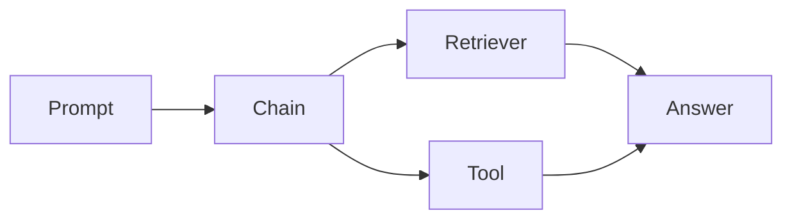

# Day 26 - LangChain

## Introduction
LangChain is a framework for building LLM applications with prompts, tools, retrieval, and agent workflows. It helps organize common AI app patterns without hiding the underlying engineering.


## Learning Objectives
By the end of this day, you should be able to:

- explain what LangChain is good for
- identify chains, tools, retrievers, and agents
- understand when a framework helps and when plain code is better
- build a small modular AI workflow
- keep framework usage readable and testable

## Theory
Frameworks are useful when they reduce repetitive wiring. LangChain provides building blocks for prompt pipelines, retrieval, tool use, and more. The important thing is to keep the app understandable rather than hiding logic inside abstractions.

### Visual Diagram


## Code Examples

### Python
```python
steps = ["prompt", "retrieve", "reason", "respond"]
print(steps)
```

### TypeScript
```typescript
const steps = ['prompt', 'retrieve', 'reason', 'respond'];
console.log(steps);
```

## Best Practices
- use frameworks to simplify repetition, not to obscure logic
- keep chains small and composable
- test the non-framework parts directly
- document the role of each component
- upgrade carefully when the framework changes

## Common Mistakes
- putting all logic into one opaque chain
- treating framework defaults as guaranteed best practice
- not understanding the underlying APIs
- overengineering a simple workflow
- ignoring maintainability when the prototype grows

## Exercises
- Easy: Define a chain.
- Medium: Explain when a framework helps.
- Hard: Design a small retrieval workflow.
- Challenge: Compare framework code with plain code for the same task.

## Mini Project
Sketch a LangChain-based note assistant with prompt setup, retrieval, and response formatting.

## Summary
LangChain can speed up AI app development, but good engineering still means keeping workflows clear, testable, and modular.

## Additional Resources
- https://python.langchain.com/docs/
- https://js.langchain.com/docs/
- https://www.langchain.com/
