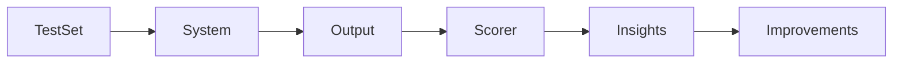
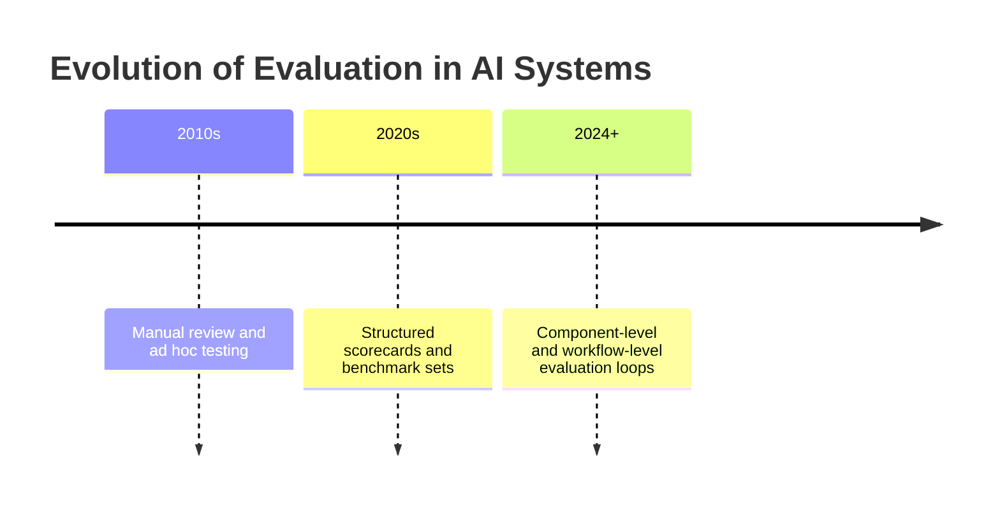
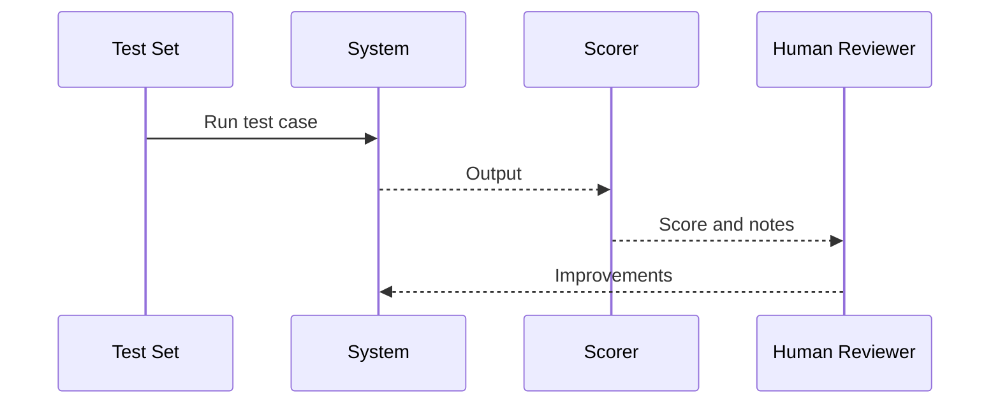
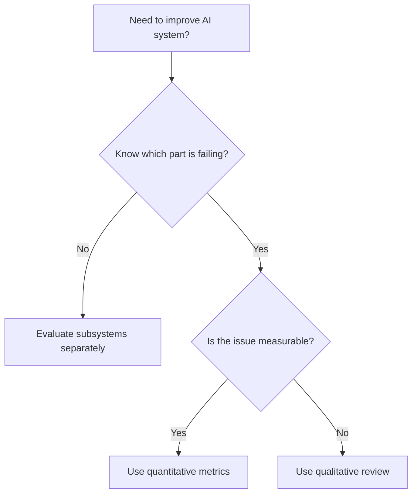
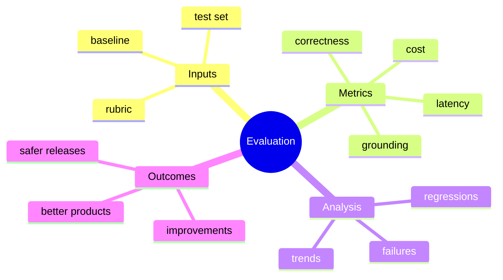

# Day 27 - Evaluation

[Previous: Day 26 - LangChain](../day_26/day_26_langchain.md) | [Next: Day 28 - Guardrails](../day_28/day_28_guardrails.md)

## Introduction
Yesterday we built a modular workflow with LangChain. Today we ask a harder question: how do we know whether the system is actually good?

Evaluation is how you measure whether an AI system works well. Without evaluation, you are guessing. With evaluation, you can improve the system with evidence.


This matters because AI products can look impressive while still failing on real tasks. Evaluation helps you catch regressions, compare prompts or models, understand failure modes, and make better design decisions.

Today you will learn how to evaluate prompts, retrieval, tool use, groundedness, latency, and user experience in a structured way.

## Learning Objectives
By the end of this day, you should be able to:

- explain why evaluation matters for AI products
- distinguish qualitative and quantitative evaluation
- design test cases and scorecards
- understand retrieval, generation, and tool-use evaluation separately
- create a small evaluation loop for your project
- compare a system against a baseline
- identify failure modes and regression patterns

## Prerequisites
You should already understand:

- Day 21: Knowledge Assistant Project
- Day 22: What are AI Agents?
- Day 25: MCP
- Day 26: LangChain

If those are unclear, revisit them first. Evaluation only makes sense when you know what parts of the system you are measuring.

## Big Picture
Evaluation turns AI development into engineering.



The idea is simple:

- define the behavior you care about
- create representative tests
- score outputs consistently
- inspect failures
- improve the system and retest

That loop gives you evidence instead of intuition.

## Why Evaluation Exists
Evaluation exists because a good demo is not the same as a good product.

An AI system may appear smart on a handful of examples, but fail on:

- unclear questions
- malformed inputs
- retrieval misses
- tool failures
- adversarial prompts
- unusual but realistic user behavior

Evaluation helps you find out whether the system is truly helpful or just persuasive.

## Historical Background
Evaluation has always been part of engineering, but AI teams often skipped it early on because prototypes were moving fast.

As systems became more complex, the need for evaluation became obvious. Teams needed a way to compare prompts, retrievers, models, tools, and safety behavior across versions.



## Deep Theory

### What is evaluation?
Evaluation is the process of measuring how well a system performs on representative tasks.

The key phrase is "representative tasks." If your tests do not look like real use, the results will not help you improve the product.

### Why it matters
Evaluation helps you:

- catch regressions after code changes
- compare prompts or models fairly
- understand whether retrieval is actually working
- identify which subsystem is causing problems
- justify design decisions with evidence

### Types of evaluation
There are several useful evaluation types:

| Type | What it measures | Example |
| --- | --- | --- |
| Qualitative | Human judgment and experience | Is the answer helpful? |
| Quantitative | Numeric scores or rates | Accuracy, latency, recall |
| Component-level | One subsystem at a time | Retrieval quality |
| End-to-end | Full user-facing behavior | Task success rate |
| Regression | Whether performance changed over time | Did a new prompt break anything? |

### What can be evaluated?
You can evaluate many parts of an AI system:

- prompts
- retrieval quality
- answer correctness
- groundedness
- tool choice
- tool output handling
- latency
- cost
- user satisfaction

### Separate the subsystems
This is one of the most important ideas in this lesson.

If the system is bad, you need to know why.

Maybe the prompt is weak. Maybe retrieval is poor. Maybe the tool returned bad data. Maybe the model hallucinated. If you measure everything as one blob, you cannot tell which part failed.

### Evaluation pipeline
The general loop is:

1. define a stable test set
2. choose a scoring rubric
3. run the system on the test set
4. score each output
5. inspect failures
6. fix the system
7. rerun the tests

### Advantages
- turns guesswork into evidence
- makes improvements measurable
- helps compare versions fairly
- surfaces failure patterns
- supports continuous improvement

### Limitations
- human review takes time
- metrics can miss nuance
- test sets can become stale
- numbers can look good while user experience is still poor
- evaluation itself must be maintained

### Alternatives
- informal manual testing only
- user feedback without structured tests
- ad hoc spot checks
- benchmark-only approaches without product-specific cases

### When should you use evaluation?
Use evaluation whenever:

- you change prompts, retrievers, tools, or models
- you need to compare options
- you want to reduce regressions
- you are preparing for production

### When should you not rely only on evaluation numbers?
Do not rely only on numbers when:

- the system’s behavior is subtle
- the user experience matters beyond correctness
- the test set is too small or too easy
- the metric misses the real failure mode

## Visual Learning

### Evaluation Loop


### Decision Tree


### Evaluation Mind Map


## Code Walkthrough

These examples show the basic idea of storing test cases and scoring outputs.

### Python Example: Scorecard for one response
```python
scorecard = {
    'correctness': 4,
    'clarity': 5,
    'grounding': 4,
    'helpfulness': 5,
}

print(scorecard)
```

#### Code Explanation
- `scorecard` keeps the criteria explicit.
- each field represents one aspect of behavior.
- the numeric scale is simple enough for manual review.

### TypeScript Example: Evaluation record
```typescript
type EvaluationRecord = {
  question: string;
  answer: string;
  correctness: number;
  clarity: number;
  grounding: number;
  latencyMs: number;
};

const record: EvaluationRecord = {
  question: 'What is RAG?',
  answer: 'RAG retrieves relevant context before generation.',
  correctness: 5,
  clarity: 5,
  grounding: 5,
  latencyMs: 820,
};

console.log(record);
```

#### Code Explanation
- `EvaluationRecord` stores both quality and performance data.
- `latencyMs` keeps non-quality behavior visible.
- structured records make comparisons easier.

### Python Example: Baseline comparison
```python
baseline = {'correctness': 3, 'grounding': 3, 'clarity': 4}
candidate = {'correctness': 4, 'grounding': 5, 'clarity': 4}

def compare_scores(base, new):
    return {key: new[key] - base[key] for key in base}


print(compare_scores(baseline, candidate))
```

#### Code Explanation
- `baseline` stores the previous version’s scores.
- `candidate` stores the new version’s scores.
- `compare_scores` shows the change per metric.

### TypeScript Example: Aggregating results
```typescript
type Metric = 'correctness' | 'clarity' | 'grounding';

function average(scores: number[]): number {
  const total = scores.reduce((sum, value) => sum + value, 0);
  return total / scores.length;
}

const metrics: Record<Metric, number[]> = {
  correctness: [4, 5, 4],
  clarity: [5, 4, 5],
  grounding: [4, 5, 5],
};

console.log(Object.fromEntries(Object.entries(metrics).map(([key, values]) => [key, average(values)])));
```

#### Code Explanation
- `average` computes the mean score.
- `metrics` groups repeated measurements.
- aggregating helps compare versions across many test cases.

### Python Example: Stable test set
```python
test_set = [
    {
        'question': 'What is an embedding?',
        'expected': 'A vector representation of meaning.',
    },
    {
        'question': 'How does RAG work?',
        'expected': 'It retrieves context before generation.',
    },
]

for test_case in test_set:
    print(test_case)
```

#### Code Explanation
- `test_set` contains representative questions.
- each test case includes an expected behavior or answer shape.
- stable test sets make regressions visible.

## Practical Examples

### Beginner Example: Evaluation sheet for a study assistant
Create a simple sheet with columns for question, answer, correctness, grounding, and helpfulness.

Why it works:

- it is easy to understand
- it creates a repeatable review process
- it highlights the most important dimensions

### Intermediate Example: Knowledge assistant evaluation
For the repository assistant, test questions like:

- What is a vector database?
- How is memory different from retrieval?
- What should I study before agents?

Score whether the assistant answers correctly, cites the right lesson, and admits uncertainty when needed.

What could go wrong:

- if the test set is too small, the scores may be misleading
- if the questions are too easy, the system may look better than it is

### Professional Example: Retrieval evaluation
A production retrieval system should be evaluated separately from generation.

You may measure:

- whether the right chunks were retrieved
- whether the answer used them correctly
- whether the citations point to the right source

Why professionals like this:

- it isolates the failure mode
- it helps tune chunking and ranking
- it prevents blaming the model for retrieval problems

### Real-World Company Example
Companies building customer support or documentation assistants often maintain hidden test sets of real user questions. They use those sets to compare prompt updates, index changes, and model changes before releasing updates.

That practice prevents regressions from reaching users.

## Best Practices
- keep a stable evaluation set
- score the behavior you care about
- compare changes against a baseline
- review failures manually
- evaluate each subsystem separately when possible
- include real user-style questions
- keep metrics simple enough to inspect
- track latency and cost alongside quality

## Common Mistakes
- only testing happy paths
- changing the test set every time
- mixing prompt quality with retrieval quality
- using evaluation numbers without inspection
- ignoring latency and cost
- not keeping a baseline
- measuring the wrong thing because it is easy to count

### Debugging Strategy
When evaluation scores look bad, inspect them in this order:

1. Is the test set representative?
2. Is the rubric measuring the right thing?
3. Is the failure in retrieval, generation, or tools?
4. Are the results being manually reviewed?
5. Is the baseline comparison fair?

## Performance

Evaluation also needs performance awareness.

### Latency
Track latency because a system can be accurate but too slow to use.

### Cost
Track cost because repeated evaluation can become expensive as the test set grows.

### Memory
Keep evaluation artifacts organized so they can be reviewed later.

### Scalability
As the project grows, you may need:

- automated scoring for simple cases
- periodic human review for subtle cases
- separate test suites for prompts, retrieval, and tools

### Reliability
Stable evaluation is what lets you trust improvements over time.

## Security

Evaluation itself may expose sensitive examples or outputs.

### Prompt Injection
Some test cases should include adversarial inputs to ensure the system resists injection.

### Secrets and API Keys
Do not store secrets in test sets or logs.

### Authentication and Authorization
Evaluation should only use data the system is allowed to access.

### Data Privacy
If test cases are derived from user data, anonymize them and follow retention rules.

### Hallucinations and Model Safety
Use evaluation to check whether the model invents facts or citations.

## Evaluation Dimensions

When reviewing an answer, ask:

- Is it correct?
- Is it grounded in the sources?
- Is it clear?
- Is it complete enough?
- Is it safe?
- Is it fast enough?

These questions cover both quality and product usefulness.

## Exercises

### Easy
1. Explain what evaluation is.
2. Name three things you can evaluate.
3. Give one reason a demo is not enough.
4. Explain why a stable test set matters.

### Medium
5. Write three test prompts.
6. Explain the difference between qualitative and quantitative evaluation.
7. Describe why retrieval should be evaluated separately.
8. Explain why latency should be measured.

### Hard
9. Create a simple scoring rubric.
10. Design a regression test set for an assistant.
11. Explain how to evaluate groundedness.
12. Describe how to compare a new prompt against a baseline.

### Challenge
13. Build a small evaluation sheet for the knowledge assistant project.
14. Add accuracy, grounding, helpfulness, and latency columns.
15. Create a test set with both easy and difficult questions.
16. Add a manual review column for failure notes.
17. Compare two versions of the assistant using the same test set.

### Reflection Questions
18. Why is evaluation a form of engineering rather than guesswork?
19. What is the biggest risk of using only metrics?
20. Why should you evaluate subsystems separately?
21. How does evaluation help before you add guardrails?
22. What part of your project would you evaluate first?

## Mini Project
Build a small evaluation sheet for the knowledge assistant project.

### Goal
Create a repeatable way to score the repository knowledge assistant on accuracy, grounding, clarity, helpfulness, and latency.

### Features
- a stable test set
- a scorecard with multiple criteria
- a baseline comparison
- a manual review column
- a section for failure notes

### Suggested structure
```text
evaluation/
├── test_set.json
├── scorecard.csv
├── rubric.md
├── results/
└── README.md
```

### Project Steps
1. define the questions you want to test
2. write a rubric for scoring responses
3. run the assistant on each question
4. compare the outputs to expectations
5. record failure patterns and latency
6. use the results to improve the assistant

### What You Learn
- how to make AI improvement repeatable
- how to compare versions fairly
- how to separate retrieval errors from generation errors
- how evaluation prepares the project for guardrails and deployment

## Capstone Update
Add these items to the final capstone plan:

- a stable test set of representative user questions
- a scorecard for correctness, grounding, clarity, and latency
- a baseline version for comparison
- a manual review process for failures
- separate checks for retrieval, generation, and tools

This makes the capstone easier to improve systematically instead of by guesswork.

## Summary
Evaluation turns AI development from guesswork into engineering.

It helps you improve behavior systematically instead of relying on intuition. The main lessons from today are:

- good evaluation starts with representative tests
- evaluate subsystems separately when possible
- keep a baseline and compare against it
- combine metrics with manual review

If Day 26 taught you how to organize workflows, Day 27 teaches you how to prove those workflows actually work.

[Previous: Day 26 - LangChain](../day_26/day_26_langchain.md) | [Next: Day 28 - Guardrails](../day_28/day_28_guardrails.md)

## Further Reading
- https://www.evals.ai/
- https://platform.openai.com/docs/guides/evals
- https://www.deeplearning.ai/short-courses/
- https://docs.langchain.com/docs/guides/evaluation
- https://arxiv.org/abs/2307.15043
