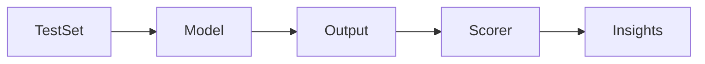

# Day 27 - Evaluation

## Introduction
Evaluation is how you measure whether an AI system works well. Without evaluation, you are guessing. With evaluation, you can improve the system with evidence.


## Learning Objectives
By the end of this day, you should be able to:

- explain why evaluation matters for AI products
- distinguish qualitative and quantitative evaluation
- design test cases and scorecards
- understand retrieval, generation, and tool-use evaluation separately
- create a small evaluation loop for your project

## Theory
A good AI app is not just a nice demo. It should perform well on representative tasks. Evaluation helps you catch regressions, compare models, and understand failure modes.

You can evaluate prompts, retrieval quality, tool choice, groundedness, latency, and user satisfaction.

### Visual Diagram


## Code Examples

### Python
```python
scorecard = {
    "correctness": 4,
    "clarity": 5,
    "grounding": 4,
}
print(scorecard)
```

### TypeScript
```typescript
const scorecard = {
  correctness: 4,
  clarity: 5,
  grounding: 4,
};

console.log(scorecard);
```

## Best Practices
- keep a stable evaluation set
- score the behavior you care about
- compare changes against a baseline
- review failures manually
- evaluate each subsystem separately when possible

## Common Mistakes
- only testing happy paths
- changing the test set every time
- mixing prompt quality with retrieval quality
- using evaluation numbers without inspection
- ignoring latency and cost

## Exercises
- Easy: Explain what evaluation is.
- Medium: Write three test prompts.
- Hard: Create a simple scoring rubric.
- Challenge: Design a regression test set for an assistant.

## Mini Project
Build a small evaluation sheet for the knowledge assistant project. Include accuracy, grounding, and helpfulness.

## Summary
Evaluation turns AI development from guesswork into engineering. It helps you improve behavior systematically instead of relying on intuition.

## Additional Resources
- https://www.evals.ai/
- https://platform.openai.com/docs/guides/evals
- https://www.deeplearning.ai/short-courses/
