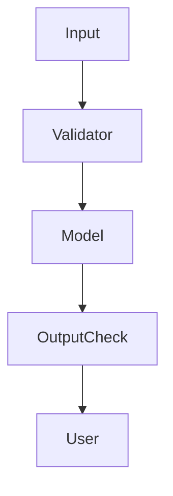

# Day 28 - Guardrails

[Previous: Day 27 - Evaluation](../day_27/day_27_evaluation.md) | [Next: Day 29 - Deployment](../day_29/day_29_deployment.md)

## Introduction
Guardrails are the rules and checks that keep AI systems safe, reliable, and aligned with product requirements. They help prevent bad outputs, unsafe actions, and confusing behavior.


## Learning Objectives
By the end of this day, you should be able to:

- explain what guardrails are
- identify safety checks before and after generation
- understand policy, schema, and content filtering layers
- design a refusal or escalation path
- think about security and prompt injection risk

## Theory
Guardrails are not just about safety policy. They also support quality and reliability. A guardrail can validate input, constrain output, block dangerous actions, or trigger human review.

The best guardrails are explicit, testable, and proportionate to the risk.

### Visual Diagram


## Code Examples

### Python
```python
allowed_topics = {"study", "notes", "summary"}
request_topic = "study"
print(request_topic in allowed_topics)
```

### TypeScript
```typescript
const allowedTopics = new Set(['study', 'notes', 'summary']);
const requestTopic = 'study';

console.log(allowedTopics.has(requestTopic));
```

## Best Practices
- validate inputs before the model sees them
- validate outputs before the user sees them
- add refusal paths for unsupported requests
- test prompt injection and adversarial inputs
- keep safety rules understandable to developers

## Common Mistakes
- assuming the model will self-police perfectly
- adding too many restrictions that harm usability
- placing guardrails only at the end of the flow
- ignoring prompt injection in retrieval systems
- forgetting to test unsafe inputs

## Exercises
- Easy: Define a guardrail.
- Medium: List three places to add checks.
- Hard: Design a prompt injection defense.
- Challenge: Create a refusal message that stays helpful.

## Mini Project
Design guardrails for a support assistant that must not leak private information or make unauthorized changes.

## Summary
Guardrails protect users and systems. They work best when they are layered, specific, and tested against realistic misuse.

[Previous: Day 27 - Evaluation](../day_27/day_27_evaluation.md) | [Next: Day 29 - Deployment](../day_29/day_29_deployment.md)

## Additional Resources
- https://www.nist.gov/itl/ai-risk-management-framework
- https://platform.openai.com/docs/guides/safety-best-practices
- https://docs.anthropic.com/en/docs/guardrails
