# Day 29 - Deployment

[Previous: Day 28 - Guardrails](../day_28/day_28_guardrails.md) | [Next: Day 30 - Capstone Project](../day_30/day_30_capstone_project.md)

## Introduction

Yesterday you built guardrails that keep StudySpark safe. Today you learn how to **ship it**—so real users can depend on it, operators can observe it, and your team can recover when something breaks.

Deployment is the step where your AI app becomes an available service. A demo on your laptop can survive manual steps, missing config, and silent failures. Production cannot. Deployment means packaging the app reproducibly, configuring secrets safely, monitoring latency and errors, planning rollbacks, and treating observability as part of the product—not a Day 31 afterthought.

Think of deployment like opening a restaurant after recipe testing. The dish (your RAG pipeline) might taste great in the kitchen, but opening night requires health permits (guardrails), supplier contracts (API keys), staff radios (logging), fire exits (rollback), and inspectors (health checks). StudySpark's capstone demo on Day 30 should run from a clean environment because **you deployed it like a product**, not because you memorized local-only steps.


This lesson bridges Day 28 safety and Day 30 synthesis. You will leave with a deployment plan for [`projects/studyspark/`](../../projects/studyspark/) that covers configuration, containers, staging, monitoring, and release discipline.

## Learning Objectives

By the end of this day, you should be able to:

- explain what changes when an AI app moves from laptop to production
- manage configuration and secrets without hardcoding credentials
- design health checks, structured logs, and metrics for LLM applications
- describe containerization benefits for StudySpark's Python stack
- compare staging and production environments with a safe promotion flow
- plan rollbacks when a release degrades quality or safety metrics
- integrate eval gates (Day 27) and guardrails (Day 28) into deploy checklist
- estimate operational costs: model tokens, retrieval, and infra
- write a deployment plan document for the capstone
- update [`projects/CAPSTONE.md`](../../projects/CAPSTONE.md) with deploy artifacts

## How to Use This Lesson

This lesson is designed for **all skill levels**. Pick one path and follow it consistently.

| Level | Suggested approach | Time |
| --- | --- | --- |
| **Beginner** | Read Introduction → Big Picture → Deep Theory → trace one code example → Easy exercises | 5–7 hours |
| **Intermediate** | Skim objectives → Visual Learning → Code Walkthrough → Medium/Hard exercises → Mini project | 3–5 hours |
| **Advanced** | Deep Theory tradeoffs → Dockerfile + health route → Challenge exercises → capstone slice | 2–4 hours |

### Apply Today

Complete at least one item before moving to the next day:

- [ ] Trace one code example in **Python or TypeScript** (one language is enough)
- [ ] Complete exercises for your level (see Exercises section)
- [ ] Update [`projects/CAPSTONE.md`](../../projects/CAPSTONE.md) with today's capstone item
- [ ] Add today's safety, eval, or deploy item to the capstone checklist.

> **Stuck?** Re-read Big Picture, review Prerequisites, or see [SYLLABUS.md](../../SYLLABUS.md) for path guidance.

## Prerequisites

You should already understand:

- Day 27: Evaluation (baselines, metrics, pre-deploy gates)
- Day 28: Guardrails (refusal, tool gating, audit logs)
- StudySpark architecture from Weeks 2–4 ([`projects/studyspark/README.md`](../../projects/studyspark/README.md))
- environment variables for secrets (Day 8)

Deployment is easier when you know **what behavior** you protect and **how you measure** it.

## Big Picture

Deployment turns code into a running service with operational guarantees.

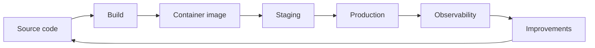

Core ideas:

- **Reproducible builds** — same artifact in staging and prod
- **Configuration via environment** — secrets never in git
- **Health and readiness** — orchestrators know when to route traffic
- **Observability** — logs, metrics, traces explain failures
- **Controlled release** — staging first, rollback ready

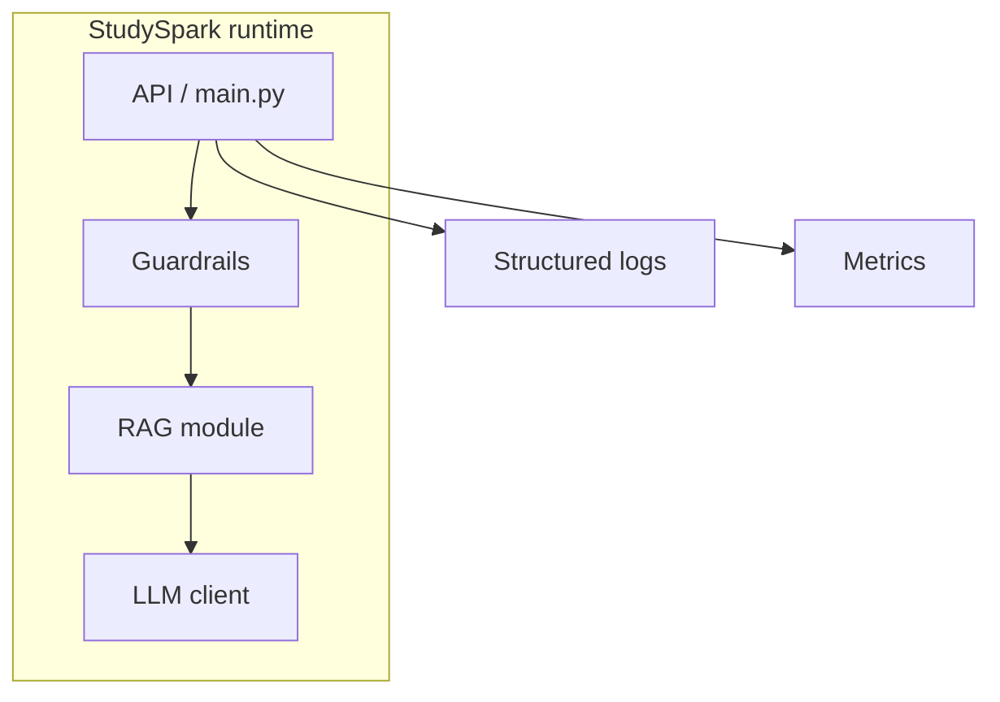

## Why Deployment Exists

A working local app is not a dependable service. Production introduces:

| Concern | Local demo | Production |
| --- | --- | --- |
| Secrets | `.env` on laptop | Secret manager / platform env |
| Traffic | One user | Concurrent users |
| Failures | Restart manually | Auto-restart, alerts |
| Dependencies | Implicit versions | Pinned in container/requirements |
| Quality | "Looks good" | Eval baseline must hold |
| Safety | Informal | Guardrails + audit logs |

The goal is not merely uptime—it is **trustworthy behavior under real conditions**.

## Historical Background

Software deployment evolved from bare-metal scripts to containers and platforms-as-a-service. AI apps add **non-deterministic dependencies** (model providers) and **quality drift** (index/prompt changes without code changes).

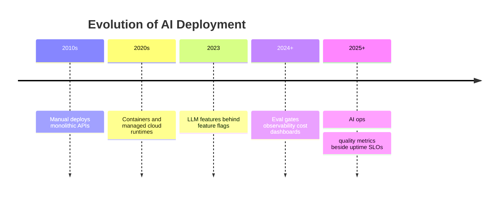

StudySpark should follow 2025 practice: deploy when eval + guardrails pass, not when the demo script works once.

## Deep Theory

### What changes in production?

Production systems must handle:

- **Real traffic patterns** — spikes, slow queries, cancellations
- **Dependency failures** — model 503, vector DB timeout, MCP server down
- **Configuration mistakes** — wrong model name, missing API key
- **Security exposure** — public endpoints, injection attempts
- **Operational accountability** — on-call needs logs, not vibes

AI-specific: a green health check only means the process runs—not that answers are good. Pair **liveness** with **quality monitors** from Day 27.

### The twelve-factor fit for StudySpark

Key [12-factor](https://12factor.net/) habits for this capstone:

| Factor | StudySpark application |
| --- | --- |
| Codebase | One repo: `projects/studyspark/` |
| Config | `app/config.py` reads env vars |
| Dependencies | `requirements.txt` pinned |
| Backing services | LLM API, vector DB as attached resources |
| Logs | stdout JSON logs, not log files in container |
| Processes | Stateless API; state in DB/memory store |
| Port binding | Expose HTTP via `$PORT` |

### Configuration management

Never hardcode in source:

- `OPENAI_API_KEY`, `ANTHROPIC_API_KEY`
- model IDs and embedding model names
- vector store URLs
- feature flags (`ENABLE_LIVE_LLM`, `MOCK_LLM=true`)

Use [`projects/studyspark/.env.example`](../../projects/studyspark/.env.example) as the template; real values only in environment or secret manager.

```python
# app/config.py pattern
from dataclasses import dataclass
import os


@dataclass(frozen=True)
class Settings:
    llm_provider: str
    model_name: str
    mock_llm: bool
    log_level: str


def load_settings() -> Settings:
    return Settings(
        llm_provider=os.getenv("LLM_PROVIDER", "mock"),
        model_name=os.getenv("MODEL_NAME", "mock-mini"),
        mock_llm=os.getenv("MOCK_LLM", "true").lower() == "true",
        log_level=os.getenv("LOG_LEVEL", "INFO"),
    )
```

### Secrets handling

Rules:

- never commit `.env` (verify `.gitignore`)
- separate keys per environment
- rotate on leak suspicion
- fail fast at startup if required secret missing
- never log secrets or full prompts with PII

### Containerization

Docker (or similar) packages StudySpark with Python version and dependencies:

```dockerfile
# Conceptual Dockerfile fragment
FROM python:3.12-slim
WORKDIR /app
COPY projects/studyspark/requirements.txt .
RUN pip install --no-cache-dir -r requirements.txt
COPY projects/studyspark/ .
ENV MOCK_LLM=false
CMD ["python", "-m", "app.main"]
```

Benefits: reproducible runs for teammates, CI, and cloud platforms.

### Staging vs production

| Environment | Purpose | Typical config |
| --- | --- | --- |
| Development | Fast iteration | `MOCK_LLM=true` |
| Staging | Pre-prod validation | Live model, test index |
| Production | Real users | Live model, prod index, strict guardrails |

Promote staging → prod only when eval baseline passes and guardrail tests green.

### Release strategy

Patterns:

- **Staging-first** — mandatory soak period
- **Gradual rollout** — 5% → 25% → 100% traffic
- **Feature flags** — enable RAG or tools independently
- **Rollback** — previous container image + previous index snapshot

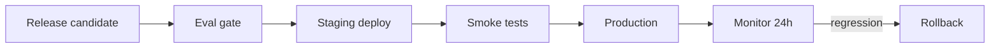

### Observability

Three pillars for StudySpark:

**Logs** — structured JSON with `request_id`, `stage`, `latency_ms`, `model`, guardrail `decision`

**Metrics** — counters and histograms: requests, errors, p95 latency, tokens, retrieval hits, refusals

**Traces** (optional) — OpenTelemetry spans per pipeline stage (Day 26 logging pattern)

AI ops dashboards should show **quality AND uptime**: grounding proxy metrics, refusal rate, cost per 1k requests.

### Reliability patterns

- **Timeouts** on every external call (LLM, vector DB, MCP)
- **Retries with backoff** for transient 429/503 (Day 8)
- **Circuit breakers** when provider degraded
- **Graceful degradation** — fallback message when RAG unavailable
- **Idempotency** for tool writes where possible

### Advantages of disciplined deployment

- users can access StudySpark reliably
- incidents are diagnosable
- releases are reversible
- eval/safety gates become enforceable

### Limitations

- operational overhead for solo learners
- cloud costs for always-on services
- container complexity if team is small

### When to deploy StudySpark

Deploy (even to a small staging URL) when:

- capstone pipeline runs end-to-end
- eval baseline documented
- guardrails tested
- config documented in README

Wait if:

- secrets in git history
- no health check
- cannot explain rollback steps

## Visual Learning

### Deployment pipeline sequence

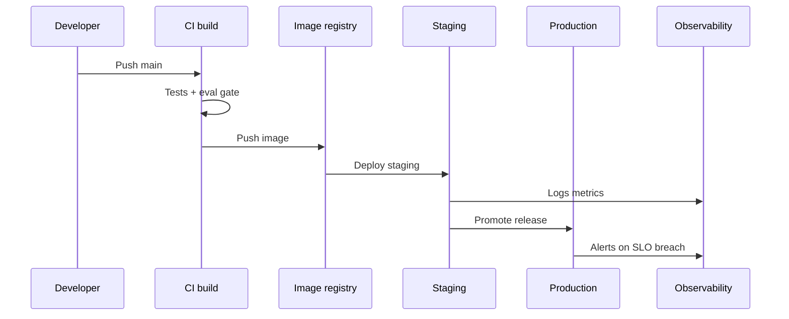

### Environment promotion

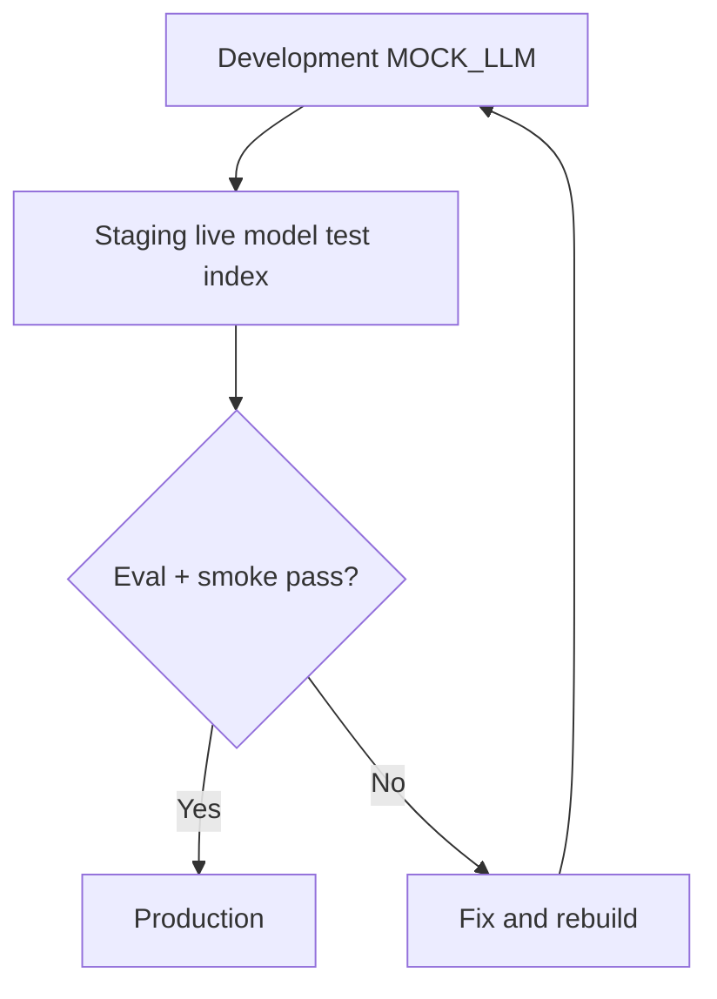

### StudySpark deploy architecture

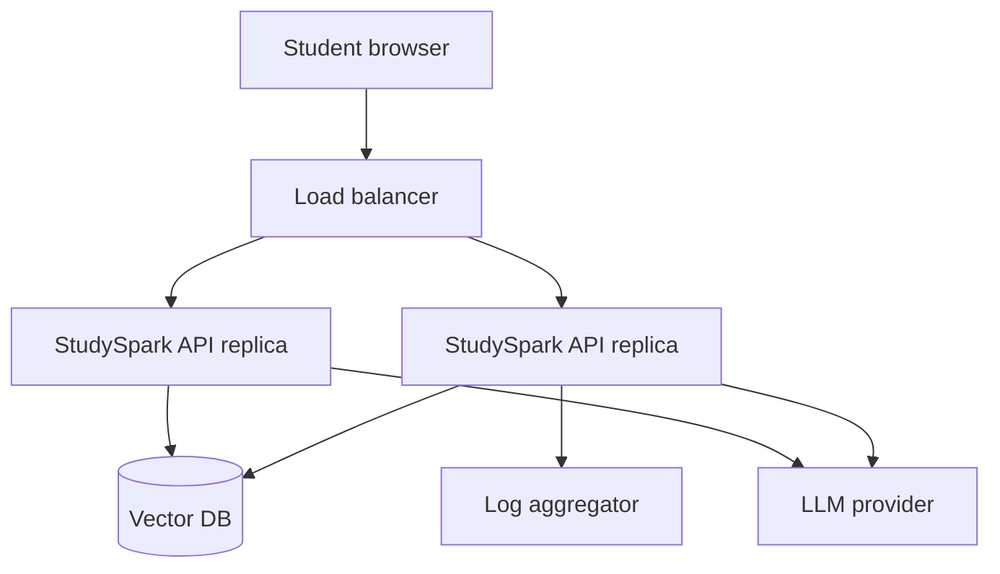

### Observability mind map

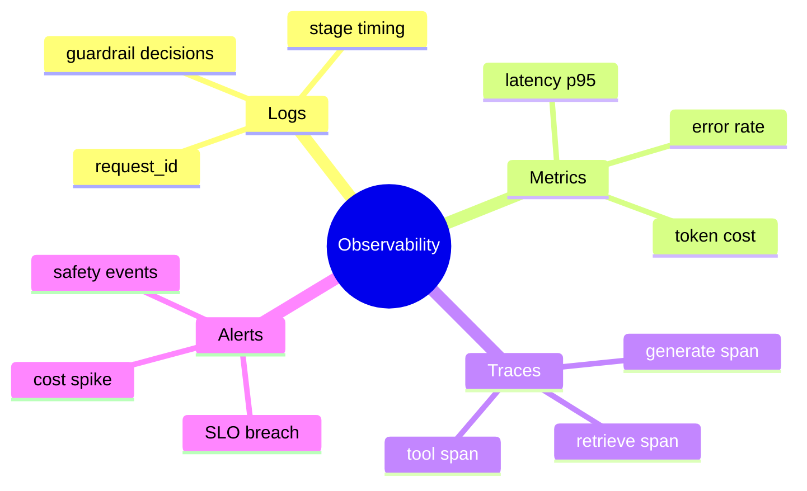

### Rollback decision tree

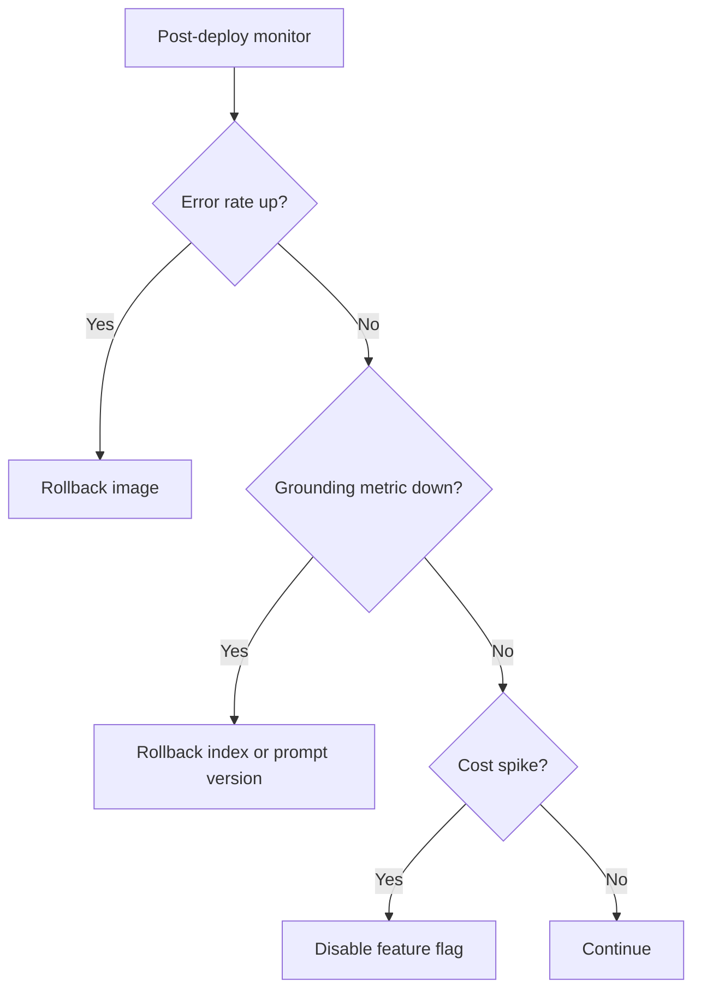

### Config vs code separation

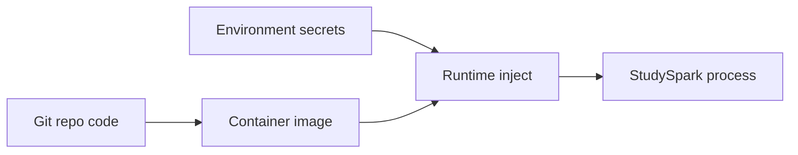

### Health check flow

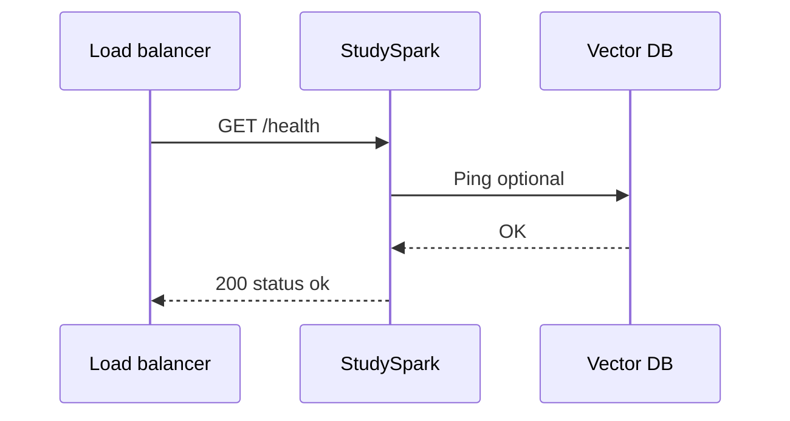

## Code Walkthrough

### Example 1: Python — Environment config with fail-fast

```python
import os


def require_env(name: str) -> str:
    value = os.getenv(name)
    if not value:
        raise RuntimeError(f"Missing required environment variable: {name}")
    return value


def load_api_key(mock_mode: bool) -> str | None:
    if mock_mode:
        return None
    return require_env("OPENAI_API_KEY")
```

#### Code Explanation

- Startup fails loudly in production misconfiguration.
- Mock mode skips live keys for CI and beginners.

### Example 2: TypeScript — Typed settings

```typescript
type Env = "development" | "staging" | "production";

function loadSettings() {
  const env = (process.env.APP_ENV ?? "development") as Env;
  const mockLlm = process.env.MOCK_LLM === "true";
  return { env, mockLlm, model: process.env.MODEL_NAME ?? "mock-mini" };
}
```

#### Code Explanation

- `APP_ENV` drives log verbosity and strictness.

### Example 3: Python — Health and readiness

```python
def health_check() -> dict:
    return {"status": "ok", "service": "studyspark"}


def readiness_check(vector_ok: bool, llm_ok: bool) -> dict:
    ready = vector_ok and llm_ok
    return {"status": "ready" if ready else "degraded", "vector_ok": vector_ok, "llm_ok": llm_ok}
```

#### Code Explanation

- Liveness (`/health`) vs readiness (`/ready`) — readiness can fail if dependencies down.

### Example 4: TypeScript — Structured log entry

```typescript
type LogEntry = {
  level: "info" | "warn" | "error";
  message: string;
  requestId: string;
  stage?: string;
  latencyMs?: number;
};

const entry: LogEntry = {
  level: "info",
  message: "request_complete",
  requestId: "req-42",
  stage: "generate",
  latencyMs: 612,
};

console.log(JSON.stringify(entry));
```

#### Code Explanation

- JSON logs parse cleanly in CloudWatch, Datadog, etc.

### Example 5: Python — Request middleware sketch

```python
import time
import uuid


def handle_request(question: str, pipeline_fn) -> dict:
    request_id = str(uuid.uuid4())
    start = time.perf_counter()
    try:
        result = pipeline_fn(question)
        latency_ms = int((time.perf_counter() - start) * 1000)
        log_decision(request_id, "success", latency_ms)
        return {"request_id": request_id, **result, "latency_ms": latency_ms}
    except Exception as exc:
        log_decision(request_id, "error", str(exc))
        raise
```

#### Code Explanation

- Every response traceable by `request_id` links to guardrail audit logs.

### Example 6: Python — Dockerfile-oriented startup check

```python
# scripts/check_setup.py pattern — run in CI and container ENTRYPOINT wrapper
from app.config import load_settings

settings = load_settings()
print(f"StudySpark starting: mock={settings.mock_llm} model={settings.model_name}")
```

#### Code Explanation

- Reuse existing [`projects/studyspark/scripts/check_setup.py`](../../projects/studyspark/scripts/check_setup.py) in deploy pipeline.

### Example 7: TypeScript — Feature flag

```typescript
function isFeatureEnabled(name: string): boolean {
  return process.env[`FEATURE_${name.toUpperCase()}`] === "true";
}

// FEATURE_RAG=true in staging first
console.log(isFeatureEnabled("rag"));
```

#### Code Explanation

- Roll out RAG without redeploying entire app logic.

### Example 8: Python — Graceful degradation

```python
def answer_with_fallback(question: str, rag_fn, mock_fn) -> dict:
    try:
        return rag_fn(question)
    except TimeoutError:
        return mock_fn(question) | {"degraded": True, "message": "RAG temporarily unavailable"}
```

#### Code Explanation

- Better partial service than total failure—document degraded mode in UI.

### Example 9: YAML — Conceptual CI deploy gate

```yaml
# .github/workflows/deploy.yml (conceptual fragment)
jobs:
  test:
    steps:
      - run: pytest projects/studyspark/tests
      - run: python projects/studyspark/evaluation/run_eval.py --mock
      - run: python projects/studyspark/scripts/check_setup.py
```

#### Code Explanation

- Eval + tests before image build prevents shipping known regressions.

### Example 10: Markdown — Rollback runbook snippet

```markdown
## Rollback StudySpark v1.2 → v1.1
1. `kubectl rollout undo deployment/studyspark` (or redeploy previous image tag)
2. Restore vector index snapshot `index-2026-07-01`
3. Verify `/health` and run smoke test set (5 questions)
4. Confirm grounding metric recovered in dashboard
```

#### Code Explanation

- Rollback includes **data** (index) not only code when retrieval changed.

## Practical Examples

### Beginner Example: Document `.env.example`

Expand StudySpark README with every required variable and what happens if missing.

### Intermediate Example: Staging on Render/Fly/Railway

Deploy Docker image with `MOCK_LLM=false`, run eval smoke tests against staging URL.

### Advanced Example: Blue-green with feature flag

Two replicas; switch `FEATURE_NEW_PROMPT` after eval compares staging metrics.

### Production Example: SLO dashboard

Track p95 latency < 2s, error rate < 1%, refusal rate stable, cost/request within budget.

### Real-World Company Example

Internal AI tools deploy to staging with **automated eval** comparing to baseline; production rollout pauses if grounding drops—because uptime without quality is a silent incident.

## Comparison Tables

### Environment comparison

| Setting | Dev | Staging | Prod |
| --- | --- | --- | --- |
| MOCK_LLM | often true | false | false |
| Log level | DEBUG | INFO | INFO/WARN |
| Eval gate | optional | required | required before promote |
| Public access | localhost | team URL | users |

### Liveness vs readiness

| Probe | Question | Failure action |
| --- | --- | --- |
| Liveness | Process alive? | Restart container |
| Readiness | Can serve traffic? | Remove from load balancer |

### Deploy blocker checklist

| Blocker | Detected by |
| --- | --- |
| Secret missing | Startup fail-fast |
| Eval regression | CI eval job |
| Guardrail test fail | pytest safety suite |
| Broken health | orchestrator probe |

## Best Practices

- pin dependencies in `requirements.txt`
- use `.env.example`, never commit secrets
- separate staging and production keys
- structured logs with `request_id`
- health + readiness endpoints
- run eval before promote (Day 27)
- document rollback including index versions
- monitor cost and latency from day one of staging
- keep MockLLM path for CI always working

## Common Mistakes

- hardcoded API keys in source
- no staging—deploy straight to prod
- health check only hits `/` HTML, not dependencies
- logs as unstructured print spam
- ignoring model provider outages
- rollback plan "git revert" without image/index plan
- deploying without rerunning eval on staging

### Debugging Strategy

When production misbehaves:

1. **Config** — right env vars in this environment?
2. **Secrets** — key valid and not expired?
3. **Dependencies** — vector DB and LLM reachable?
4. **Logs** — same `request_id` across stages?
5. **Metrics** — latency vs error vs quality shift?
6. **Recent changes** — code, prompt, or index?

## Performance

### Latency

Production p95 = retrieve + generate + guardrails + network. Set SLOs per stage from Day 27 eval data.

### Cost

Monitor tokens/request and embedding costs for ingestion jobs. Alert on 2× daily spend.

### Memory

Size containers for peak context length; avoid loading entire index into RAM.

### Scalability

Horizontally scale stateless API replicas; vector DB scales separately.

### Reliability

Combine retries, timeouts, degradation, and rollback—uptime alone insufficient.

## Security

### Prompt injection

Deployed systems face public input—keep Day 28 guardrails enabled in all environments.

### Secrets

Use platform secret stores in prod; rotate keys; audit access.

### Authentication

If StudySpark becomes multi-user, add auth before production URL goes public.

### Data privacy

Redact PII from logs; define retention for traces.

### Model safety

Deployment does not fix hallucinations—monitor grounding proxies post-launch.

## Evaluation in Production

Post-deploy monitoring (extends Day 27):

| Signal | Action |
| --- | --- |
| Grounding score drop | Rollback prompt/index |
| Refusal spike | Tune guardrails |
| Latency SLO breach | Scale or optimize retrieval |
| User thumbs-down | Sample for eval set addition |

Schedule weekly eval reruns on production sample queries (with consent/anonymization).

## Platform Options for StudySpark

You do not need Kubernetes on Day 29. Pick a path matching your level:

| Platform | Best for | StudySpark notes |
| --- | --- | --- |
| Local + README | Beginners, portfolio | MockLLM demo sufficient |
| Railway / Render / Fly.io | Quick staging URL | Single container, env vars in dashboard |
| Docker Compose | Local staging parity | API + vector DB containers |
| AWS/GCP/Azure | Production teams | Secret Manager + managed DB |

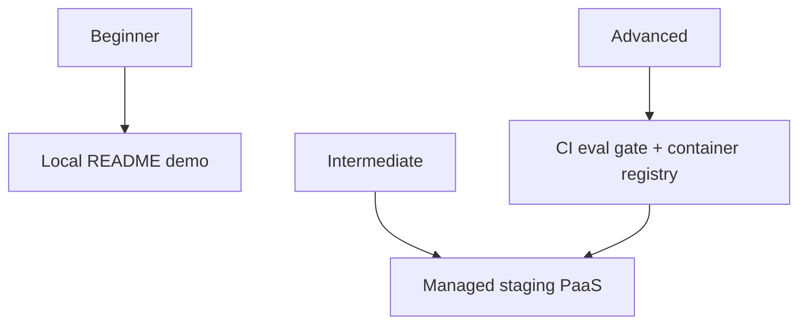

### Minimal staging checklist (PaaS)

1. Connect GitHub repo
2. Set build command: `pip install -r projects/studyspark/requirements.txt`
3. Set start command documented in README
4. Add env vars from `.env.example`
5. Hit `/health` after deploy
6. Run five smoke questions from eval set

## Cost and Capacity Planning

Estimate before leaving staging:

$$
\text{monthly cost} \approx (\text{daily requests} \times \text{tokens/request} \times \text{price per token}) + \text{hosting}
$$

Example assumptions for portfolio sizing:

| Variable | Conservative estimate |
| --- | --- |
| Daily active users | 10 (class demo) |
| Questions per user | 5 |
| Tokens per question | 3,000 in + 500 out |
| Hosting | $5–20/month PaaS |

Log `prompt_tokens` and `completion_tokens` per request in structured logs—Day 27 eval should include a **cost column** so deploy surprises do not happen in production.

## Incident Response Runbook (Lightweight)

When staging breaks after deploy:

| Step | Action |
| --- | --- |
| 1 | Check status page of LLM provider |
| 2 | Compare error rate spike to deploy time |
| 3 | Roll back image if errors correlate |
| 4 | If quality drop without errors, rollback index/prompt version |
| 5 | Post-mortem: add failing case to eval set |

Store this in `deployment/incident_runbook.md`—reviewers value operational maturity.

## StudySpark Step-by-Step Deploy Walkthrough

### Beginner: documented local run (required)

1. Clone repo; create venv
2. `pip install -r projects/studyspark/requirements.txt`
3. Copy `.env.example` → `.env`; set `MOCK_LLM=true`
4. `python projects/studyspark/scripts/check_setup.py`
5. Run main entrypoint; ask one eval question from test set
6. Screenshot or log output for portfolio

### Intermediate: Docker local staging

```dockerfile
FROM python:3.12-slim
WORKDIR /app
COPY projects/studyspark/requirements.txt .
RUN pip install --no-cache-dir -r requirements.txt
COPY projects/studyspark/ .
ENV MOCK_LLM=true
EXPOSE 8000
CMD ["python", "-m", "app.main"]
```

Build and run:

```bash
docker build -f projects/studyspark/deployment/docker/Dockerfile -t studyspark:local .
docker run --env-file projects/studyspark/.env.example -p 8000:8000 studyspark:local
```

Verify health endpoint if implemented; otherwise confirm startup log line from `check_setup.py` logic.

### Advanced: CI pipeline with eval gate

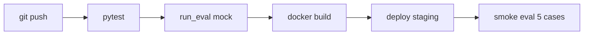

Fail the pipeline if grounding on smoke set drops below baseline—this connects Day 27 directly to Day 29.

## Production SLO Starter Set for StudySpark

| SLO | Target | Measurement window |
| --- | --- | --- |
| Availability | 99% | 30 days |
| p95 latency | < 2.5 s | 7 days |
| Error rate | < 1% | 7 days |
| Policy test pass | 100% | every deploy |

SLOs are promises—start conservative for a capstone; document when you expect to miss them (e.g., live model cold starts).

## Environment Variable Matrix for StudySpark

Document every variable in `.env.example`:

| Variable | Required | Default | Purpose |
| --- | --- | --- | --- |
| `MOCK_LLM` | no | `true` | Use mock client without API keys |
| `LLM_PROVIDER` | no | `mock` | openai, anthropic, mock |
| `OPENAI_API_KEY` | if live | — | Provider secret |
| `MODEL_NAME` | no | `mock-mini` | Generation model id |
| `EMBEDDING_MODEL` | if RAG live | — | Embedding model id |
| `VECTOR_DB_URL` | if RAG live | — | Vector store connection |
| `LOG_LEVEL` | no | `INFO` | Logging verbosity |
| `APP_ENV` | no | `development` | development/staging/production |

Fail-fast at startup when a required live variable is missing—students should see a clear error, not a vague stack trace mid-question.

## Observability Sample Dashboard Layout

| Panel | Chart type | Alert if |
| --- | --- | --- |
| Requests/min | line | N/A |
| p95 latency | line | > SLO 15 min |
| Error rate | line | > 1% 5 min |
| Tokens/request | bar | 2× weekly avg |
| Refusal rate | line | 2× baseline |
| Eval grounding | stat | below gate |

Even a markdown mockup of this dashboard in `deployment/monitoring.md` satisfies Day 29 for learners without Grafana access.

## Pre-Demo Deploy Drill (Day 30 Prep)

Run this sequence the night before your capstone demo:

1. Fresh clone into a new directory (simulates reviewer machine)
2. Follow README only—no memory of local fixes
3. `check_setup.py` must pass
4. Run five questions: three supported, one refusal, one weak-evidence
5. If live API used, verify key in env—not in shell history committed to notes
6. Snapshot logs with `request_id` for one successful and one refused request
7. Tag git `studyspark-v1.0` at passing commit

If step 2 fails, your deployment documentation—not your code—is the bug. Fix README before recording video.

## Multi-Environment Secret Hygiene

| Mistake | Consequence | Prevention |
| --- | --- | --- |
| Same API key dev+prod | Leak in dev logs compromises prod | Separate keys per env |
| Key in slide screenshot | Public repo scrape | Use placeholder in slides |
| `.env` committed once | Git history forever | rotate key; git filter if needed |
| Staging uses prod index | Test pollutes prod data | Separate indexes |

Document which environment your demo uses in README header: **"Demo config: MOCK_LLM=true"** or **"Staging with read-only prod index copy."**

## Beginner Path: README-Only Deploy

Deployment for beginners is **documentation excellence**, not cloud accounts:

- Complete `.env.example` with comments for every variable
- Document exact commands from clone to first successful question
- Explain MockLLM vs live model paths side by side
- Include "expected output" snippet from `check_setup.py`
- List failure modes: missing venv, wrong working directory, unset env

Reviewers grade whether a stranger can run StudySpark—not whether you deployed to AWS. Intermediate and advanced paths add Docker and staging URLs; beginners should not block Day 30 on infrastructure they do not need yet.

Link your finished deploy section from [`projects/studyspark/README.md`](../../projects/studyspark/README.md) and check Day 29 in [`projects/CAPSTONE.md`](../../projects/CAPSTONE.md).

Treat deployment docs as living code: when a reviewer fails at step 3 of your README, fix the README in the same commit—not in a private message. That habit separates AI demos from maintainable products.

## Exercises

### Easy

1. Why use environment variables for API keys?
2. Name one thing never to commit to git.
3. What is a health check for?
4. Difference between staging and production?
5. What is structured logging?
6. Why pin dependency versions?
7. What does MOCK_LLM enable in CI?

### Medium

8. List three production concerns for StudySpark.
9. Explain liveness vs readiness.
10. Why staging should mirror production?
11. Describe rollback in two steps minimum.
12. What metrics alert first after deploy?
13. How eval gates fit CI/CD?
14. What belongs in `.env.example`?
15. Why log `request_id`?

### Hard

16. Write Dockerfile for StudySpark (conceptual ok).
17. Design `/health` and `/ready` responses with dependency checks.
18. Create production readiness checklist (15 items).
19. Document secret rotation procedure.
20. Plan degraded mode when vector DB is down.

### Challenge

21. Full `deployment/` docs folder for StudySpark.
22. GitHub Actions workflow: test → eval → build image.
23. Define SLOs and alert thresholds from Day 27 baselines.
24. Staging promotion runbook with eval sign-off.
25. Cost projection: 1000 users × 10 questions/day.

### Reflection Questions

26. Why is deployment more than copying code to a server?
27. Most important metric after launch?
28. Why deployment needs eval and guardrails complete?
29. What breaks first if secrets misconfigured?
30. Easiest deploy mistake to ignore until too late?

## Quizzes

### Quiz 1

1. Name two environments besides production.
2. Why fail-fast on missing config?
3. What is containerization for?
4. Where is StudySpark code rooted?

**Answers:** 1. Development and staging  2. Avoid silent broken prod deploys  3. Reproducible runtime packaging  4. [`projects/studyspark/`](../../projects/studyspark/)

### Quiz 2

1. What is rollback?
2. Name two observability pillars.
3. Why run eval before promote?
4. What file lists env vars template?

**Answers:** 1. Revert to previous known-good release  2. Logs and metrics (traces third)  3. Catch regressions before users hit them  4. `.env.example`

### Quiz 3

1. Difference liveness/readiness?
2. What is graceful degradation?
3. Why separate API keys per env?
4. What CAPSTONE day tracks deploy?

**Answers:** 1. Liveness=process up; readiness=can serve  2. Partial service when dependency fails  3. Limit blast radius of leak  4. Day 29 in [`projects/CAPSTONE.md`](../../projects/CAPSTONE.md)

### Quiz 4

1. What is feature flag deploy?
2. Name AI-specific prod metric besides uptime.
3. Why JSON logs?
4. What script checks local/staging setup?

**Answers:** 1. Toggle features without full redeploy  2. Examples: grounding proxy, refusal rate, token cost  3. Machine-parseable for search/alert  4. `scripts/check_setup.py`

### Quiz 5

1. What is staging-first release?
2. Rollback include besides code?
3. Why timeouts on LLM calls?
4. Connect Day 28 to Day 29?

**Answers:** 1. Deploy to staging and validate before prod  2. Vector index or prompt version  3. Prevent hung requests tying up workers  4. Guardrails must be active in deployed environments

## Interview Questions

### Conceptual

- What changes when an LLM app goes to production?
- How do staging, eval gates, and rollback interact?
- Why is observability different for AI apps?

### System design

- Design deploy architecture for StudySpark with RAG and MCP tools.
- How would you implement blue-green deploy for an AI API?
- What belongs in a production readiness review?

### Practical

- Walk through debugging elevated p95 latency after deploy.
- How do you handle provider outage without lying to users?
- Write smoke test list for post-deploy verification.

## Mini Project

Write a deployment plan for StudySpark.

### Goal

Practical document + minimal infra sketch covering build, secrets, logging, monitoring, staging, rollback.

### Features

- environment variable matrix
- health/readiness spec
- structured logging format
- staging → prod promotion steps
- eval gate before promote
- rollback runbook
- optional Dockerfile

### Suggested structure

```text
projects/studyspark/
├── deployment/
│   ├── README.md
│   ├── release-process.md
│   ├── rollback-plan.md
│   ├── monitoring.md
│   └── docker/
│       └── Dockerfile
├── scripts/
│   └── check_setup.py
└── .env.example
```

### Project Steps

1. list all config vars and secrets
2. define health/readiness behavior
3. specify log fields (`request_id`, stages, latency)
4. write staging promotion checklist with eval sign-off
5. write rollback steps (image + index)
6. check Day 29 in [`projects/CAPSTONE.md`](../../projects/CAPSTONE.md)

### What You Learn

- production thinking for AI apps
- connecting eval and guardrails to release process
- preparing Day 30 final demo on a clean environment

## Cumulative Capstone Update

Add these items to the final capstone plan in [`projects/CAPSTONE.md`](../../projects/CAPSTONE.md):

- deployment architecture and runtime configuration documented in StudySpark README
- secret management strategy (`.env.example` + fail-fast loader)
- health checks and observability plan (logs, metrics, request IDs)
- staging environment and rollback workflow
- production monitoring for latency, cost, errors, and quality proxies

This turns StudySpark from prototype into a product that can be safely released and demonstrated on Day 30.

## Summary

Deployment turns an AI project into a dependable product. The main lessons from today are:

- reproducible builds and env-based config are non-negotiable
- staging, eval gates, and rollback reduce release risk
- observability must cover quality and safety—not just uptime
- StudySpark's MockLLM path keeps CI cheap while staging validates live behavior

If Day 28 taught you to keep the system safe, Day 29 teaches you how to **ship** it responsibly—ready for Day 30 capstone consolidation.

[Previous: Day 28 - Guardrails](../day_28/day_28_guardrails.md) | [Next: Day 30 - Capstone Project](../day_30/day_30_capstone_project.md)

## Further Reading

- https://12factor.net/
- https://docs.docker.com/
- https://fastapi.tiangolo.com/deployment/
- https://opentelemetry.io/
- https://cloud.google.com/architecture/ai-ml
