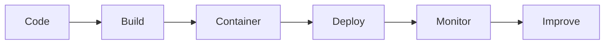

# Day 29 - Deployment

[Previous: Day 28 - Guardrails](../day_28/day_28_guardrails.md) | [Next: Day 30 - Capstone Project](../day_30/day_30_capstone_project.md)

## Introduction
Deployment is the step where your AI app becomes available to real users. Shipping an AI product means handling environment variables, scaling, observability, and reliability.


## Learning Objectives
By the end of this day, you should be able to:

- explain what changes when an AI app goes to production
- identify basic deployment concerns
- understand environment management and secret handling
- design logging and monitoring for AI systems
- think about containerization and release strategy

## Theory
A demo can survive on manual steps. A production app needs repeatability. Deployment is about packaging the app so it can run reliably in a controlled environment.

Docker, CI/CD, monitoring, and clear configuration management all matter here.

### Visual Diagram


## Code Examples

### Python
```python
import os

api_key = os.getenv("API_KEY", "missing")
print(api_key)
```

### TypeScript
```typescript
const apiKey = process.env.API_KEY ?? 'missing';
console.log(apiKey);
```

## Best Practices
- keep secrets out of source control
- use environment variables for configuration
- add health checks and logs
- test deployment in a staging environment first
- monitor latency, errors, and cost after launch

## Common Mistakes
- shipping with hardcoded secrets
- ignoring observability until users complain
- deploying without a rollback plan
- forgetting to test container behavior
- assuming the model provider will handle all reliability issues

## Exercises
- Easy: Explain why environment variables matter.
- Medium: List three production concerns.
- Hard: Design a deployment checklist.
- Challenge: Plan a rollback strategy for a failing release.

## Mini Project
Write a deployment plan for the knowledge assistant, including build, secrets, logging, and monitoring.

## Summary
Deployment turns an AI project into a product. The work does not end when the model responds correctly; it ends when users can depend on the system.

[Previous: Day 28 - Guardrails](../day_28/day_28_guardrails.md) | [Next: Day 30 - Capstone Project](../day_30/day_30_capstone_project.md)

## Additional Resources
- https://docs.docker.com/
- https://fastapi.tiangolo.com/deployment/
- https://12factor.net/
