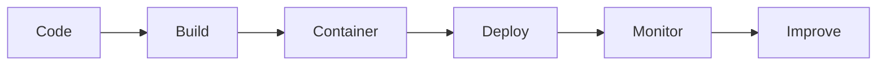
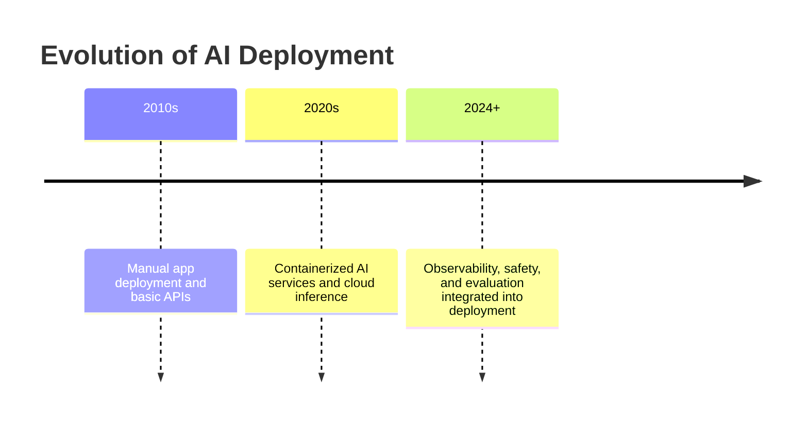
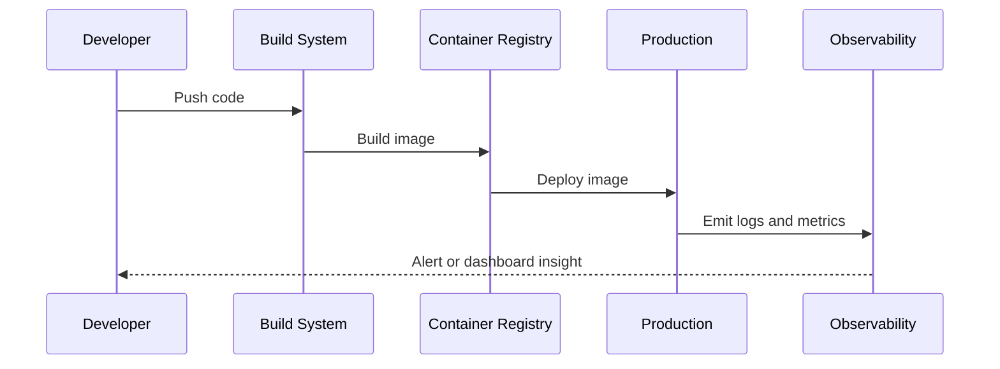
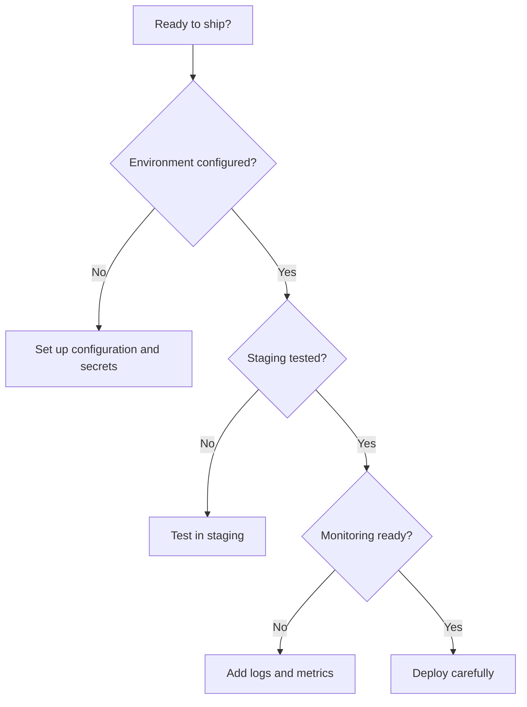
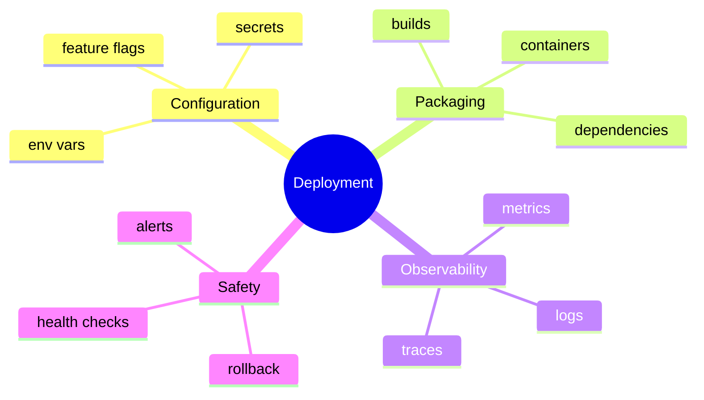

# Day 29 - Deployment

[Previous: Day 28 - Guardrails](../day_28/day_28_guardrails.md) | [Next: Day 30 - Capstone Project](../day_30/day_30_capstone_project.md)

## Introduction
Yesterday we learned how to keep the system safe. Today we learn how to ship it.

Deployment is the step where your AI app becomes available to real users. Shipping an AI product means handling environment variables, scaling, observability, reliability, and release strategy.


A demo can survive on manual steps. A production app needs repeatability. Deployment is about packaging the app so it can run reliably in a controlled environment.

This chapter explains what changes when an AI app goes to production, how to manage configuration and secrets, how to containerize the app, how to monitor it, and how to plan for rollback when things go wrong. It is the bridge between the safety work of Day 28 and the final synthesis in Day 30.

## Learning Objectives
By the end of this day, you should be able to:

- explain what changes when an AI app goes to production
- identify the basic deployment concerns for AI systems
- understand environment management and secret handling
- design logging and monitoring for AI apps
- think about containerization and release strategy
- describe the difference between staging and production
- write a deployment plan for the knowledge assistant

## Prerequisites
You should already understand:

- Day 27: Evaluation
- Day 28: Guardrails
- the architecture of the knowledge assistant and agent workflows

If those are fuzzy, review them first. Deployment becomes much easier when you already know what behavior you are trying to protect and monitor.

## Big Picture
Deployment turns code into a running service.



The important idea is this:

- build the app in a reproducible way
- package it with its dependencies
- configure it safely with environment variables
- monitor it after release
- improve it based on observed behavior

That is what turns an AI project into a product.

## Why Deployment Exists
Deployment exists because a working app on your laptop is not the same as a dependable service.

Production introduces new problems:

- secrets must be handled safely
- users expect uptime and responsiveness
- model and tool calls must be observed
- failures must be recoverable
- configuration must be stable across environments

The goal is not just to make the app run. The goal is to make it run reliably for real users.

## Historical Background
Traditional software already had deployment concerns: build artifacts, servers, configuration, and logs.

AI apps add more moving parts:

- model providers
- retrieval services
- tool servers
- memory stores
- evaluation traces
- guardrails and policy checks

That means deployment for AI systems includes both standard software concerns and AI-specific runtime concerns.



## Deep Theory

### What changes in production?
In production, your system must handle:

- real traffic
- unpredictable input
- slower or failing dependencies
- secrets and configuration
- monitoring and alerting
- rollback when something breaks

That means production deployment is as much about operations as it is about code.

### Configuration management
Configuration should not be hardcoded into source files.

Use environment variables or a secure configuration system for:

- API keys
- model names
- database URLs
- feature flags
- log levels

Environment-specific configuration helps you keep development, staging, and production separate.

### Secrets handling
Secrets should stay out of source control.

Good secret handling means:

- store secrets in environment variables or a secret manager
- rotate them when needed
- scope them to the smallest possible privilege
- avoid printing them in logs

### Containerization
Containers package the app and its dependencies so it runs more consistently.

That matters because AI apps often depend on:

- Python or Node.js versions
- system libraries
- runtime environment settings
- model client dependencies

Containerization helps reduce the “it works on my machine” problem.

### Release strategy
A release strategy describes how changes move from development to production.

Common release patterns include:

- staging first
- gradual rollout
- rollback on failure
- feature flags for risky behavior

### Observability
Observability means being able to understand what the system is doing from logs, metrics, and traces.

For AI systems, observability should include:

- request latency
- error rates
- model call counts
- retrieval hit rates
- tool call failures
- cost per request

### Reliability
Reliability means the system keeps working in a predictable way.

In AI apps, reliability often depends on more than the model:

- external model providers may fail or slow down
- retrieval systems may return bad context
- tools may be unavailable
- prompts may drift after updates

### Advantages
- makes the app available to real users
- improves repeatability and reliability
- supports monitoring and debugging
- helps teams manage changes safely
- turns a prototype into a product

### Limitations
- deployment adds operational complexity
- configuration and infrastructure can fail
- monitoring must be maintained
- rollout mistakes can affect users

### Alternatives
- local-only apps
- manual deployments
- non-containerized server processes
- static demos without live backend behavior

### When should you deploy?
Deploy when:

- the app is useful enough for real users
- you can observe and support it
- you have a rollback path
- you know what success looks like

### When should you wait?
Wait when:

- the app is unstable
- the behavior is not yet evaluated
- safety or access control is incomplete
- you cannot monitor the system meaningfully

## Visual Learning

### Deployment Pipeline


### Deployment Decision Tree


### Production Mind Map


## Code Walkthrough

The examples below show the practical building blocks of deployment.

### Python Example: Read configuration from environment
```python
import os

api_key = os.getenv('API_KEY', 'missing')
print(api_key)
```

#### Code Explanation
- `os.getenv` reads configuration from the environment.
- the fallback value is only for demonstration; real systems should fail safely if a required secret is missing.
- the code keeps secrets out of source files.

### TypeScript Example: Read environment configuration
```typescript
const apiKey = process.env.API_KEY ?? 'missing';

console.log(apiKey);
```

#### Code Explanation
- `process.env` reads runtime configuration.
- `??` provides a fallback if the variable is not set.
- configuration stays outside the codebase.

### Python Example: Simple health check
```python
def health_check():
        return {
                'status': 'ok',
                'service': 'knowledge-assistant',
        }


print(health_check())
```

#### Code Explanation
- `health_check` gives the deployment system a quick way to verify the service is alive.
- health checks are important for load balancers and monitoring.

### TypeScript Example: Structured log entry
```typescript
type LogEntry = {
    level: 'info' | 'warn' | 'error';
    message: string;
    requestId: string;
};

const logEntry: LogEntry = {
    level: 'info',
    message: 'Knowledge assistant started successfully.',
    requestId: 'req-123',
};

console.log(logEntry);
```

#### Code Explanation
- structured logs are easier to search and analyze.
- `requestId` helps trace a user request across services.
- logs should be machine-readable when possible.

### Python Example: Fail fast when config is missing
```python
def require_config(value, name):
        if not value:
                raise ValueError(f'Missing required config: {name}')


require_config(os.getenv('API_KEY'), 'API_KEY')
```

#### Code Explanation
- `require_config` prevents silent misconfiguration.
- failing fast is better than launching an app that looks healthy but cannot work.

### TypeScript Example: Build metadata for observability
```typescript
type RequestMeta = {
    requestId: string;
    environment: 'development' | 'staging' | 'production';
    model: string;
};

const meta: RequestMeta = {
    requestId: 'req-123',
    environment: 'production',
    model: 'gpt-5.4-mini',
};

console.log(meta);
```

#### Code Explanation
- `RequestMeta` keeps deployment context visible.
- the model name and environment are helpful for debugging and audits.

## Practical Examples

### Beginner Example: Environment variables for API keys
A beginner deployment step is to move the API key out of the source file and into an environment variable.

Why it works:

- it reduces secret leakage risk
- it keeps development and production separate
- it makes configuration easier to change

### Intermediate Example: Staging before production
Before releasing the knowledge assistant, deploy it to staging and test retrieval, citations, guardrails, and tool behavior.

What could go wrong:

- staging may use different data than production
- missing config values can cause runtime errors
- monitoring may not be configured yet

### Professional Example: Production knowledge assistant
A real production assistant should:

- read secrets from a secure config source
- provide health checks
- emit structured logs
- monitor latency, cost, and failure rates
- support rollback if a bad release is detected

Why professionals care:

- the system must be dependable
- debugging requires traces and logs
- deployment risk must be controlled

### Real-World Company Example
Internal AI tools at companies often go through a staged rollout with metrics, logs, and careful access control. That is because AI failures may not crash the app immediately, but they can still produce bad answers or unsafe actions.

## Best Practices
- keep secrets out of source control
- use environment variables for configuration
- add health checks and logs
- test deployment in a staging environment first
- monitor latency, errors, and cost after launch
- keep a rollback plan ready
- separate deployment settings from application logic
- version your model and retrieval dependencies

## Common Mistakes
- shipping with hardcoded secrets
- ignoring observability until users complain
- deploying without a rollback plan
- forgetting to test container behavior
- assuming the model provider will handle all reliability issues
- not checking that staging matches production closely enough

### Debugging Strategy
When deployment fails, inspect it in this order:

1. Is the configuration present and correct?
2. Are the secrets available?
3. Does the container start cleanly?
4. Are health checks passing?
5. Are logs and metrics telling the same story?

## Performance

Deployment affects latency, cost, and reliability in real use.

### Latency
Production latency comes from:

- model calls
- retrieval calls
- tool calls
- network hops

You can improve it by:

- caching safe and repeatable steps
- reducing unnecessary round trips
- using smaller contexts when possible
- monitoring slow dependencies

### Cost
Costs grow when:

- requests are too frequent
- prompts are too large
- retrieval is inefficient
- tool calls repeat unnecessarily

### Memory
Containers and services should keep runtime memory usage predictable.

### Scalability
To scale deployment, teams often:

- add replicas
- separate services by responsibility
- use load balancers
- batch expensive background jobs

### Reliability
Reliability is the product of repeatability, monitoring, and fallback planning.

## Security

Deployment is a security boundary.

### Prompt Injection
Deployed systems may receive untrusted input, retrieved content, or tool output. Guardrails still matter in production.

### Secrets and API Keys
Use secure secret storage and rotate credentials when needed.

### Authentication and Authorization
Access control should be preserved across deployment environments.

### Data Privacy
Logs and traces can contain user data. Treat them carefully.

### Hallucinations and Model Safety
Deployment does not reduce hallucinations by itself. Monitoring and evaluation remain necessary after launch.

## Evaluation in Production
Deployment should be paired with monitoring and evaluation.

### What to watch
- latency
- error rates
- retrieval quality drift
- user feedback
- safety events
- cost per request

### Useful questions
- Did the deployed system behave like staging?
- Did the model or retrieval quality change after release?
- Are users seeing more refusals than expected?
- Are logs sufficient to diagnose problems?

## Exercises

### Easy
1. Explain why environment variables matter.
2. Name one thing that should never be hardcoded.
3. Explain what a health check is for.
4. Give one reason staging matters.

### Medium
5. List three production concerns.
6. Explain why logs are important.
7. Describe why a rollback plan matters.
8. Explain the difference between development and production.

### Hard
9. Design a deployment checklist.
10. Create a secret-handling plan for the knowledge assistant.
11. Describe how you would monitor latency and cost.
12. Explain how to test container behavior before release.

### Challenge
13. Plan a rollback strategy for a failing release.
14. Add health checks to the knowledge assistant deployment plan.
15. Define the metrics you would alert on first.
16. Design a staging environment that is close to production.
17. Create a production readiness checklist.

### Reflection Questions
18. Why is deployment more than copying code to a server?
19. What is the most important thing to monitor after launch?
20. Why does deployment need guardrails and evaluation to be complete?
21. What would break first if secrets were misconfigured?
22. Which deployment problem is easiest to ignore but hardest to fix later?

## Mini Project
Write a deployment plan for the knowledge assistant.

### Goal
Create a practical deployment plan that covers build, secrets, logging, monitoring, staging, rollback, and release steps.

### Features
- a staging environment
- environment variables and secret handling
- structured logs
- health checks
- monitoring and alerts
- rollback steps

### Suggested structure
```text
deployment-plan/
├── docs/
│   ├── release-process.md
│   ├── rollback-plan.md
│   └── monitoring.md
├── infra/
│   └── docker/
└── README.md
```

### Project Steps
1. define how the app is built
2. list required environment variables
3. describe how secrets are managed
4. write the health and readiness checks
5. define what is logged and monitored
6. create a rollback plan
7. document the staging-to-production release flow

### What You Learn
- how to think about production readiness
- how to reduce deployment risk
- how configuration and observability fit together
- how this prepares the capstone for the final project launch

## Capstone Update
Add these items to the final capstone plan:

- deployment architecture and runtime configuration
- secret management strategy
- health checks and observability plan
- staging and rollback workflow
- production monitoring for latency, cost, and errors

This turns the capstone from a good prototype into a product that can be safely released.

## Summary
Deployment turns an AI project into a product.

The work does not end when the model responds correctly; it ends when users can depend on the system. The main lessons from today are:

- deployment needs repeatability and configuration discipline
- secrets, logs, and health checks are production essentials
- staging and rollback reduce risk
- observability is part of the product, not an afterthought

If Day 28 taught you to keep the system safe, Day 29 teaches you how to ship it responsibly.

[Previous: Day 28 - Guardrails](../day_28/day_28_guardrails.md) | [Next: Day 30 - Capstone Project](../day_30/day_30_capstone_project.md)

## Further Reading
- https://docs.docker.com/
- https://fastapi.tiangolo.com/deployment/
- https://12factor.net/
- https://opentelemetry.io/
- https://cloud.google.com/architecture/ai-ml
