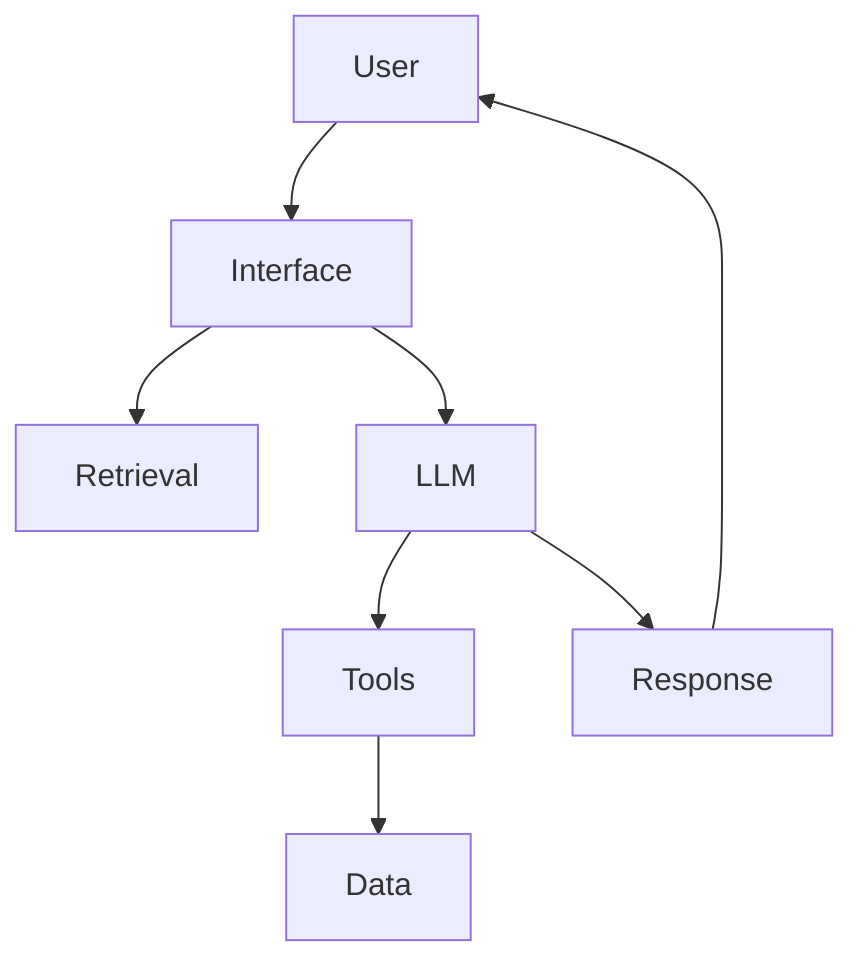

# Day 30 - Capstone Project

## Introduction
The capstone project is where you bring everything together: prompting, APIs, retrieval, memory, agents, evaluation, guardrails, and deployment.


## Learning Objectives
By the end of this day, you should be able to:

- define a complete AI product scope
- connect multiple AI engineering patterns into one app
- plan evaluation and safety for a real system
- explain the architecture of your final project
- present a practical roadmap for improvement

## Theory
A capstone project should feel like a small but real product. It should solve a specific problem for a specific user with a clear data flow and measurable success criteria.

The project can be a research assistant, study assistant, support copilot, or knowledge navigator. What matters is that it is coherent and complete.

### Visual Diagram


## Code Examples

### Python
```python
project = {
    "name": "Knowledge Assistant",
    "features": ["chat", "search", "citations", "memory"],
}
print(project)
```

### TypeScript
```typescript
const project = {
  name: 'Knowledge Assistant',
  features: ['chat', 'search', 'citations', 'memory'],
};

console.log(project);
```

## Best Practices
- choose one concrete problem
- keep the architecture simple enough to explain
- define evaluation from the start
- add guardrails and fallback behavior
- ship a usable first version before adding complexity

## Common Mistakes
- trying to solve every AI problem in one app
- skipping documentation for the architecture
- not testing with real content and real users
- focusing on features instead of value
- ignoring maintenance after the demo works

## Exercises
- Easy: Define the capstone problem.
- Medium: List the main components.
- Hard: Write an evaluation plan.
- Challenge: Create a launch checklist for the product.

## Mini Project
Build the final project brief. Include users, problem statement, architecture, data sources, evaluation, and future improvements.

## Summary
The capstone proves you can combine AI engineering skills into one product. A strong final project is focused, useful, and well-architected.

## Additional Resources
- https://www.fastapi.tiangolo.com/
- https://docs.docker.com/
- https://modelcontextprotocol.io/
