# Day 30 - Capstone Project

[Previous: Day 29 - Deployment](../day_29/day_29_deployment.md)

## Introduction

This is the final day of **30 Days of AI Engineering**. The capstone is where everything comes together: prompting, APIs, structured outputs, tool use, retrieval, memory, agents, MCP, evaluation, guardrails, and deployment. After Day 29, StudySpark is ready to become a polished final product—not a sequence of disconnected exercises.

**StudySpark** is the course capstone product: a study assistant that helps learners understand course material, summarize notes, generate quizzes, retrieve answers from a knowledge base, use tools safely, and ship with evidence that it works. You have been building toward it since Day 1, updating [`projects/CAPSTONE.md`](../../projects/CAPSTONE.md) after each lesson and growing code in [`projects/studyspark/`](../../projects/studyspark/).

Think of Day 30 like a thesis defense and product launch on the same day. You are not judged on using every technique—you are judged on **coherence**: one user, one workflow, clear architecture, measurable quality, safe behavior, and a demo that runs from a documented environment.


If earlier days taught you the vocabulary of AI engineering, today you speak it fluently in one integrated system.

## Learning Objectives

By the end of this day, you should be able to:

- describe StudySpark's complete scope, user, and success metrics
- map every week's capstone components to concrete files in `projects/studyspark/`
- explain the end-to-end architecture from UI to LLM, RAG, tools, guardrails, and deploy
- demonstrate evaluation results with baseline comparison (Day 27)
- show guardrails handling policy, injection, and weak evidence (Day 28)
- run or document deployment from staging to demo-ready state (Day 29)
- present a 3-minute demo script: problem → flow → eval → limits
- list three v2 improvements grounded in eval data—not feature wishlists
- complete the checklist in [`projects/CAPSTONE.md`](../../projects/CAPSTONE.md)
- package the project for portfolio review (README, architecture, honest limits)

## How to Use This Lesson

This lesson is designed for **all skill levels**. Pick one path and follow it consistently.

| Level | Suggested approach | Time |
| --- | --- | --- |
| **Beginner** | Read Introduction → Big Picture → trace StudySpark README → complete CAPSTONE checkboxes → Easy exercises | 6–8 hours |
| **Intermediate** | Consolidate `app/` modules → run eval suite → demo script → Medium/Hard exercises | 4–6 hours |
| **Advanced** | Full deploy to staging → adversarial testing → portfolio write-up → Challenge exercises | 3–5 hours |

### Apply Today

Complete at least one item before moving to the next day:

- [ ] Trace one code example in **Python or TypeScript** (one language is enough)
- [ ] Complete exercises for your level (see Exercises section)
- [ ] Update [`projects/CAPSTONE.md`](../../projects/CAPSTONE.md) with today's capstone item
- [ ] Add today's safety, eval, or deploy item to the capstone checklist.

> **Stuck?** Re-read Big Picture, review Prerequisites, or see [SYLLABUS.md](../../SYLLABUS.md) for path guidance.

## Prerequisites

You should already understand the full course arc:

- Week 1: prompting, tokens, prompt helper spec
- Week 2: OpenAI/Claude APIs, structured outputs, tools, streaming, StudySpark shell
- Week 3: embeddings, vector DB, RAG, hybrid search, memory, knowledge assistant MVP
- Week 4: agents, planning, MCP, orchestration (Day 26), evaluation, guardrails, deployment

The capstone is synthesis—not new theory. Review any weak day before claiming completion.

## Big Picture

StudySpark solves **one problem for one user**:

| Element | Definition |
| --- | --- |
| **User** | A student preparing for exams using their notes + this curriculum |
| **Workflow** | Ask question → get grounded, cited study help (or safe refusal) |
| **Source of truth** | Indexed course lessons + user notes (Week 3+) |
| **Success** | Correct, grounded answers within latency budget; policy-safe refusals |

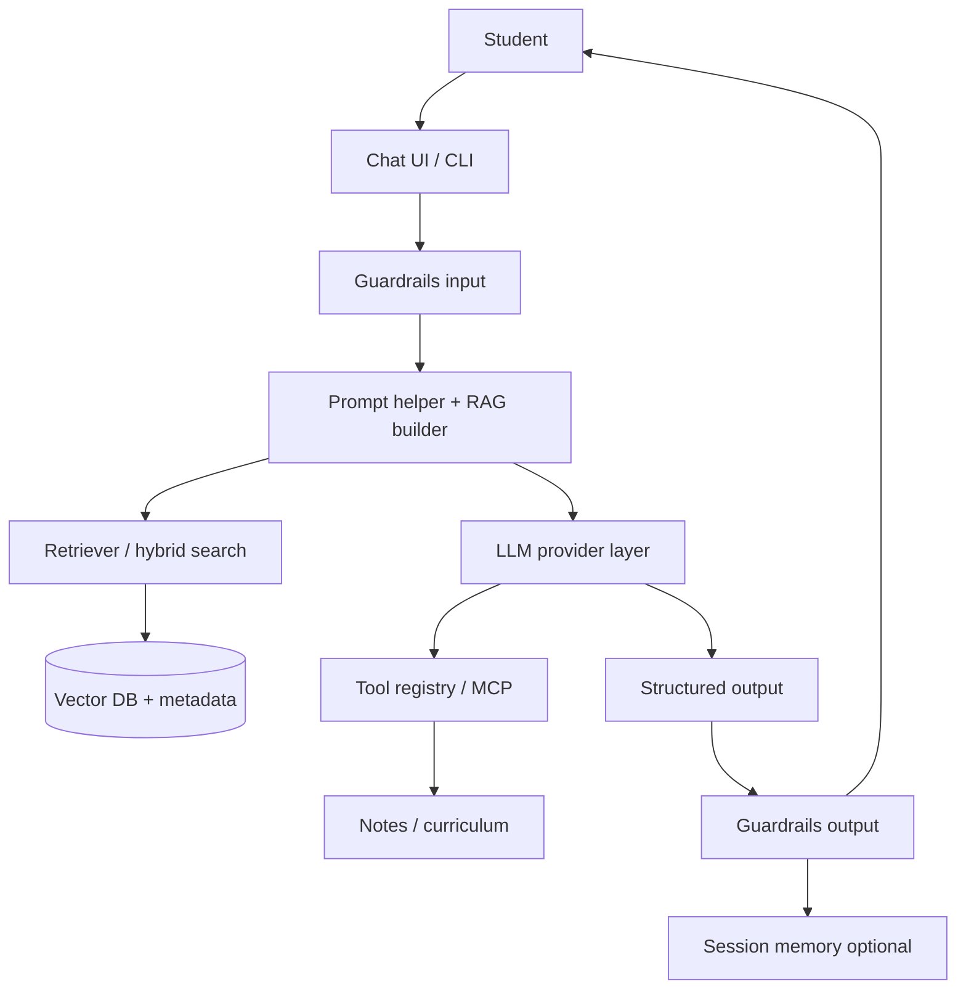

The goal is not to build everything—it is to build the **right things** provably.

## Why the Capstone Exists

Learning AI engineering becomes real when you assemble a complete system. At Day 30 you should answer:

- **What problem** does StudySpark solve?
- **Who** is it for?
- **Where** does data come from and who may access it?
- **How** do you know it works (eval artifacts)?
- **How** do you keep it safe (guardrails)?
- **How** do you run it outside your laptop (deploy docs)?

Those are product and operations questions—not only coding questions. Employers and reviewers trust engineers who can connect techniques to outcomes.

## StudySpark: Consolidated Capstone from All Weeks

Use [`projects/CAPSTONE.md`](../../projects/CAPSTONE.md) as the master checklist. Below is how each week maps to deliverables in [`projects/studyspark/`](../../projects/studyspark/).

### Week 1 — Foundations (Days 1–7)

| Day | Capstone artifact | Location / action |
| --- | --- | --- |
| 1 | Problem statement & persona | CAPSTONE.md profile + README intro |
| 2 | LLM mental model ("when to trust output") | `docs/trust_model.md` or README section |
| 3 | Token budget notes | Comment in prompt templates |
| 4–5 | Reusable prompt templates | `app/prompts/` or prompt helper |
| 6 | Request/response schema on paper | Informs `app/schemas/` |
| 7 | Prompt Helper spec | `spec.md` linked from README |

**Week 1 outcome:** You can turn vague student questions into structured prompts before any model call.

### Week 2 — Application shell (Days 8–14)

| Day | Component | StudySpark path |
| --- | --- | --- |
| 8 | OpenAI client with retries | `app/clients/openai_client.py` |
| 9 | Provider abstraction | `app/clients/provider.py` |
| 10 | Quiz + summary schemas | `app/schemas/` |
| 11–12 | Tool registry (≥2 tools) | `app/tools/` |
| 13 | Streaming chat route | `/chat/stream` in `app/main.py` |
| 14 | StudySpark shell | chat + session + integrated spec |

Starter code already includes [`app/clients/mock_llm.py`](../../projects/studyspark/app/clients/mock_llm.py) and [`app/config.py`](../../projects/studyspark/app/config.py)—extend, do not restart from scratch.

**Week 2 outcome:** StudySpark calls models (or mock), uses structured outputs, and exposes tools behind a real app boundary.

### Week 3 — Knowledge and memory (Days 15–21)

| Day | Component | StudySpark path |
| --- | --- | --- |
| 15 | Embedding ingestion | `app/rag/ingest.py` |
| 16 | Vector store + filters | `app/rag/store.py` |
| 17 | RAG prompt + citations | `app/rag/prompt_builder.py` |
| 18 | Hybrid search | `app/rag/hybrid.py` |
| 19 | Session memory policy | `app/memory/session.py` |
| 20 | Long-term memory | `app/memory/long_term.py` |
| 21 | Knowledge assistant MVP | end-to-end Q&A over repo/notes |

**Week 3 outcome:** Answers cite real lessons; "I don't know" when evidence is missing.

### Week 4 — Agents, quality, ship (Days 22–30)

| Day | Component | StudySpark path |
| --- | --- | --- |
| 22 | Agent loop design | `docs/agent_design.md` (optional v2) |
| 23 | Planner with step limits | if multi-step research added |
| 24 | Multi-agent roles | only if scope truly needs it |
| 25 | MCP / tool-server outline | MCP client in `app/tools/` |
| 26 | Framework vs plain code decision | `docs/framework_decision.md` |
| 27 | Evaluation set + metrics | `evaluation/` |
| 28 | Guardrails + refusal tests | `app/guardrails/` |
| 29 | Deployment config | `deployment/` + `.env.example` |
| 30 | Demo script + final README | README + CAPSTONE complete |

**Week 4 outcome:** StudySpark is measurable, safe, deployable, and demonstrable.

```mermaid
gantt
    title StudySpark capstone timeline
    dateFormat X
    axisFormat %s
    section Week1
    Foundations :0, 7
    section Week2
    App shell :7, 14
    section Week3
    RAG memory :14, 21
    section Week4
    Quality ship :21, 30
```

## Choosing Scope for Your Finish Line

The best capstone is **narrow enough to finish, rich enough to teach**.

### In scope for Day 30 MVP

- chat Q&A over curriculum (+ optional user notes)
- citations to lesson files
- quiz or summary generation with structured output
- refusal for homework completion and out-of-scope topics
- eval test set with baseline scores
- guardrails on input/output
- documented deploy/run steps (MockLLM path required; live optional)

### Out of scope unless you already finished MVP

- multi-user auth and billing
- autonomous multi-agent research swarms
- full LangGraph migration (Day 26 optional)
- mobile apps and voice interfaces

Expand only when base version works **and** eval is stable (Day 26 guidance).

## Deep Theory

### What makes a capstone "real"?

Three qualities:

1. **Concrete problem** — exam prep with grounded answers
2. **Multiple AI patterns** — RAG + structured output + tools + guardrails (not prompt-only)
3. **Defensible quality** — eval artifacts, not adjectives

### Architecture principles for StudySpark

| Principle | Implementation |
| --- | --- |
| Modularity | Separate `clients/`, `rag/`, `tools/`, `guardrails/` |
| Testability | MockLLM + retrieval fixtures |
| Observability | Request IDs and stage logs (Day 29) |
| Safety by default | Guardrails wrap pipeline (Day 28) |
| Evidence | Eval baseline before demo (Day 27) |

### Advantages of cumulative capstone

- portfolio-ready artifact with story arc
- proves integration skill, not tutorial completion
- surfaces weak days for honest review

### Limitations

- time forces tradeoffs—document what you cut
- solo learners may skip live deploy—staging docs still required
- scope creep is the primary failure mode

## Visual Learning

### Full StudySpark architecture

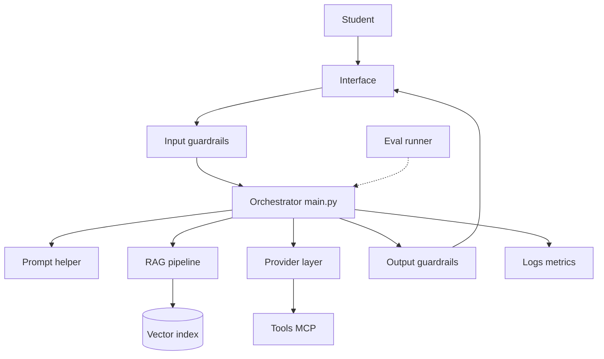

### Request lifecycle

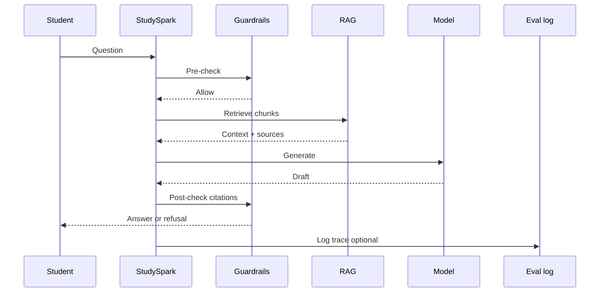

### CAPSTONE.md relationship

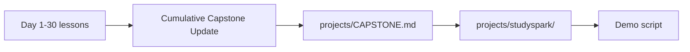

### Quality flywheel

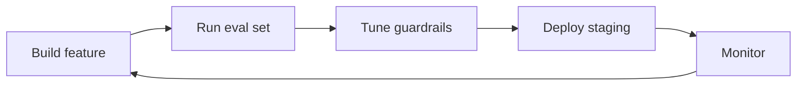

### Week integration mind map

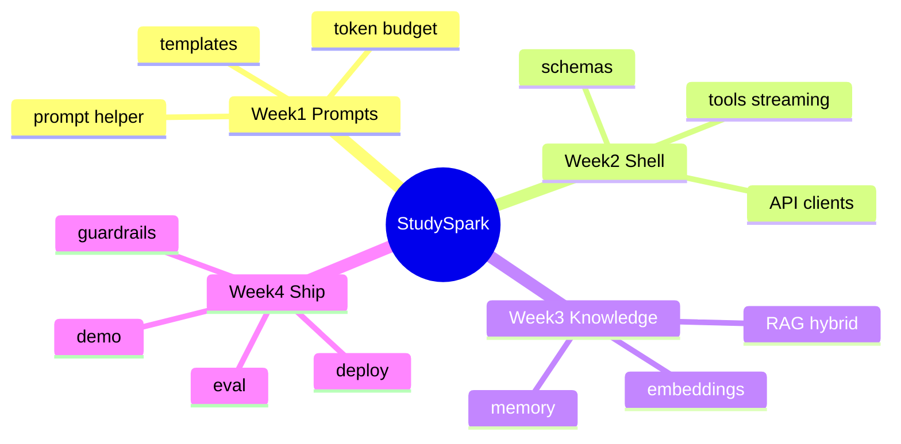

### v1 vs v2 scope

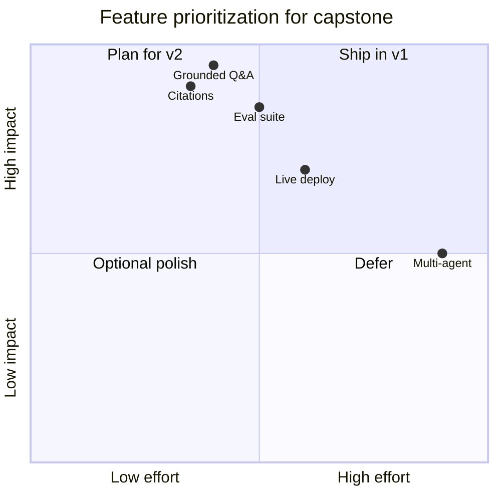

### Demo narrative arc

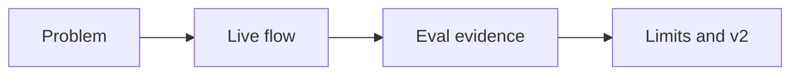

### Target folder structure (from CAPSTONE.md)

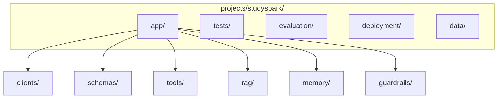

## Code Walkthrough

Examples show capstone **integration points**—wire these into StudySpark rather than standalone scripts.

### Example 1: Python — Capstone project manifest

```python
STUDYSPARK = {
    "name": "StudySpark",
    "user": "student preparing for exams",
    "workflow": "grounded Q&A with citations and safe refusals",
    "repo_root": "projects/studyspark/",
    "tracker": "projects/CAPSTONE.md",
}

print(STUDYSPARK)
```

#### Code Explanation

- Single manifest links code path to CAPSTONE tracker for reviewers.

### Example 2: TypeScript — Success metrics object

```typescript
const successMetrics = {
  groundingAvgMin: 4.0,
  citationValidRateMin: 0.9,
  p95LatencyMsMax: 2500,
  policyRefusalAccuracyMin: 0.95,
  homeworkRefusal: true,
};

console.log(successMetrics);
```

#### Code Explanation

- Thresholds should come from Day 27 baseline, not arbitrary perfection.

### Example 3: Python — End-to-end orchestration sketch

```python
def studyspark_answer(question: str, deps) -> dict:
    deps.guardrails.check_input(question)
    chunks = deps.rag.retrieve(question)
    deps.guardrails.filter_chunks(chunks)
    prompt = deps.rag.build_prompt(question, chunks)
    draft = deps.llm.generate(prompt)
    return deps.guardrails.finalize(draft, chunks)
```

#### Code Explanation

- `deps` bundles clients for testing—inject MockLLM and fixture retriever.

### Example 4: TypeScript — Readiness for demo

```typescript
type ReadinessCheck = {
  capstoneComplete: boolean;
  evalBaselineExists: boolean;
  guardrailsTested: boolean;
  readmeRunSteps: boolean;
};

function isDemoReady(check: ReadinessCheck): boolean {
  return Object.values(check).every(Boolean);
}
```

#### Code Explanation

- Day 30 "done" means checklist true, not merely code exists.

### Example 5: Python — Evaluation record for demo

```python
demo_eval = {
    "version": "v1.0",
    "cases": 20,
    "avg_grounding": 4.3,
    "avg_latency_ms": 890,
    "policy_pass_rate": 1.0,
}
```

#### Code Explanation

- Show numbers in demo slide 3—honesty builds trust.

### Example 6: Python — Feature completeness by week

```python
WEEK_STATUS = {
    "week2_shell": True,
    "week3_rag": True,
    "week4_eval": True,
    "week4_guardrails": True,
    "week4_deploy_docs": True,
}


def completion_rate(status: dict) -> float:
    return sum(status.values()) / len(status)


print(f"{completion_rate(WEEK_STATUS)*100:.0f}%")
```

#### Code Explanation

- Identify weak week before recording demo.

### Example 7: TypeScript — Demo script outline

```typescript
const demoScript = [
  "0:00 — Problem: students drown in notes",
  "0:45 — Ask StudySpark a curriculum question",
  "1:30 — Show citation to day_17 RAG lesson",
  "2:00 — Show refusal for homework completion",
  "2:30 — Eval baseline: grounding 4.3/5",
  "2:50 — Limits: no live deploy / English only / etc.",
];

console.log(demoScript.join("\n"));
```

#### Code Explanation

- Required deliverable from Cumulative Capstone Update below.

### Example 8: Python — v2 improvement list (evidence-based)

```python
V2_IMPROVEMENTS = [
    "Hybrid search tuning — recall@5 was 0.72 on paraphrase set",
    "Streaming UX — p95 acceptable but perceived latency high",
    "Session memory — users repeat context each turn in user tests",
]
```

#### Code Explanation

- Each item ties to eval or user observation—not "add blockchain."

### Example 9: Python — Run from clean env (deploy proof)

```bash
# Document these steps in README — Day 29/30
python -m venv .venv
source .venv/bin/activate  # Windows: .venv\Scripts\activate
pip install -r projects/studyspark/requirements.txt
cp projects/studyspark/.env.example .env
python projects/studyspark/scripts/check_setup.py
python -m projects.studyspark.app.main  # or documented entrypoint
```

#### Code Explanation

- Demo machine should follow README exactly—no hidden local fixes.

### Example 10: TypeScript — CAPSTONE checkbox types

```typescript
type CapstoneWeek = "week1" | "week2" | "week3" | "week4";
type CapstoneItem = { day: number; component: string; done: boolean };

function remaining(items: CapstoneItem[]): CapstoneItem[] {
  return items.filter((i) => !i.done);
}
```

#### Code Explanation

- Mirror table structure in [`projects/CAPSTONE.md`](../../projects/CAPSTONE.md).

## Practical Examples

### Beginner Example: Minimum viable demo

MockLLM + 10-lesson index + citation formatter + homework refusal + CAPSTONE checkboxes complete + 3-minute recorded walkthrough.

### Intermediate Example: Full local StudySpark

Live model optional; eval folder with 20 cases; guardrail tests in pytest; deployment README with Docker sketch.

### Advanced Example: Staging deploy

Public staging URL, eval smoke on deploy, guardrail metrics in logs, portfolio page linking GitHub + demo video.

### Production-shaped Example: Internal pilot

Three classmates use StudySpark for one week; feedback becomes new eval cases; v2 priorities ranked by failure frequency.

### Real-World Company Example

Hiring managers prefer one coherent capstone with eval numbers over five half-finished tutorials. StudySpark demonstrates integration—the skill job descriptions actually request.

## Comparison Tables

### Capstone maturity levels

| Level | Evidence | Typical finish |
| --- | --- | --- |
| Bronze | MockLLM + RAG + README | Beginner path |
| Silver | + eval baseline + guardrails | Intermediate |
| Gold | + staging deploy + demo video | Advanced |

### Feature vs proof

| Feature impresses laypeople | Proof impresses engineers |
| --- | --- |
| Streaming UI | Eval delta after prompt change |
| Multi-agent | Citation verification tests |
| Fancy model name | Guardrail false positive rate |
| Many tools | Rollback runbook |

### What reviewers check first

| Reviewer | Looks for |
| --- | --- |
| Engineer | Architecture diagram, tests, eval |
| Product | Clear user/problem, demo flow |
| Security | Refusal behavior, secrets handling |
| You (honesty) | Documented limits |

## Best Practices

- complete [`projects/CAPSTONE.md`](../../projects/CAPSTONE.md) checkboxes honestly
- keep README run steps copy-pasteable ([`projects/studyspark/README.md`](../../projects/studyspark/README.md))
- demo happy path **and** refusal path
- show eval numbers with baseline comparison
- document known limits (languages, index size, no auth yet)
- tag git release `studyspark-v1.0` for snapshot
- credit MockLLM path for reviewers without API keys
- list v2 items with evidence from eval

## Common Mistakes

- capstone is README only—no runnable `app/`
- citations fabricated—guardrails not wired
- demo only happy path—crashes on refusal case
- CAPSTONE boxes checked without artifacts
- scope explosion (multi-agent + MCP + LangGraph day before demo)
- no eval baseline—cannot defend quality claims
- secrets in demo recording or git history

### Debugging Strategy

When capstone feels incomplete:

1. Open CAPSTONE.md—which week has most unchecked boxes?
2. Run `check_setup.py`—what fails first?
3. Run eval suite—lowest metric dimension?
4. Cut scope to MVP table above—ship that first
5. Record demo—even bronze level—then iterate v2

## Performance

For demo day:

- pre-warm index; cache embedding model load
- use smaller model for live demo reliability
- keep demo questions in eval pass set
- have MockLLM fallback if live API fails mid-demo

Document p95 latency from eval in README—not live guesses.

## Security

Final security checklist before demo:

- [ ] No API keys in repo, recordings, or slides
- [ ] Homework refusal tested
- [ ] Injection test case in eval set
- [ ] Tool writes gated or disabled in demo build
- [ ] Logs redact user note content

See Day 28 guardrails module in StudySpark.

## Evaluation

Capstone evaluation story (required):

| Artifact | Path |
| --- | --- |
| Test set | `evaluation/test_set.json` |
| Rubric | `evaluation/rubric.md` |
| Baseline | `evaluation/results/baseline_v1.json` |
| Summary | README "Quality" section |

Demo must mention **one metric** and **one known failure mode** you are improving in v2.

## Deployment Readiness

Before calling Day 30 complete:

- [ ] `scripts/check_setup.py` passes on clean venv
- [ ] `.env.example` documents all variables
- [ ] `deployment/README.md` or equivalent exists
- [ ] Rollback steps documented (even for local-only)
- [ ] Health or startup log line confirms config loaded

Live cloud deploy is optional for course completion; **documented** deploy is not.

## Portfolio and Presentation Guide

Your Day 30 deliverable is consumed by **humans**, not only test runners.

### README sections reviewers expect

1. **Problem** — one paragraph, student exam prep
2. **Demo** — GIF, video link, or numbered steps
3. **Architecture** — diagram (from this lesson)
4. **Quality** — eval summary table with baseline
5. **Safety** — policy matrix excerpt
6. **Run locally** — exact commands from [`projects/studyspark/README.md`](../../projects/studyspark/README.md)
7. **Limits** — honest scope boundaries
8. **v2 roadmap** — three evidence-based improvements

### Three-minute demo structure (required)

| Time | Content |
| --- | --- |
| 0:00–0:40 | Problem: fragmented notes, exam stress |
| 0:40–1:40 | Live flow: supported question + visible citation |
| 1:40–2:20 | Safety: homework refusal or weak-evidence response |
| 2:20–2:50 | Quality: one eval metric vs baseline |
| 2:50–3:00 | Limits + v2 tease |

Practice the **refusal path**—it proves Week 4 maturity more than another perfect answer.

### Git hygiene for submission

```bash
git tag studyspark-v1.0
git push origin studyspark-v1.0  # when remote exists
```

Tag marks the capstone snapshot reviewers should clone.

## Retrospective: 30-Day Skill Map

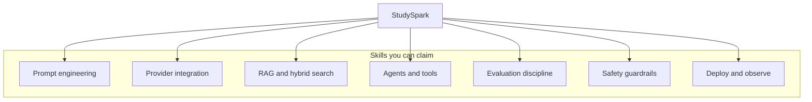

When updating LinkedIn or resume, cite **outcomes** ("built RAG assistant with eval baseline and citation guardrails") not buzzwords alone.

## Peer Review Checklist

Swap projects with a classmate and verify:

- [ ] Their README runs on your machine with MockLLM
- [ ] At least one citation links to a real lesson file
- [ ] Homework refusal triggers correctly
- [ ] CAPSTONE.md matches observable features
- [ ] Feedback becomes a new eval case for them

Teaching others to break your app is the fastest final polish.

## Week-by-Week Narrative for Your README

Write a short "Build log" section summarizing the 30-day arc—future you (and reviewers) will forget why folders exist.

**Week 1 — Language:** You learned to speak to models precisely. StudySpark started as a problem statement: one student, exam prep, structured prompts from the Day 7 helper.

**Week 2 — Shell:** You connected real APIs (or mocks), structured quiz outputs, tools, and streaming. The repo gained `app/clients/` and `app/schemas/`—StudySpark became runnable code, not notes.

**Week 3 — Knowledge:** Embeddings and vector search grounded answers in *this* curriculum. RAG with citations differentiated StudySpark from a generic chatbot. Memory policies kept sessions useful without unbounded context cost.

**Week 4 — Trust and ship:** Agents and MCP extended reach, but evaluation proved quality, guardrails enforced policy, and deployment docs let others run your work. Day 30 merges the checklist in [`projects/CAPSTONE.md`](../../projects/CAPSTONE.md) into one demo-ready story.

This narrative belongs in your README introduction—two paragraphs max.

## After the Capstone: Continued Learning

Day 30 is not the ceiling. High-leverage next steps:

| Direction | Resource / action |
| --- | --- |
| Deeper eval | OpenAI evals, RAGAS-style metrics |
| Safety | OWASP LLM Top 10 projects |
| Scale | Load test staging; optimize retrieval |
| Product | User interviews; expand eval set |
| Frameworks | Revisit LangGraph only if agent scope grows |

The course goal was **integration literacy**—you now know which book to open when a specific problem appears.

## Submission Package Checklist

Package these artifacts together for portfolio or instructor review:

| Artifact | Path |
| --- | --- |
| Runnable code | [`projects/studyspark/`](../../projects/studyspark/) |
| Capstone tracker | [`projects/CAPSTONE.md`](../../projects/CAPSTONE.md) |
| Eval summary | `evaluation/results/baseline_v1.json` + README section |
| Safety policy | `docs/policy.md` or guardrails README |
| Deploy docs | `deployment/README.md` |
| Demo script | `docs/demo_script.md` |
| Optional video | link in README |

Zip or link the repo tag `studyspark-v1.0`—not a folder of disconnected homework files.

## Congratulations — Course Complete

You built **StudySpark** across four weeks: prompts, APIs, knowledge, agents, quality, safety, and deployment. That is the same arc many production AI teams follow—compressed into one portfolio artifact.

Share your demo, keep iterating v2 from eval data, and use [`projects/CAPSTONE.md`](../../projects/CAPSTONE.md) as a template for the next AI product you ship.

You have earned the finish line—ship StudySpark v1.0 with evidence, not perfection.

## Exercises

### Easy

1. State StudySpark's one user and one workflow.
2. Where is the capstone checklist file?
3. Name three Week 3 components.
4. What is MockLLM for?
5. List two success metrics.
6. What should demo slide "limits" include?
7. Link path to StudySpark README.

### Medium

8. Map Days 8–10 to folders under `app/`.
9. Write three demo questions (supported, policy, weak evidence).
10. Explain why citations matter for trust.
11. What CAPSTONE Week 4 items relate to Day 27–29?
12. Draft README "Quick Start" in five steps.
13. Compare bronze vs gold capstone maturity.
14. Name one optional Day 26 framework decision artifact.
15. How does session memory differ from RAG?

### Hard

16. Draw architecture diagram matching your actual `app/` tree.
17. Run eval (mock ok); paste summary metrics into README.
18. Implement missing guardrail: citation verification.
19. Write 3-minute demo script with timestamps.
20. Tag v1.0 git release and document changelog.

### Challenge

21. Complete all CAPSTONE.md checkboxes with linked evidence.
22. Record demo video: problem → flow → eval → limits.
23. Deploy StudySpark to staging; run smoke eval remotely.
24. Add adversarial note to index; verify guardrails in demo.
25. Portfolio page: architecture + eval chart + honest retrospective.

### Reflection Questions

26. Which week taught you the most technically?
27. What would you cut if you had half the time?
28. What makes a reviewer trust this project?
29. How does StudySpark connect all 30 days?
30. What three v2 improvements matter most—and why?

## Quizzes

### Quiz 1

1. What is StudySpark's primary user?
2. Where is cumulative checklist stored?
3. Name two Week 2 components.
4. What proves quality beyond demo?

**Answers:** 1. Student preparing for exams  2. [`projects/CAPSTONE.md`](../../projects/CAPSTONE.md)  3. Examples: API client, schemas, tools  4. Evaluation baseline and metrics

### Quiz 2

1. What file contains starter StudySpark code?
2. What is required demo deliverable on Day 30?
3. Name one out-of-scope item for MVP.
4. Why MockLLM in README?

**Answers:** 1. [`projects/studyspark/`](../../projects/studyspark/)  2. 3-minute demo script (+ complete CAPSTONE)  3. Examples: multi-user auth, full multi-agent  4. Run without API keys for reviewers/learners

### Quiz 3

1. Which week added RAG?
2. What guardrail policy example from CAPSTONE eval?
3. What deployment script checks setup?
4. What is v2 improvement list based on?

**Answers:** 1. Week 3 (Days 15–21)  2. Refuses graded homework  3. `scripts/check_setup.py`  4. Eval data and user feedback—not random features

### Quiz 4

1. What modules belong in `app/guardrails/`?
2. What does "grounded Q&A" mean?
3. Name eval artifact paths.
4. Why document limits in demo?

**Answers:** 1. Input/output checks, tool gate, refusal helpers  2. Answers supported by retrieved course material with citations  3. `evaluation/test_set.json`, rubric, baseline results  4. Honesty and scope control build credibility

### Quiz 5

1. What is the capstone flywheel BUILD→EVAL→…?
2. Which day added deployment docs?
3. What principle says separate rag/tools/guardrails?
4. Finish: "If lessons taught vocabulary, Day 30 is ___"

**Answers:** 1. Build → eval → guard → deploy → monitor → build  2. Day 29  3. Modularity/testability  4. Fluency in one integrated system (accept similar)

## Interview Questions

### Conceptual

- Walk through StudySpark architecture end-to-end.
- How do you prove an LLM feature works?
- Tradeoffs you made to finish capstone on time?

### System design

- How would you add multi-user note isolation?
- Scale StudySpark to 10k MAU—what breaks first?
- Design v2 hybrid search improvement experiment.

### Behavioral

- Hardest bug during capstone and how you debugged it?
- What would you do differently starting Week 1 again?
- How do you balance demo polish vs eval honesty?

## Mini Project

**Final deliverable:** Complete StudySpark capstone package.

### Goal

Runnable [`projects/studyspark/`](../../projects/studyspark/), completed [`projects/CAPSTONE.md`](../../projects/CAPSTONE.md), demo script, eval summary, deployment docs.

### Required features (MVP)

- grounded Q&A with citations OR honest uncertainty
- structured quiz or summary generation
- at least two tools or tool stubs with validation
- guardrails: scope + homework refusal + citation check
- eval: ≥15 test cases + baseline metrics
- README quick start from clean environment
- 3-minute demo script

### Suggested final structure

```text
projects/studyspark/
├── app/
│   ├── clients/
│   ├── schemas/
│   ├── tools/
│   ├── rag/
│   ├── memory/
│   ├── guardrails/
│   ├── config.py
│   └── main.py
├── evaluation/
├── deployment/
├── tests/
├── docs/
│   ├── framework_decision.md
│   └── demo_script.md
├── scripts/check_setup.py
├── .env.example
└── README.md
```

### Project Steps

1. audit CAPSTONE.md—list unchecked items
2. implement highest-risk gaps (RAG, guardrails, eval)
3. run `check_setup.py` and full pytest
4. run eval; save baseline summary in README
5. write demo script; rehearse refusal case
6. record demo or live dry-run
7. mark Day 30 complete; tag `studyspark-v1.0`

### What You Learn

- full-stack AI product engineering in one repo
- how to communicate architecture, quality, and limits
- how course topics compose into shippable software

## Final Checklist

Before claiming Day 30 complete:

- [ ] Problem, user, and workflow stated in README
- [ ] Architecture diagram matches code
- [ ] StudySpark answers real curriculum questions with citations
- [ ] Unsupported questions refused appropriately
- [ ] Eval baseline documented
- [ ] Guardrails tested (including adversarial case)
- [ ] Deploy/run steps work from README on clean machine
- [ ] [`projects/CAPSTONE.md`](../../projects/CAPSTONE.md) checkboxes complete
- [ ] Demo script recorded or rehearsed
- [ ] Three v2 improvements listed with evidence

## Course Wrap-Up

This repository began with AI engineering foundations and progressed through prompting, APIs, structured outputs, tool use, retrieval, memory, agents, MCP, orchestration choices, evaluation, guardrails, deployment, and this capstone.

You now have:

- **Conceptual map** — when to use RAG, tools, agents, guardrails
- **Practical codebase** — StudySpark in [`projects/studyspark/`](../../projects/studyspark/)
- **Quality discipline** — eval baselines beat gut feeling
- **Shipping mindset** — config, logs, rollback, honest limits

Week 4's arc was: organize workflows (Day 26), prove they work (Day 27), keep them safe (Day 28), ship responsibly (Day 29), synthesize (Day 30).

## Cumulative Capstone Update

**Final consolidation.** Merge all daily updates into one deliverable:

1. Complete every checkbox in [`projects/CAPSTONE.md`](../../projects/CAPSTONE.md)
2. Ensure [`projects/studyspark/`](../../projects/studyspark/) runs end-to-end (MockLLM path minimum)
3. Record a **3-minute demo script** (problem → flow → evaluation → limits) in `docs/demo_script.md`
4. List **three improvements** you would ship in v2—each tied to eval data or observed failure modes

This is the official finish line for **30 Days of AI Engineering**. Congratulations on building a real AI product, not just completing lessons.

## Summary

The capstone is final proof that you can think like an AI engineer. A strong StudySpark:

- focuses on one student workflow
- integrates RAG, structured outputs, tools, guardrails, and ops thinking
- measures quality with eval artifacts
- refuses unsafe or unsupported requests
- runs from documented setup in [`projects/studyspark/README.md`](../../projects/studyspark/README.md)
- tracks progress honestly in [`projects/CAPSTONE.md`](../../projects/CAPSTONE.md)

If the earlier lessons taught you the language of AI engineering, **Day 30 is where you speak it fluently**—in code, metrics, demo, and documentation.

[Previous: Day 29 - Deployment](../day_29/day_29_deployment.md)

## Further Reading

- [`projects/CAPSTONE.md`](../../projects/CAPSTONE.md) — master checklist
- [`projects/studyspark/README.md`](../../projects/studyspark/README.md) — starter and quick start
- [Full syllabus](../../SYLLABUS.md)
- https://www.fastapi.tiangolo.com/
- https://www.nist.gov/itl/ai-risk-management-framework
