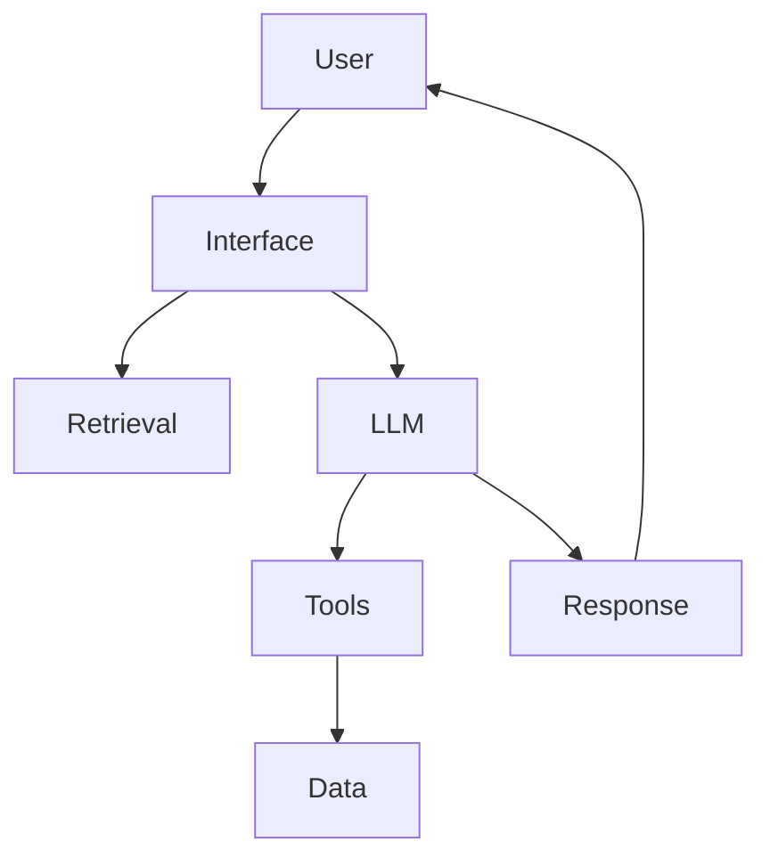
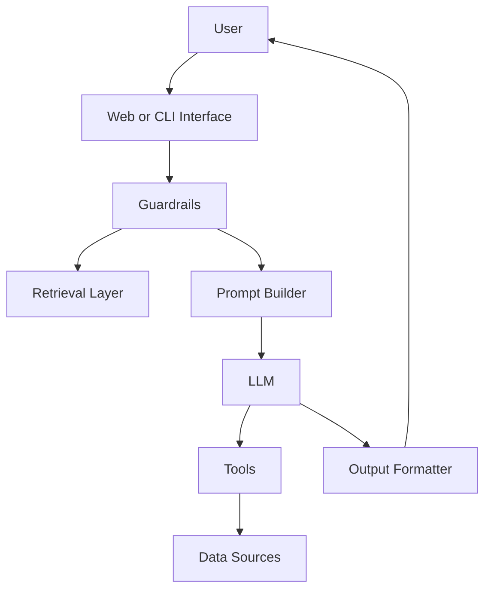
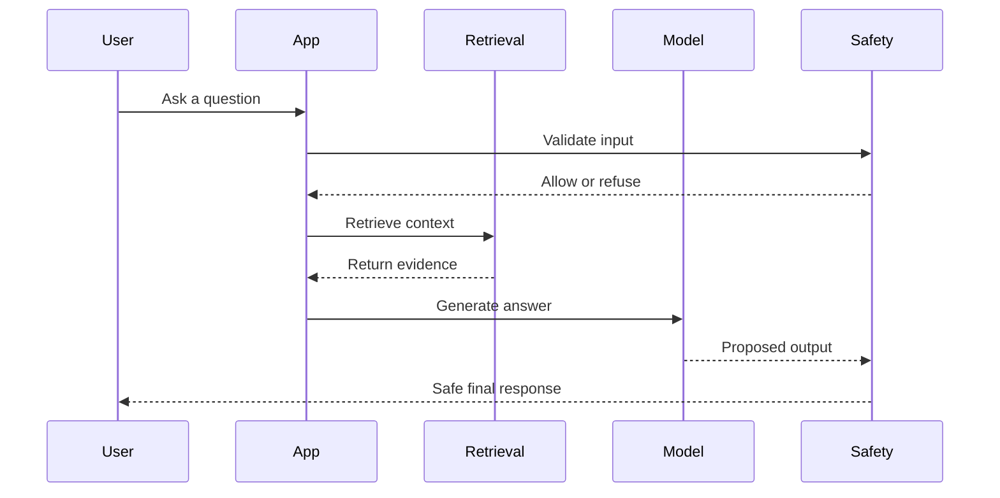
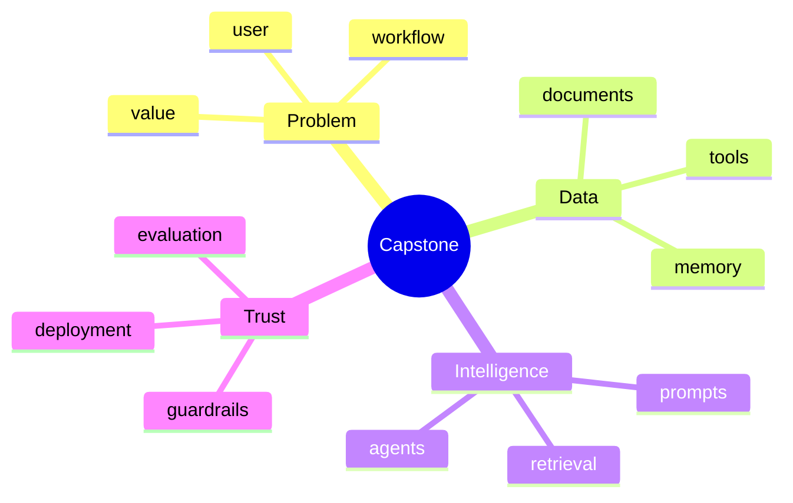
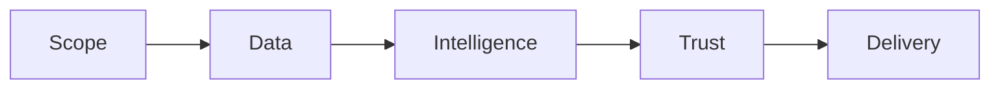

# Day 30 - Capstone Project

[Previous: Day 29 - Deployment](../day_29/day_29_deployment.md)

## Introduction
This is the final day of the course. The capstone is where everything comes together: prompting, APIs, retrieval, memory, agents, evaluation, guardrails, and deployment. After Day 29, the system is ready to become a polished final product instead of just a sequence of technical exercises.


The capstone should not feel like a random demo. It should feel like a small but real product with a purpose, a user, an architecture, and measurable success criteria.

If the earlier days taught you the pieces, this day teaches you how to assemble them into a coherent system.

## Learning Objectives
By the end of this day, you should be able to:

- define a complete AI product scope
- connect multiple AI engineering patterns into one app
- plan evaluation and safety for a real system
- explain the architecture of your final project
- present a practical roadmap for improvement
- describe how the capstone uses ideas from the whole course
- package your project for review, demo, and deployment

## Prerequisites
You should already understand:

- prompting and structured outputs
- retrieval and memory
- agents and planning
- evaluation and guardrails
- deployment basics

The capstone is not a new concept. It is the synthesis of the whole course.

## Big Picture
A capstone project should solve one specific problem for one specific kind of user.

It should have:

- a clear user need
- a bounded scope
- a simple but real architecture
- evidence that it works
- safety and deployment thinking



The goal is not to build everything. The goal is to build the right things in a way that proves you understand AI engineering.

## Why the Capstone Exists
The capstone exists because learning AI engineering only becomes real when you build a complete system.

At this point you should be able to answer:

- what problem does the app solve?
- who is it for?
- where does the data come from?
- how do you know it works?
- how do you keep it safe?
- how do you ship it?

Those are product questions, not just coding questions.

## Choosing the Right Project
The best capstone is narrow enough to finish and rich enough to teach.

Good project ideas include:

- a study assistant for course materials
- a research assistant for document Q&A
- a support copilot for internal tickets
- a knowledge navigator for an organization
- a travel planner with retrieval and tools

What matters is not novelty. What matters is clarity.

### A good capstone should have
- one main user
- one main workflow
- one main source of truth
- one clear success metric

### A bad capstone usually has
- too many user types
- too many unrelated features
- no evaluation plan
- no safety boundaries
- no deployment plan

## Deep Theory

### What makes a capstone “real”?
A real capstone has three qualities:

1. It solves a concrete problem.
2. It uses more than one AI engineering pattern.
3. It can be explained and defended.

### How the pieces fit together
The capstone may use:

- prompts to guide behavior
- APIs to call models or tools
- retrieval to ground responses
- memory to personalize experiences
- agents to plan or delegate work
- evaluation to measure quality
- guardrails to reduce risk
- deployment to make it usable

### Advantages
- proves practical understanding
- creates a portfolio-ready artifact
- connects theory with implementation
- helps you think like a product builder

### Limitations
- time constraints force tradeoffs
- the project cannot solve every problem
- good scope control is harder than it looks

### Alternatives
- a tiny demo, which is easier but less impressive
- a research-only project, which may not show product thinking
- a feature-only prototype, which may not demonstrate system design

### When should you keep the scope small?
Keep the scope small when:

- you are working alone
- the deadline is short
- the data is limited
- the deployment target is simple

### When should you expand the scope?
Expand only when:

- the base version already works
- the evaluation is stable
- the safety story is clear
- the extra feature adds real value

## Visual Learning

### Capstone Architecture


### Capstone Delivery Flow


### Capstone Mind Map


## Code Walkthrough

The examples below show how to represent a capstone as a system rather than a loose idea.

### Python Example: Capstone project definition
```python
project = {
    'name': 'Knowledge Assistant',
    'user': 'students and learners',
    'features': ['chat', 'search', 'citations', 'memory'],
}

print(project)
```

#### Code Explanation
- `project` describes the scope in one place.
- `name` identifies the product.
- `user` clarifies who the product is for.
- `features` names the core value.

### TypeScript Example: Capstone project definition
```typescript
const project = {
  name: 'Knowledge Assistant',
  user: 'students and learners',
  features: ['chat', 'search', 'citations', 'memory'],
};

console.log(project);
```

#### Code Explanation
- the same idea in TypeScript keeps the product definition portable.
- a simple object is enough to express the initial scope.

### Python Example: Capstone success criteria
```python
success_metrics = {
    'answer_accuracy': 'high',
    'citation_rate': 'high',
    'latency': 'acceptable',
    'safety_events': 'low',
}

print(success_metrics)
```

#### Code Explanation
- the capstone should have measurable outcomes.
- accuracy, citation quality, latency, and safety are all relevant.

### TypeScript Example: Simple evaluation record
```typescript
type EvaluationRecord = {
  question: string;
  answer: string;
  grounded: boolean;
};

const record: EvaluationRecord = {
  question: 'What is retrieval?',
  answer: 'Retrieval finds relevant context before generation.',
  grounded: true,
};

console.log(record);
```

#### Code Explanation
- `EvaluationRecord` stores one test case.
- `grounded` tells you whether the answer is supported.
- this is the beginning of a repeatable evaluation workflow.

### Python Example: Capstone readiness check
```python
def is_ready_for_demo(features, has_evaluation, has_guardrails):
    return bool(features) and has_evaluation and has_guardrails


print(is_ready_for_demo(['chat', 'search'], True, True))
```

#### Code Explanation
- this helper asks whether the project is ready to show.
- a capstone is not just code; it is a system that can be defended.

## Practical Examples

### Beginner Example: Study assistant
The simplest capstone can be a study assistant that answers questions about your course materials.

What it includes:

- a document loader
- retrieval over lessons
- citations in the answer
- a fallback path for unsupported questions

Why it is a good choice:

- it uses retrieval, prompts, and guardrails
- it is easy to explain
- it is directly tied to the course

### Intermediate Example: Knowledge assistant
A stronger project is a knowledge assistant for a folder of documents.

What it includes:

- chunking and indexing
- semantic retrieval
- memory for preferences
- output evaluation
- refusal when evidence is weak

What could go wrong:

- stale documents
- bad citations
- prompt injection in source files
- too much context causing slower responses

### Professional Example: Support copilot
A professional capstone could support an internal team.

It might:

- retrieve policy and ticket context
- draft suggested replies
- escalate risky cases to a human
- log decisions for review

This is a strong capstone because it shows safety, retrieval, and deployment thinking.

### Real-World Company Example
Companies often start with an internal knowledge assistant because it is easier to control than a fully open consumer product. The data is better known, the risks are clearer, and the success criteria are easier to measure.

## Implementation Roadmap

### Phase 1: Scope
Define the user, problem, and core workflow.

### Phase 2: Data
Collect the documents, tools, or APIs the system will use.

### Phase 3: Intelligence
Add prompts, retrieval, memory, or agents where needed.

### Phase 4: Trust
Add evaluation, guardrails, and refusal behavior.

### Phase 5: Delivery
Package the app, deploy it, and monitor it.



## Best Practices
- choose one concrete problem
- keep the architecture simple enough to explain
- define evaluation from the start
- add guardrails and fallback behavior
- ship a usable first version before adding complexity
- document the system architecture clearly
- include a demo path and a failure path
- make your success metrics visible

## Common Mistakes
- trying to solve every AI problem in one app
- skipping documentation for the architecture
- not testing with real content and real users
- focusing on features instead of value
- ignoring maintenance after the demo works
- building too much before validating the core workflow

### Debugging Strategy
When the capstone feels too big, ask these questions:

1. What is the single most important user task?
2. What is the smallest version that solves it?
3. What is the easiest way to prove it works?
4. What can be removed without breaking the product?

## Evaluation
The capstone should have a clear evaluation story.

### What to measure
- answer correctness
- citation quality
- groundedness
- latency
- cost
- safety events
- user satisfaction

### Useful questions
- Does the assistant answer the right question?
- Does it cite the right evidence?
- Does it refuse when necessary?
- Does it remain fast enough to use?
- Can a reviewer understand why it behaved the way it did?

### Minimal test set
A simple test set can include:

- supported questions
- unsupported questions
- adversarial prompts
- retrieval-heavy questions
- tool-related questions

## Security

The capstone must inherit the safety thinking from the previous lesson.

### Prompt Injection
Assume some inputs or documents may try to manipulate the system.

### Secrets and API Keys
Do not hardcode credentials in the project.

### Authentication and Authorization
Make sure the assistant only accesses the data it should access.

### Data Privacy
User data should be protected in prompts, logs, and retrieval layers.

### Hallucinations and Model Safety
Use citations, fallbacks, and refusal paths to keep the assistant honest.

## Deployment Readiness
Before demoing the capstone, check that:

- the app can start from a clean environment
- configuration is documented
- logs are readable
- health checks exist
- failure paths are safe
- the model and data dependencies are known

## Exercises

### Easy
1. Define the capstone problem.
2. Name the main user.
3. List the main components.
4. Explain what makes the project coherent.

### Medium
5. Write an evaluation plan.
6. Explain how retrieval fits into the project.
7. Describe one guardrail you would add.
8. Explain how the project should be deployed.

### Hard
9. Design the architecture for your own capstone.
10. Explain how memory or agents fit, if at all.
11. Write a test set for the project.
12. Define success metrics and failure thresholds.

### Challenge
13. Create a launch checklist for the product.
14. Write the project brief as if you were presenting it to a team.
15. Describe the rollback plan if the demo fails in production.
16. Add a safety and evaluation section to the brief.
17. Explain how you would improve the capstone after version 1.

### Reflection Questions
18. What part of the project proves the most AI engineering skill?
19. What is the biggest risk if the scope gets too large?
20. What would make a reviewer trust the project more?
21. How does the capstone connect the whole course?
22. What would you change if you had one more week?

## Mini Project
Build the final project brief.

### Goal
Produce a concise but complete capstone brief that another engineer could read and understand without additional explanation.

### Required Sections
- user
- problem statement
- scope
- architecture
- data sources
- evaluation
- guardrails
- deployment
- future improvements

### Suggested structure
```text
capstone-brief/
├── README.md
├── architecture.md
├── evaluation.md
├── safety.md
└── deployment.md
```

### Project Steps
1. choose the product and user
2. define the exact problem
3. sketch the architecture
4. list the data sources and tools
5. describe evaluation and safety
6. explain how it will be deployed
7. add the next improvements you would make after launch

### What You Learn
- how to communicate a product clearly
- how to connect every major AI engineering concept
- how to describe quality, safety, and deployment in one plan
- how to present your work like a real project

## Final Checklist
Before you consider the capstone complete, confirm that:

- the problem is specific
- the architecture is understandable
- the system can answer real questions
- the output is grounded or properly refused
- evaluation exists
- guardrails exist
- deployment is documented
- the demo can be explained in a few minutes

## Course Wrap-Up
This repository started with the basics of AI engineering and moved through prompting, APIs, structured outputs, tool use, retrieval, memory, agents, evaluation, guardrails, deployment, and now the final project. Week 4 follows a clear path: keep it safe, ship it responsibly, then package everything into a coherent capstone.

The capstone proves you can combine those pieces into one product.

## Summary
The capstone is the final proof that you can think like an AI engineer.

A strong final project is focused, useful, and well-architected. It shows that you can:

- define a problem
- choose the right techniques
- build a system that works
- evaluate it honestly
- keep it safe
- deploy it responsibly

If the earlier lessons taught you the language of AI engineering, the capstone is where you speak it fluently.

[Previous: Day 29 - Deployment](../day_29/day_29_deployment.md)

## Further Reading
- https://www.fastapi.tiangolo.com/
- https://docs.docker.com/
- https://modelcontextprotocol.io/
- https://www.nist.gov/itl/ai-risk-management-framework
- https://opentelemetry.io/
