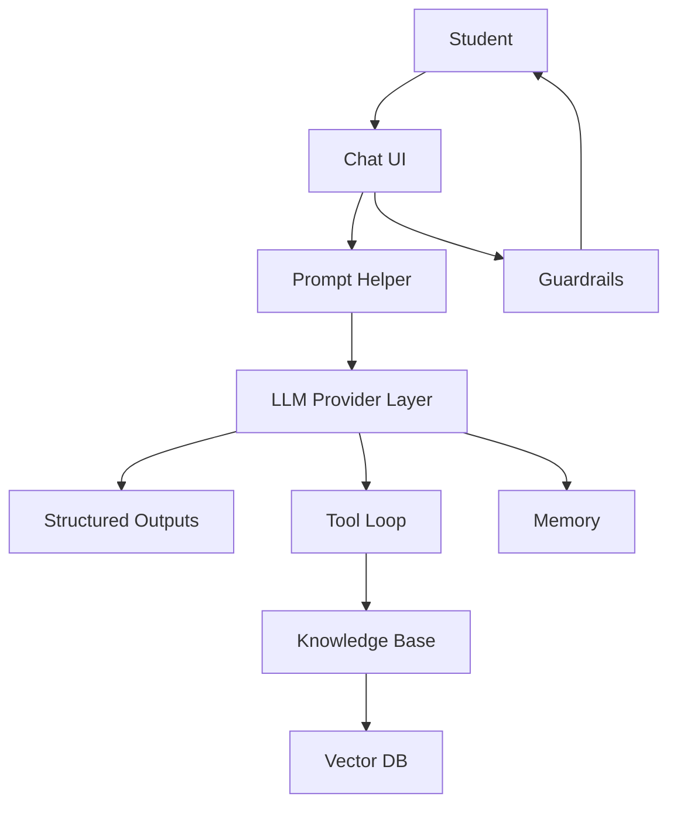

# StudySpark — Cumulative Capstone Tracker

Use this file as your **single source of truth** for the course project. Update it after every lesson's **Cumulative Capstone Update** section.

## Your Profile

| Field | Your answer |
| --- | --- |
| Name | |
| Learning path | Beginner / Intermediate / Advanced |
| Start date | |
| Target finish | |
| Primary language | Python / TypeScript / Both |

## Product Summary

**StudySpark** is a study assistant that:

- helps learners understand course material
- summarizes notes and generates quizzes
- retrieves answers from a knowledge base (Week 3+)
- uses tools and safe refusals (Week 2+)
- is evaluated and deployable (Week 4)

**One user, one workflow:** a student preparing for exams using their own notes and this curriculum.

## Architecture (Living Diagram)



## Component Checklist

Check items as you complete each day's capstone update.

### Week 1 — Foundations

| Day | Component | Done |
| --- | --- | --- |
| 1 | Problem statement and user persona written | ☐ |
| 2 | LLM mental model doc (when to trust output) | ☐ |
| 3 | Token budget notes for prompts | ☐ |
| 4 | Three reusable prompt templates | ☐ |
| 5 | Advanced prompt patterns in templates | ☐ |
| 6 | Request/response schema on paper | ☐ |
| 7 | Prompt Helper spec (`spec.md`) | ☐ |

### Week 2 — Application shell

| Day | Component | Done |
| --- | --- | --- |
| 8 | `openai_client` module with retries | ☐ |
| 9 | `LLMProvider` + OpenAI/Claude adapters | ☐ |
| 10 | Pydantic/Zod schemas for quiz + summary | ☐ |
| 11 | Tool registry (≥2 tools) | ☐ |
| 12 | Function-calling flows (read + write) | ☐ |
| 13 | Streaming `/chat/stream` endpoint | ☐ |
| 14 | StudySpark shell: chat + session + spec | ☐ |

### Week 3 — Knowledge and memory

| Day | Component | Done |
| --- | --- | --- |
| 15 | Embedding ingestion pipeline | ☐ |
| 16 | Vector store + metadata filters | ☐ |
| 17 | RAG prompt builder + citations | ☐ |
| 18 | Hybrid search (keyword + vector) | ☐ |
| 19 | Session memory policy | ☐ |
| 20 | Long-term memory store | ☐ |
| 21 | Repo/course knowledge assistant MVP | ☐ |

### Week 4 — Agents, quality, ship

| Day | Component | Done |
| --- | --- | --- |
| 22 | Agent loop design doc | ☐ |
| 23 | Planner with step limits | ☐ |
| 24 | Multi-agent roles (if needed) | ☐ |
| 25 | MCP or tool-server outline | ☐ |
| 26 | Framework vs plain code decision | ☐ |
| 27 | Evaluation set + metrics | ☐ |
| 28 | Guardrails + refusal tests | ☐ |
| 29 | Deployment config (Docker/env) | ☐ |
| 30 | Demo script + final README | ☐ |

## Folder Structure (Target)

```text
projects/studyspark/
├── app/
│   ├── clients/       # Day 8–9
│   ├── schemas/       # Day 10
│   ├── tools/         # Day 11–12
│   ├── rag/           # Day 17–18
│   ├── memory/        # Day 19–20
│   └── main.py
├── tests/
├── data/
├── .env.example
└── README.md
```

## Evaluation Checklist (Use from Day 14+)

| Test | Pass? |
| --- | --- |
| Answers stay on study topics | ☐ |
| Refuses to complete graded homework | ☐ |
| Cites source lesson when using RAG | ☐ |
| Says "I don't know" when evidence missing | ☐ |
| Streaming cancels cleanly | ☐ |
| Tool calls validated before execution | ☐ |

## Notes and Decisions

Use this space for design decisions, blockers, and ideas.

```
Date:
Day:
Note:
```

## Links

- [StudySpark starter code](studyspark/README.md)
- [Full syllabus](../SYLLABUS.md)
- [Day 30 capstone lesson](../day_30/day_30_capstone_project.md)
